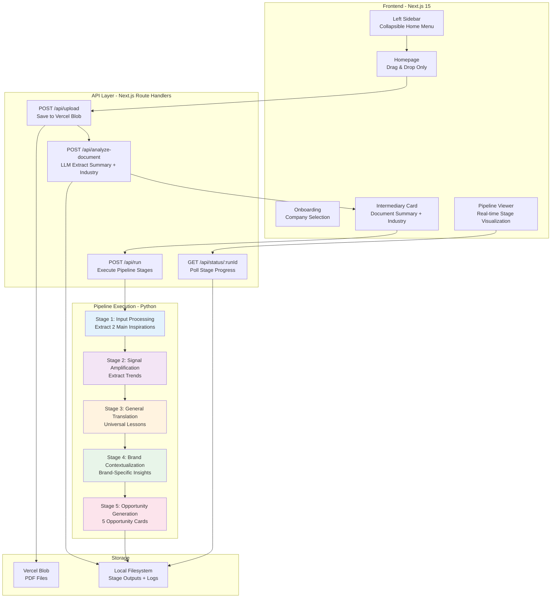

# Innovation Pipeline Web App - Hackathon Architecture

**Version:** 2.0 (Hackathon Build)
**Last Updated:** January 2025
**Status:** Ready for Implementation
**Architecture Type:** Minimal Web Wrapper + Real-time Pipeline Visualization
**Build Time:** 8-10 hours (1 day hackathon)

---

## Table of Contents

1. [Introduction](#1-introduction)
2. [Architecture Overview](#2-architecture-overview)
3. [Tech Stack](#3-tech-stack)
4. [User Journey](#4-user-journey)
5. [UI Specifications](#5-ui-specifications)
6. [API Design](#6-api-design)
7. [Pipeline Integration](#7-pipeline-integration)
8. [Deployment](#8-deployment)
9. [Implementation Roadmap](#9-implementation-roadmap)

---

## 1. Introduction

### Purpose

Build a **minimal web interface** that wraps the existing Python pipeline, enabling users to:
1. **Pre-select company** during team-led onboarding (loads brand context from YAML profiles)
2. Upload PDF trend reports via drag & drop
3. Watch real-time pipeline execution across 5 stages
4. View extracted trends, insights, and opportunity cards

**Key Change:** Brand selection happens during onboarding (before homepage), not on the homepage itself. This enables clean client presentations without exposing multi-brand selector.

### Core Philosophy

**Reuse, Don't Rebuild**
- Keep 100% of existing Python pipeline logic
- Add thin Next.js web layer on top
- Focus on UI/UX, not backend refactoring
- Ship in 1 day

### Key Constraints

- ⏱️ **8-10 hour build time** (hackathon scope)
- 🎨 **Ultra-minimal UI** (shadcn/ui components only)
- 🚫 **No database** (file-based state)
- 🚫 **No complex orchestration** (sequential API calls)
- ✅ **Vercel Blob for file storage**
- ✅ **Real-time stage visualization**

---

## 2. Architecture Overview

### System Diagram



### Architecture Principles

1. **Minimal Web Wrapper**: Next.js frontend + API routes trigger existing Python pipeline
2. **Vercel Blob Storage**: Store uploaded PDFs, serve via public URLs
3. **File-Based State**: No database - use filesystem for stage outputs
4. **Sequential Execution**: Run stages 1-5 sequentially in single API call
5. **Log-Based Progress**: Poll log files to detect current stage
6. **shadcn/ui MCP**: Use Magic component builder for rapid UI development

---

## 3. Tech Stack

### Complete Technology Matrix

| Category | Technology | Version | Purpose |
|----------|-----------|---------|---------|
| **Frontend Framework** | Next.js | 15.1.8 | React Server Components + App Router |
| **UI Components** | shadcn/ui | latest | Minimal, accessible components |
| **UI Builder** | shadcn/ui MCP | latest | AI-powered component generation |
| **Styling** | Tailwind CSS | 3.4+ | Utility-first CSS |
| **State Management** | React useState | built-in | Local component state |
| **File Upload** | react-dropzone | 14.3+ | Drag & drop PDF upload |
| **Markdown Rendering** | react-markdown | 9.0+ | Display opportunity cards |
| **PDF Parsing** | pdf-parse | 1.1.1 | Extract text from PDFs |
| **YAML Parser** | yaml | 2.3.4 | Load brand profiles |
| **API Client** | Native fetch | built-in | Server/client data fetching |
| **Backend Runtime** | Python | 3.11 | Existing pipeline (unchanged) |
| **Pipeline Framework** | LangChain | 0.1.0 | Existing implementation |
| **LLM Provider** | OpenRouter | latest | Claude Sonnet 4.5 via existing setup |
| **File Storage** | Vercel Blob | 0.23+ | PDF storage with public URLs |
| **Deployment** | Vercel | latest | One-click deploy |
| **Environment** | Node.js | 20+ | API routes runtime |

### Why This Stack?

- ✅ **Next.js 15**: React Server Components reduce client bundle size
- ✅ **shadcn/ui MCP**: Generate components via MCP tool (`mcp__magic__21st_magic_component_builder`)
- ✅ **Vercel Blob**: Simple API for file storage without S3 complexity
- ✅ **No Database**: Avoid Postgres/Drizzle setup overhead
- ✅ **React Dropzone**: Proven drag & drop library
- ✅ **Existing Python Pipeline**: Zero refactoring needed

---

## 3.1 Project Directory Structure

```
innovation-web/
├── app/
│   ├── api/
│   │   ├── analyze-document/
│   │   │   └── route.ts          # LLM document analysis
│   │   ├── onboarding/
│   │   │   ├── current-company/
│   │   │   │   └── route.ts      # Get current company from cookie
│   │   │   └── set-company/
│   │   │       └── route.ts      # Set company cookie
│   │   ├── run/
│   │   │   └── route.ts          # Execute pipeline
│   │   ├── status/
│   │   │   └── [runId]/
│   │   │       └── route.ts      # Poll pipeline status
│   │   └── upload/
│   │       └── route.ts          # Upload to Vercel Blob
│   ├── analyze/
│   │   └── [uploadId]/
│   │       └── page.tsx          # Intermediary card page
│   ├── onboarding/
│   │   └── page.tsx              # Company selection
│   ├── pipeline/
│   │   └── [runId]/
│   │       └── page.tsx          # Pipeline viewer
│   ├── results/
│   │   └── [runId]/
│   │       └── page.tsx          # Results display
│   ├── layout.tsx                # Root layout
│   └── page.tsx                  # Homepage (upload)
├── components/
│   ├── ui/                       # shadcn/ui components
│   │   ├── badge.tsx
│   │   ├── button.tsx
│   │   ├── card.tsx
│   │   ├── select.tsx
│   │   └── skeleton.tsx
│   ├── CompanyBadge.tsx          # Display company name
│   ├── FileUploadZone.tsx        # Drag & drop upload
│   ├── InspirationTrack.tsx      # Stage 1 inspiration card
│   ├── LeftSidebar.tsx           # Collapsible home menu
│   └── StageBox.tsx              # Stages 2-5 status box
├── lib/
│   └── utils.ts                  # Utility functions
├── public/
│   └── images/                   # Static images
├── .env.local                    # Environment variables
├── .env.example                  # Environment template
├── next.config.js
├── package.json
├── tailwind.config.ts
└── tsconfig.json

# Python Pipeline (existing, unchanged)
pipeline/
├── stages/
│   ├── stage1_input_processing.py
│   ├── stage2_signal_amplification.py
│   ├── stage3_general_translation.py
│   ├── stage4_brand_contextualization.py
│   └── stage5_opportunity_generation.py
├── utils.py
└── chains.py

scripts/
└── run_pipeline.py               # Entry point (modified)

data/
├── brand-profiles/               # YAML files
├── brand-research/               # Markdown files
└── test-outputs/                 # Pipeline outputs
    └── {run_id}/
        ├── logs/
        │   └── pipeline.log
        ├── stage1/
        │   ├── inspiration-analysis.md
        │   └── inspirations.json
        ├── stage2/
        ├── stage3/
        ├── stage4/
        └── stage5/
            ├── opportunity-1.md
            ├── opportunity-2.md
            ├── opportunity-3.md
            ├── opportunity-4.md
            └── opportunity-5.md
```

---

## 4. User Journey

### Flow Diagram

```
┌─────────────────────────────────────────────────────────────────┐
│ ONBOARDING: Company Selection (Team-Led)                        │
│ - Team member selects target company from dropdown              │
│ - System loads brand profile from YAML files                    │
│   (/data/brand-profiles/{company-id}.yaml)                      │
│ - Company context saved to session/cookie                       │
│ - User redirected to landing page                               │
└─────────────────────────────────────────────────────────────────┘
                            ↓
┌─────────────────────────────────────────────────────────────────┐
│ LANDING PAGE: My Board of Ideators                              │
│ - Clean visual design with "My Board of Ideators" heading       │
│ - Circular pattern of colored circles                           │
│ - Central search/input bar for file upload or search            │
│ - Top navigation: Everything | Spaces | Serendipity             │
│ - User can upload file or browse existing boards                │
└─────────────────────────────────────────────────────────────────┘
                            ↓
┌─────────────────────────────────────────────────────────────────┐
│ HOMEPAGE: Upload Only (Brand Pre-Selected)                      │
│ - Display selected company name at top (e.g. "Lactalis Canada") │
│ - Drag & drop PDF (trend report)                                │
│ - File uploads to Vercel Blob                                   │
│ - Redirect to intermediary card page                            │
└─────────────────────────────────────────────────────────────────┘
                            ↓
┌─────────────────────────────────────────────────────────────────┐
│ INTERMEDIARY CARD: Document Analysis (LLM-Powered)              │
│ - Extract PDF text content                                      │
│ - LLM analyzes document to generate:                            │
│   • Concise summary (2-3 sentences)                             │
│   • Industry identification                                     │
│   • Source attribution                                          │
│   • Theme/topic categorization                                  │
│ - Display in card format matching design reference              │
│ - Show "Launch" button to start pipeline                        │
└─────────────────────────────────────────────────────────────────┘
                            ↓
┌─────────────────────────────────────────────────────────────────┐
│ PIPELINE VIEWER: Real-time Execution                            │
│                                                                  │
│ ┌─────────────────────────────────────────────────────────────┐ │
│ │ Stage 1: Extracting Inspirations                            │ │
│ │ ┌─────────────────────┐  ┌─────────────────────┐           │ │
│ │ │ Inspiration Track 1 │  │ Inspiration Track 2 │           │ │
│ │ │ "Experience Theater"│  │ "Community Building"│           │ │
│ │ │ Loading...          │  │ Loading...          │           │ │
│ │ └─────────────────────┘  └─────────────────────┘           │ │
│ └─────────────────────────────────────────────────────────────┘ │
│                                                                  │
│ ┌─────────────────────────────────────────────────────────────┐ │
│ │ Stage 2: Amplifying Signals                                 │ │
│ │ Status: Waiting...                                          │ │
│ └─────────────────────────────────────────────────────────────┘ │
│                                                                  │
│ ┌─────────────────────────────────────────────────────────────┐ │
│ │ Stage 3: Translating to Lessons                             │ │
│ │ Status: Pending                                             │ │
│ └─────────────────────────────────────────────────────────────┘ │
│                                                                  │
│ ┌─────────────────────────────────────────────────────────────┐ │
│ │ Stage 4: Brand Contextualization                            │ │
│ │ Status: Pending                                             │ │
│ └─────────────────────────────────────────────────────────────┘ │
│                                                                  │
│ ┌─────────────────────────────────────────────────────────────┐ │
│ │ Stage 5: Generating Opportunities                           │ │
│ │ Status: Pending                                             │ │
│ └─────────────────────────────────────────────────────────────┘ │
└─────────────────────────────────────────────────────────────────┘
                            ↓
┌─────────────────────────────────────────────────────────────────┐
│ RESULTS: Opportunity Cards                                       │
│ - 5 opportunity cards (markdown rendered)                       │
│ - Download all as PDF                                           │
│ - Start new pipeline run                                        │
└─────────────────────────────────────────────────────────────────┘
```

### Detailed Steps

#### Step 0: Onboarding/Landing - Company Selection via Visual Interface (30 seconds, Team-Led)
1. Team member navigates to `/` (root - landing page/onboarding combined)
2. Sees "My Board of Ideators" page matching `docs/image/Landing-page.png` design
3. **Central input bar** displays placeholder: "Enter company name (Lactalis, Columbia, Decathlon, McCormick)"
4. User types company name into central search bar
5. System validates company name against available profiles
6. On valid entry, loads brand profile from `/data/brand-profiles/{company-id}.yaml`
7. Company ID saved to cookie/session storage
8. Redirect to upload page (`/upload`) with company context pre-loaded

**Why This Design?**
- **Clean, minimalist interface** - No dropdown clutter
- **Direct text input** - Faster than selecting from dropdown
- **Visual brand experience** - Colored circles create welcoming aesthetic
- **Team-controlled** - Company name is known, direct entry
- **Scalable** - Easy to add more companies without UI changes

**Design Elements:**
- **Title:** "My Board of Ideators" with "My" in teal italics
- **8 Colored Circles:** Arranged in circular pattern (teal, blue, yellow, orange)
- **Central Input Bar:** White rectangular input with company name placeholder
- **Top Navigation:** "Everything" | "Spaces" | "Serendipity" (visual only)
- **Background:** Light gray/off-white with subtle texture

#### Step 1: Homepage - Upload Only (1-2 minutes)
1. User lands on homepage matching `docs/image/main-page.png` design
2. **Company name displayed at top** (e.g. "Lactalis Canada")
3. **"My Board of Ideators"** title with brand styling
4. **Upload sources** card with drag & drop zone
5. User drags PDF trend report → file uploads to Vercel Blob
6. **No brand selector visible** (already selected in onboarding)
7. After successful upload → redirect to `/analyze/[uploadId]`

#### Step 2: Intermediary Card - Document Analysis (30-60 seconds)
1. Display loading state: "Analyzing document..."
2. Backend calls LLM to extract:
   - **Summary:** 2-3 sentence concise description of document content
   - **Industry:** Primary industry/sector identified (e.g. "fashion", "food & beverage", "sports")
   - **Source:** Document source if identifiable (e.g. "trendwatching.com")
   - **Theme:** Main topic or category (e.g. "marketing strategies", "sustainability")
3. Display extracted information in card format matching `docs/image/intermediary-card.png`:
   - Hero image placeholder
   - Title (generated from summary)
   - Source badges (e.g. "trendwatching.com", "8 others")
   - Industry badge (orange pill)
   - Theme badge (red pill)
   - Summary text
4. Show "Launch" button at bottom
5. Click "Launch" → POST to `/api/run` → redirect to `/pipeline/[runId]`

#### Step 3: Pipeline Execution (15-30 minutes)
**Stage 1: Special UI (2 Inspiration Tracks)**
- Displays 2 side-by-side cards
- Each card shows inspiration title + loading animation
- When complete: Shows extracted inspiration text (~2-3 paragraphs each)

**Stages 2-5: Minimal Box UI**
- Each stage = single box with:
  - Stage number + name
  - Status: "Running..." → "Complete ✓"
  - High-level description (1 sentence)
- No detailed output shown until complete

**Progress Polling:**
- Frontend polls `/api/status/:runId` every 5 seconds
- Updates stage status based on log file parsing
- Shows completion checkmarks as stages finish

#### Step 3: Results Display (2-3 minutes)
- All stages complete → shows 5 opportunity cards
- Each card rendered from markdown (frontmatter + content)
- "Download All" button exports as PDF
- "New Pipeline" button returns to homepage

---

## 5. UI Specifications

### 5.0 Onboarding/Landing Page - Company Selection

**Reference:** `docs/image/Landing-page.png`

**Purpose:** Combined onboarding and landing page where users enter company name to access their board

**Layout:**
```
┌──────────────────────────────────────────────────────────────┐
│                                    [Everything] [Spaces] [Serendipity]
│                                                               │
│                  ●  (teal)                                   │
│                                                               │
│         ●  (blue)                      ●  (yellow)           │
│                                                               │
│                                                               │
│    ●  (orange)     My Board of Ideators    ●  (orange)       │
│                                                               │
│                  ┌────────────────────────────────────┐      │
│                  │  Lactalis, Columbia, Decathlon...  │      │
│                  │  (Type company name)               │      │
│                  └────────────────────────────────────┘      │
│                                                               │
│         ●  (yellow)                    ●  (blue)             │
│                                                               │
│                  ●  (teal)                                   │
│                                                               │
└──────────────────────────────────────────────────────────────┘
```

**Visual Elements:**
- **Title:** "My Board of Ideators" with "My" in teal/green italics
- **Colored Circles:** 8 circles in circular arrangement (teal, blue, yellow, orange)
- **Central Input:** White rectangular text input with placeholder text
  - Placeholder: "Lactalis, Columbia, Decathlon, McCormick..."
  - On focus: Placeholder text fades
- **Top Navigation:** Three tabs aligned to right (Everything, Spaces, Serendipity)
- **Background:** Light gray/off-white with subtle texture

**Interactions:**
- **Type company name** → Validates against available companies
- **Press Enter or blur** → If valid, loads company profile and redirects to `/upload`
- **Invalid company** → Show error message below input
- **Hover over circles** → Optional: Slight scale/glow effect
- **Navigation tabs** → Visual only (Phase 1)

**Validation Logic:**
- Accepts: "Lactalis", "Columbia", "Decathlon", "McCormick" (case-insensitive)
- Maps to: `lactalis-canada`, `columbia-sportswear`, `decathlon`, `mccormick-usa`
- Loads corresponding YAML from `/data/brand-profiles/{company-id}.yaml`

**shadcn/ui Components Used:**
- `Tabs` - Top navigation
- `Input` - Central company name input
- Custom SVG circles or div elements for colored dots

---

### 5.1 Homepage Design

**Reference:** `docs/image/main-page.png`

**Layout:**
```
┌──────────────────────────────────────────────────────────────┐
│              Company: Lactalis Canada 🏢                      │
│                 (top-right corner, subtle)                    │
│                                                               │
│                   My Board of Ideators                        │
│                   (centered, large heading)                   │
│                                                               │
│   ┌───────────────────────────────────────────────────────┐  │
│   │              📤 Upload sources                         │  │
│   │                                                        │  │
│   │      Drag & drop or choose file to upload             │  │
│   │                                                        │  │
│   │   Supported file types: PDF, .txt, Markdown, Audio    │  │
│   │   Trend Report, Article, etc.                         │  │
│   │                                                        │  │
│   │   ┌──────────────┐  ┌──────────────┐                 │  │
│   │   │  🔗 Link     │  │  📋 Paste    │                 │  │
│   │   │  Website     │  │  Copied text │                 │  │
│   │   │  YouTube     │  │              │                 │  │
│   │   └──────────────┘  └──────────────┘                 │  │
│   └───────────────────────────────────────────────────────┘  │
│                                                               │
│            or Select a Starting Point                         │
│                                                               │
│   ┌──────────────┐  ┌──────────────┐  ┌──────────────┐     │
│   │ Food & Bev   │  │ Food & Bev   │  │ Food & Bev   │     │
│   │ Sept 2025    │  │ Sept 2025    │  │ Sept 2025    │     │
│   │ SERENDIPITY  │  │ SERENDIPITY  │  │ SERENDIPITY  │     │
│   │ SEEKERS      │  │ SEEKERS      │  │ SEEKERS      │     │
│   └──────────────┘  └──────────────┘  └──────────────┘     │
└──────────────────────────────────────────────────────────────┘
```

**After File Upload:**
```
┌──────────────────────────────────────────────────────────────┐
│              Company: Lactalis Canada 🏢                      │
│                                                               │
│   ✓ File uploaded: sustainable-packaging-2025.pdf             │
│                                                               │
│   [Generate Opportunities →]                                  │
│   (no brand selector - already set in onboarding)            │
└──────────────────────────────────────────────────────────────┘
```

**shadcn/ui Components Used:**
- `Card` - Upload container
- `Button` - Primary CTA
- `Badge` - File upload status + Company indicator
- Custom drag & drop zone (react-dropzone)

**Key Changes from Original Design:**
- ✅ No brand selector on homepage (moved to onboarding)
- ✅ Company name displayed at top-right corner
- ✅ Cleaner presentation for client demos

---

### 5.2 Left Sidebar - Collapsible Home Menu

**Hover Behavior:**
- Cursor moves to left edge → sidebar slides in (300ms transition)
- Shows minimal menu with home navigation

**Layout:**
```
┌─────────────────┐
│                 │
│   🏠 Home       │
│                 │
│                 │
└─────────────────┘
```

**Implementation:**
- Click "Home" → navigate to `/` (homepage)
- Collapsed by default (only visible on hover at left edge)
- Allows user to return to upload page from any view

---

### 5.3 Intermediary Card - Document Analysis Page with Track Division

**Reference:** `docs/image/intermediary-card.png` and `docs/image/track-division.png`

**Purpose:** Display LLM-extracted document summary with ideation track selection before launching pipeline

**Layout:**
```
┌─────────────────────────────────────────────────────────────────────────────┐
│                          My Board of Ideators                               │
│                                                                              │
│  Left: Document Summary                 Right: Ideation Tracks              │
│  ┌─────────────────────────────┐       ┌──────────────────────────┐        │
│  │                              │       │ Track 1: ✓ (Selected)   │        │
│  │  [Hero Image Placeholder]   │       │ [Track Icon]             │        │
│  │                              │       │ Summary of this track.   │        │
│  │  Ad-generating QR codes...  │       │ Summary of this track.   │        │
│  │                              │       │ Summary of this track.   │        │
│  │  Source: [trendwatching.com]│       └──────────────────────────┘        │
│  │  Industry: [fashion]         │       ┌──────────────────────────┐        │
│  │  Theme: [marketing]          │       │ Track 2: ✓ (Selected)   │        │
│  │                              │       │ [Track Icon]             │        │
│  │  Most people only wear...   │       │ Summary of this track.   │        │
│  │                              │       │ Summary of this track.   │        │
│  │          • • •               │       └──────────────────────────┘        │
│  └─────────────────────────────┘                                            │
│                                                                              │
│                              [Launch]                                        │
│                    (Start pipeline with top 2 tracks)                       │
└─────────────────────────────────────────────────────────────────────────────┘
```

**Data Flow:**
1. After file upload, call `/api/analyze-document` with blob URL
2. LLM extracts structured data from document AND identifies 2 key ideation tracks
3. Display document card (left) + track division showing 2 tracks (right)
4. Both tracks displayed as selected (matching `track-division.png` UI)
5. User reviews and clicks "Launch"
6. Navigate to horizontal pipeline viewer with selected tracks

---

### 5.4 Pipeline Viewer - Horizontal Flow Layout

**Reference:** `docs/image/track-division.png` for track UI at Stage 1

**Horizontal Pipeline Layout:**

```
┌────────────────────────────────────────────────────────────────────────────┐
│  ◀ Back                  Innovation Pipeline             Company: Lactalis  │
├────────────────────────────────────────────────────────────────────────────┤
│                                                                             │
│  ┌──────────┐    ┌──────────┐    ┌──────────┐    ┌──────────┐    ┌───────┐
│  │ Stage 1  │ →  │ Stage 2  │ →  │ Stage 3  │ →  │ Stage 4  │ →  │Stage 5│
│  │ Tracks   │    │ Signals  │    │ Lessons  │    │ Context  │    │Opport.│
│  │   ✓      │    │   ⏳     │    │   ⌛     │    │   ⌛     │    │  ⌛   │
│  └──────────┘    └──────────┘    └──────────┘    └──────────┘    └───────┘
│                                                                             │
│  ┌──────────────────────────────────────────────────────────────────────┐  │
│  │ Current Stage: Stage 2 - Signal Amplification                        │  │
│  │                                                                       │  │
│  │ Extracting broader trends from selected inspiration tracks...        │  │
│  │                                                                       │  │
│  │ Progress: ████████████░░░░░ 75%        Est. time: 2 min remaining   │  │
│  └──────────────────────────────────────────────────────────────────────┘  │
│                                                                             │
│  Stage 1 Output (Completed):                                               │
│  ┌─────────────────────────────┐  ┌─────────────────────────────┐         │
│  │ Track 1 (Selected) ✓        │  │ Track 2 (Selected) ✓        │         │
│  │ [Track Icon/Image]          │  │ [Track Icon/Image]          │         │
│  │ Experience Theater          │  │ Community Building          │         │
│  │ Summary of this track...    │  │ Summary of this track...    │         │
│  └─────────────────────────────┘  └─────────────────────────────┘         │
└────────────────────────────────────────────────────────────────────────────┘
```

**Layout Features:**
1. **Horizontal Stage Row:** All 5 stages displayed in single horizontal row at top
2. **Active Stage Panel:** Below stages, shows current stage details and progress
3. **Completed Output:** Previous stage outputs shown below (e.g., Stage 1 tracks)
4. **Flow Direction:** Left to right with arrow indicators between stages
5. **Track Division:** Stage 1 displays the 2 selected tracks matching `track-division.png` UI

**shadcn/ui Components:**
- `Card` - Stage boxes and track containers
- `Progress` - Progress bars for current stage
- `Badge` - Status indicators (✓, ⏳, ⌛)
- `Separator` - Between stages

---

### 5.5 Pipeline Viewer - Stages 2-5 (Horizontal Progress)

**Horizontal Stage Indicators:**

Each stage in the horizontal row shows:
- Stage number (1-5)
- Short name
- Status icon

**Current Stage Detail Panel:**

```
┌──────────────────────────────────────────────────────────────┐
│ Stage 2: Signal Amplification                                 │
│                                                               │
│ Extracting broader trends from inspiration patterns          │
│                                                               │
│ ⏳ Running... (estimated 4-6 minutes)                         │
└──────────────────────────────────────────────────────────────┘

┌──────────────────────────────────────────────────────────────┐
│ Stage 3: Universal Translation                                │
│                                                               │
│ Converting insights into brand-agnostic lessons               │
│                                                               │
│ ⌛ Pending                                                    │
└──────────────────────────────────────────────────────────────┘

┌──────────────────────────────────────────────────────────────┐
│ Stage 4: Brand Contextualization                              │
│                                                               │
│ Applying lessons to Lactalis Canada                          │
│                                                               │
│ ⌛ Pending                                                    │
└──────────────────────────────────────────────────────────────┘

┌──────────────────────────────────────────────────────────────┐
│ Stage 5: Opportunity Generation                               │
│                                                               │
│ Creating 5 actionable innovation opportunities                │
│                                                               │
│ ⌛ Pending                                                    │
└──────────────────────────────────────────────────────────────┘
```

**Status Icons:**
- ⌛ Pending (gray)
- ⏳ Running... (blue, animated spinner)
- ✓ Complete (green checkmark)

**When Complete:**
- Box turns green background
- Shows completion time: "Completed in 4m 23s"
- Next stage automatically starts

---

### 5.6 Results Page

**5 Opportunity Cards:**

```
┌──────────────────────────────────────────────────────────────┐
│ ✓ Pipeline Complete - 5 Opportunities Generated               │
│                                                               │
│ [Download All as PDF]  [Start New Pipeline]                  │
└──────────────────────────────────────────────────────────────┘

┌──────────────────────────────────────────────────────────────┐
│ Opportunity #1: Plant-Based Dairy Theater                     │
│                                                               │
│ Strategic Rationale                                           │
│ Lactalis can leverage experience theater principles...       │
│                                                               │
│ Implementation Approach                                       │
│ • Partner with local theaters for product launches           │
│ • Create immersive tasting experiences                       │
│ • Integrate social media sharing moments                     │
│                                                               │
│ Success Metrics                                               │
│ • 20% increase in event participation                        │
│ • 15% social media engagement lift                          │
│                                                               │
│ Timeline: 6-12 months  |  Investment: $500K-$1M              │
└──────────────────────────────────────────────────────────────┘

(4 more cards...)
```

**shadcn/ui Components:**
- `Card` - Opportunity containers
- `Accordion` - Collapsible sections
- `Button` - Download/New actions
- `Badge` - Timeline/Investment tags

---

## 6. API Design

### 6.1 Endpoints

#### `POST /api/onboarding/set-company`
**Purpose:** Set company context for session (team-led onboarding)

**Request:**
```json
{
  "company_id": "lactalis-canada"
}
```

**Response:**
```json
{
  "success": true,
  "company_id": "lactalis-canada",
  "company_name": "Lactalis Canada",
  "brand_profile": {
    "brand_name": "Lactalis Canada",
    "country": "Canada",
    "industry": "Dairy / Food & Beverage",
    "positioning": "Canada's premier dairy company...",
    "product_portfolio": [...],
    "target_customers": [...],
    "strategic_priorities": [...]
  }
}
```

**Implementation:**
```typescript
// app/api/onboarding/set-company/route.ts
import { readFile } from 'fs/promises'
import { parse } from 'yaml'
import { cookies } from 'next/headers'

export async function POST(request: Request) {
  const { company_id } = await request.json()

  // Load brand profile from YAML
  const profilePath = `data/brand-profiles/${company_id}.yaml`
  const yamlContent = await readFile(profilePath, 'utf-8')
  const brandProfile = parse(yamlContent)

  // Save to cookie (expires in 7 days)
  cookies().set('company_id', company_id, {
    maxAge: 60 * 60 * 24 * 7,
    httpOnly: true,
    sameSite: 'lax'
  })

  return NextResponse.json({
    success: true,
    company_id,
    company_name: brandProfile.brand_name,
    brand_profile: brandProfile
  })
}
```

**Cookie Storage:**
- `company_id` cookie persists for 7 days
- Available to all pages via `cookies().get('company_id')`
- Client-side accessible for display (company name in top-right)

---

#### `GET /api/onboarding/current-company`
**Purpose:** Get currently selected company from session

**Response:**
```json
{
  "company_id": "lactalis-canada",
  "company_name": "Lactalis Canada"
}
```

**Implementation:**
```typescript
// app/api/onboarding/current-company/route.ts
export async function GET() {
  const companyId = cookies().get('company_id')?.value

  if (!companyId) {
    return NextResponse.json({ error: 'No company selected' }, { status: 404 })
  }

  // Load brand name from YAML
  const profilePath = `data/brand-profiles/${companyId}.yaml`
  const yamlContent = await readFile(profilePath, 'utf-8')
  const brandProfile = parse(yamlContent)

  return NextResponse.json({
    company_id: companyId,
    company_name: brandProfile.brand_name
  })
}
```

---

#### `POST /api/analyze-document`
**Purpose:** Use LLM to extract summary and metadata from uploaded document

**Request:**
```json
{
  "blob_url": "https://blob.vercel-storage.com/uploads/abc123.pdf"
}
```

**Response:**
```json
{
  "upload_id": "upload-20250115-142030",
  "analysis": {
    "title": "Ad-generating QR codes incorporated into garments to make resale easy",
    "summary": "Most people only wear a fraction of the clothes they own. To keep their products in use, the Danish fashion brand Samsøe Samsøe is adding smart labels that simplify future resales. Sewn into garments...",
    "industry": "fashion",
    "theme": "marketing strategies",
    "sources": ["trendwatching.com", "8 others"]
  },
  "blob_url": "https://blob.vercel-storage.com/uploads/abc123.pdf",
  "analyzed_at": "2025-01-15T14:20:35Z"
}
```

**Implementation:**
```typescript
// app/api/analyze-document/route.ts
import { NextResponse } from 'next/server'
import { ChatOpenAI } from '@langchain/openai'
import { readFile } from 'fs/promises'
import { writeFile } from 'fs/promises'

export async function POST(request: Request) {
  const { blob_url } = await request.json()
  const upload_id = `upload-${Date.now()}`

  // Download PDF from Blob
  const response = await fetch(blob_url)
  const buffer = await response.arrayBuffer()
  const tmpPath = `/tmp/${upload_id}.pdf`
  await writeFile(tmpPath, Buffer.from(buffer))

  // Extract text from PDF
  const { PdfReader } = await import('pypdf')
  const reader = new PdfReader(tmpPath)
  const pages = await reader.getPages()
  const fullText = pages.map(p => p.extractText()).join('\n')

  // Use LLM to analyze document
  const llm = new ChatOpenAI({
    modelName: process.env.LLM_MODEL || 'anthropic/claude-sonnet-4.5',
    openAIApiKey: process.env.OPENROUTER_API_KEY,
    configuration: {
      baseURL: process.env.OPENROUTER_BASE_URL
    }
  })

  const analysisPrompt = `Analyze this document and extract:

1. A compelling title (10-15 words) that captures the main innovation or trend
2. A concise summary (2-3 sentences, ~50 words) explaining what the document is about
3. The primary industry (single word: fashion, food, technology, healthcare, etc.)
4. The main theme or topic (2-3 words: e.g. "marketing strategies", "sustainability", "customer experience")
5. Any identifiable sources mentioned in the document

Document text:
${fullText.slice(0, 4000)}

Respond in JSON format:
{
  "title": "...",
  "summary": "...",
  "industry": "...",
  "theme": "...",
  "sources": ["source1", "source2"]
}
`

  const result = await llm.invoke(analysisPrompt)
  const analysis = JSON.parse(result.content)

  return NextResponse.json({
    upload_id,
    analysis,
    blob_url,
    analyzed_at: new Date().toISOString()
  })
}
```

---

#### `POST /api/upload`
**Purpose:** Upload PDF to Vercel Blob storage

**Request:**
```typescript
Content-Type: multipart/form-data

{
  file: File (PDF)
}
```

**Response:**
```json
{
  "blob_url": "https://blob.vercel-storage.com/uploads/abc123.pdf",
  "file_name": "sustainable-packaging-2025.pdf",
  "file_size": 2457600
}
```

**Implementation:**
```typescript
// app/api/upload/route.ts
import { put } from '@vercel/blob'

export async function POST(request: Request) {
  const formData = await request.formData()
  const file = formData.get('file') as File

  const blob = await put(`uploads/${Date.now()}-${file.name}`, file, {
    access: 'public',
  })

  return NextResponse.json({
    blob_url: blob.url,
    file_name: file.name,
    file_size: file.size,
  })
}
```

---

#### `POST /api/run`
**Purpose:** Execute pipeline with uploaded file (brand from session)

**Request:**
```json
{
  "blob_url": "https://blob.vercel-storage.com/uploads/abc123.pdf"
}
```

**Note:** `brand_id` is read from cookie (set during onboarding), not passed in request

**Response:**
```json
{
  "run_id": "run-7f3e4a2b-9c1d-4e8f-b5a6-3d2c1e0f9a8b",
  "status": "running",
  "brand_id": "lactalis-canada",
  "created_at": "2025-01-15T14:20:30Z"
}
```

**Implementation:**
```typescript
// app/api/run/route.ts
import { exec } from 'child_process'
import { randomUUID } from 'crypto'
import { cookies } from 'next/headers'
import { NextResponse } from 'next/server'
import { writeFile } from 'fs/promises'

export async function POST(request: Request) {
  const { blob_url } = await request.json()

  // Get brand from cookie (set during onboarding)
  const brand_id = cookies().get('company_id')?.value

  if (!brand_id) {
    return NextResponse.json(
      { error: 'No company selected. Please complete onboarding.' },
      { status: 400 }
    )
  }

  // Use UUID for security (prevents run_id guessing)
  const run_id = `run-${randomUUID()}`

  // Download PDF from Blob to /tmp
  const response = await fetch(blob_url)
  const buffer = await response.arrayBuffer()
  const tmpPath = `/tmp/${run_id}.pdf`
  await writeFile(tmpPath, Buffer.from(buffer))

  // Execute pipeline in background (non-blocking)
  // IMPORTANT: Use nohup to prevent process termination when API route returns
  exec(
    `nohup python scripts/run_pipeline.py --input-file ${tmpPath} --brand ${brand_id} --run-id ${run_id} &`,
    { cwd: process.cwd() },
    (error, stdout, stderr) => {
      if (error) {
        console.error(`Pipeline execution error for ${run_id}:`, error)
      }
    }
  )

  return NextResponse.json({
    run_id,
    status: 'running',
    brand_id,
    created_at: new Date().toISOString(),
  })
}
```

---

#### `GET /api/status/:runId`
**Purpose:** Get current pipeline status by parsing log files

**Response:**
```json
{
  "run_id": "run-20250115-142030",
  "status": "running",
  "current_stage": 2,
  "stages": {
    "1": {
      "status": "complete",
      "output": {
        "inspiration_1_title": "Experience Theater",
        "inspiration_1_content": "The Savannah Bananas have...",
        "inspiration_2_title": "Community Building",
        "inspiration_2_content": "Creating a sense of belonging..."
      },
      "completed_at": "2025-01-15T14:24:15Z"
    },
    "2": {
      "status": "running",
      "started_at": "2025-01-15T14:24:16Z"
    },
    "3": { "status": "pending" },
    "4": { "status": "pending" },
    "5": { "status": "pending" }
  }
}
```

**Implementation:**
```typescript
// app/api/status/[runId]/route.ts
import { readFile, stat } from 'fs/promises'
import { NextResponse } from 'next/server'

export async function GET(
  request: Request,
  { params }: { params: { runId: string } }
) {
  const runId = params.runId
  const logPath = `data/test-outputs/${runId}/logs/pipeline.log`

  try {
    // Read log file
    const logContent = await readFile(logPath, 'utf-8')

    // Check for pipeline timeout (no log updates in 10 minutes)
    const logStats = await stat(logPath)
    const timeSinceLastUpdate = Date.now() - logStats.mtime.getTime()
    const TEN_MINUTES = 10 * 60 * 1000

    if (timeSinceLastUpdate > TEN_MINUTES) {
      const currentStage = detectStageFromLog(logContent)
      // Only timeout if not complete
      if (currentStage < 5) {
        return NextResponse.json({
          run_id: runId,
          status: 'error',
          error: 'Pipeline timeout - no activity in 10 minutes',
          current_stage: currentStage,
        })
      }
    }

    // Parse logs to detect current stage
    const currentStage = detectStageFromLog(logContent)
    const stages = parseStageOutputs(runId)

    return NextResponse.json({
      run_id: runId,
      status: currentStage === 5 ? 'complete' : 'running',
      current_stage: currentStage,
      stages,
    })
  } catch (error) {
    return NextResponse.json(
      {
        run_id: runId,
        status: 'error',
        error: 'Run not found or not started'
      },
      { status: 404 }
    )
  }
}

function detectStageFromLog(logContent: string): number {
  if (logContent.includes('Stage 5 execution completed')) return 5
  if (logContent.includes('Starting Stage 5')) return 5
  if (logContent.includes('Stage 4 execution completed')) return 4
  if (logContent.includes('Starting Stage 4')) return 4
  if (logContent.includes('Stage 3 execution completed')) return 3
  if (logContent.includes('Starting Stage 3')) return 3
  if (logContent.includes('Stage 2 execution completed')) return 2
  if (logContent.includes('Starting Stage 2')) return 2
  if (logContent.includes('Stage 1 execution completed')) return 1
  if (logContent.includes('Starting Stage 1')) return 1
  return 0
}
```

---

#### `GET /api/results/:runId`
**Purpose:** Get final opportunity cards

**Response:**
```json
{
  "run_id": "run-20250115-142030",
  "opportunities": [
    {
      "number": 1,
      "title": "Plant-Based Dairy Theater",
      "strategic_rationale": "...",
      "implementation_approach": "...",
      "success_metrics": "...",
      "timeline": "6-12 months",
      "investment": "$500K-$1M",
      "markdown_content": "# Opportunity #1\n\n..."
    },
    // ... 4 more
  ],
  "completed_at": "2025-01-15T14:45:30Z"
}
```

---

## 7. Pipeline Integration

### 7.1 Python Pipeline Modifications

**Minimal changes to `scripts/run_pipeline.py`:**

```python
# Add new CLI arguments
parser.add_argument('--input-file', type=str, help='Direct PDF file path')
parser.add_argument('--run-id', type=str, help='Unique run identifier')

def run_from_file(input_file_path: str, brand_id: str, run_id: str):
    """Execute pipeline from uploaded file."""

    # Create output directory with run_id
    output_dir = Path(f"data/test-outputs/{run_id}")
    output_dir.mkdir(parents=True, exist_ok=True)

    # Setup logging
    setup_pipeline_logging(output_dir)

    # Read PDF directly
    from pypdf import PdfReader
    reader = PdfReader(input_file_path)
    input_text = "".join(page.extract_text() for page in reader.pages)

    # Load brand data (UNCHANGED)
    brand_profile = load_brand_profile(brand_id)
    research_data = load_research_data(brand_id)

    # Run stages 1-5 (COMPLETELY UNCHANGED)
    logging.info("Starting Stage 1: Input Processing")
    stage1 = create_stage1_chain()
    result1 = stage1.run(input_text)
    stage1.save_output(result1['stage1_output'], output_dir)

    logging.info("Starting Stage 2: Signal Amplification")
    stage2 = create_stage2_chain()
    result2 = stage2.run(result1['stage1_output'])
    stage2.save_output(result2['stage2_output'], output_dir)

    # ... stages 3, 4, 5 (UNCHANGED)
```

**Stage 1 Output Modification:**

For the 2-track UI, Stage 1 must output structured JSON:

```python
# pipeline/stages/stage1_input_processing.py

def save_output(self, output: str, output_dir: Path) -> Path:
    """Save Stage 1 output with structured inspirations."""

    # Parse LLM output to extract 2 inspirations
    inspirations = parse_inspirations(output)

    # Save markdown (existing format)
    markdown_path = output_dir / "stage1" / "inspiration-analysis.md"
    markdown_path.write_text(output, encoding='utf-8')

    # Save JSON for API consumption
    json_path = output_dir / "stage1" / "inspirations.json"
    json_data = {
        "inspiration_1": {
            "title": inspirations[0]['title'],
            "content": inspirations[0]['content'],
            "key_elements": inspirations[0]['key_elements']
        },
        "inspiration_2": {
            "title": inspirations[1]['title'],
            "content": inspirations[1]['content'],
            "key_elements": inspirations[1]['key_elements']
        },
        "completed_at": datetime.now().isoformat()
    }
    json_path.write_text(json.dumps(json_data, indent=2), encoding='utf-8')

    return markdown_path
```

---

### 7.2 Stage Output Formats

**Stage 1: `inspirations.json`**
```json
{
  "inspiration_1": {
    "title": "Experience Theater",
    "content": "The Savannah Bananas have transformed...",
    "key_elements": ["Theatrical presentation", "Choreographed interactions", "Post-game experiences"]
  },
  "inspiration_2": {
    "title": "Community Building",
    "content": "Creating a sense of belonging...",
    "key_elements": ["Fan-first entertainment", "Social media integration", "Viral moment creation"]
  }
}
```

**Stages 2-5: Markdown only** (consumed by results page, not real-time UI)

---

## 8. Deployment

### 8.1 Vercel Configuration

**`vercel.json`:**
```json
{
  "buildCommand": "npm run build",
  "framework": "nextjs",
  "env": {
    "OPENROUTER_API_KEY": "@openrouter-api-key",
    "OPENROUTER_BASE_URL": "https://openrouter.ai/api/v1",
    "LLM_MODEL": "deepseek/deepseek-chat",
    "BLOB_READ_WRITE_TOKEN": "@blob-read-write-token"
  },
  "functions": {
    "app/api/run/route.ts": {
      "maxDuration": 300
    }
  }
}
```

### 8.2 Environment Variables

**Required in Vercel Dashboard:**
- `OPENROUTER_API_KEY` - OpenRouter API key
- `BLOB_READ_WRITE_TOKEN` - Vercel Blob token (auto-generated)
- `LLM_MODEL` - Model identifier (default: `deepseek/deepseek-chat`)

### 8.3 Python Dependencies

**`requirements.txt`** (existing file, versions specified):
```
langchain>=0.1.0
langchain-openai>=0.0.5
langchain-community>=0.0.1
openai>=1.0.0
pypdf>=3.17.0
pyyaml>=6.0
jinja2>=3.1.3
python-dotenv>=1.0.0
pydantic>=2.5.0
```

### 8.4 Node.js Dependencies

**`package.json`** (create in innovation-web/ directory):
```json
{
  "name": "innovation-web",
  "version": "1.0.0",
  "private": true,
  "scripts": {
    "dev": "next dev",
    "build": "next build",
    "start": "next start",
    "lint": "next lint"
  },
  "dependencies": {
    "@vercel/blob": "^0.23.0",
    "next": "15.1.8",
    "pdf-parse": "^1.1.1",
    "react": "^19.0.0",
    "react-dom": "^19.0.0",
    "react-dropzone": "^14.3.0",
    "react-markdown": "^9.0.0",
    "yaml": "^2.3.4"
  },
  "devDependencies": {
    "@types/node": "^20.0.0",
    "@types/react": "^19.0.0",
    "@types/react-dom": "^19.0.0",
    "autoprefixer": "^10.4.20",
    "postcss": "^8.4.49",
    "tailwindcss": "^3.4.0",
    "typescript": "^5.0.0"
  }
}
```

---

## 9. Implementation Roadmap

### ⚠️ CRITICAL PRE-IMPLEMENTATION CHECK

**Before starting implementation, MUST validate Python execution on Vercel:**

```typescript
// Create test-python/api/test/route.ts
import { exec } from 'child_process'
import { NextResponse } from 'next/server'

export async function GET() {
  return new Promise((resolve) => {
    exec('python --version', (error, stdout, stderr) => {
      resolve(NextResponse.json({
        pythonAvailable: !error,
        version: stdout || 'Not available',
        error: error?.message || null
      }))
    })
  })
}
```

**Deploy this test to Vercel FIRST:**
1. Create minimal Next.js project with above route
2. Deploy to Vercel: `vercel --prod`
3. Visit `/api/test` endpoint
4. **If Python unavailable:** Use contingency plan (separate Python server or containerized deployment)

**Contingency Options if Python Not Available:**
- **Option A:** Deploy Python pipeline to Render.com, trigger via webhook from Next.js
- **Option B:** Use Railway or Fly.io with Docker (containerize entire stack)
- **Option C:** Use Replit or PythonAnywhere with Python support

---

### Hour 0-1: Project Setup
- [ ] Create Next.js 15 app: `npx create-next-app@latest innovation-web --app --tailwind`
- [ ] Install dependencies:
  ```bash
  npm install @vercel/blob react-dropzone react-markdown yaml pdf-parse
  npm install -D @types/node
  ```
- [ ] Install shadcn/ui:
  ```bash
  npx shadcn-ui@latest init
  npx shadcn-ui@latest add card button select badge skeleton separator
  ```
- [ ] Symlink brand profiles: `ln -s ../data ./data`

### Hour 1-2: Onboarding Page
- [ ] Create `app/onboarding/page.tsx`
- [ ] Company selector dropdown (4 options: Lactalis, McCormick, Columbia, Decathlon)
- [ ] POST to `/api/onboarding/set-company` on selection
- [ ] Redirect to homepage with company context
- [ ] Create `app/api/onboarding/set-company/route.ts` (loads YAML, sets cookie)
- [ ] Create `app/api/onboarding/current-company/route.ts` (reads cookie)

**Use MCP Tool:**
```typescript
// Use mcp__magic__21st_magic_component_builder
// Prompt: "Create an onboarding page with centered card,
// 'Select Your Company' heading, dropdown with 4 company options,
// and Continue button that redirects on selection"
```

### Hour 2-3: Homepage UI
- [ ] Create `app/page.tsx` matching reference design
- [ ] Display company name from cookie (top-right corner)
- [ ] Implement drag & drop with react-dropzone
- [ ] **NO brand selector** (already set in onboarding)
- [ ] Upload to Vercel Blob on drop
- [ ] Show file upload status
- [ ] After upload → redirect to `/analyze/[uploadId]`
- [ ] Redirect to `/onboarding` if no company cookie found

### Hour 3-4: Intermediary Card Page
- [ ] Create `app/analyze/[uploadId]/page.tsx`
- [ ] Call `/api/analyze-document` on page load
- [ ] Show loading state during analysis
- [ ] Display card matching `docs/image/intermediary-card.png`:
  - [ ] Hero image placeholder
  - [ ] Title from LLM analysis
  - [ ] Source badges
  - [ ] Industry badge (orange)
  - [ ] Theme badge (red)
  - [ ] Summary text
- [ ] "Launch" button → POST /api/run → redirect to `/pipeline/[runId]`

**Use MCP Tool:**
```typescript
// Use mcp__magic__21st_magic_component_builder
// Prompt: "Create a file upload dropzone component with drag and drop,
// styled like the reference image with a centered upload icon,
// 'Drag & drop or choose file' text, and supported file types list"
```

### Hour 4-5: API Routes
- [ ] Create `app/api/upload/route.ts` (Vercel Blob integration)
- [ ] Create `app/api/analyze-document/route.ts` (LLM extraction)
- [ ] Create `app/api/run/route.ts` (spawn Python subprocess, read brand from cookie)
- [ ] Create `app/api/status/[runId]/route.ts` (log parsing)
- [ ] Create `app/api/results/[runId]/route.ts` (read markdown files)

### Hour 5-6: Pipeline Modifications
- [ ] Add `--input-file` and `--run-id` CLI args to `run_pipeline.py`
- [ ] Add JSON output to Stage 1 for 2-track UI
- [ ] Test local execution with sample PDF

### Hour 6-8: Pipeline Viewer UI
- [ ] Create `app/pipeline/[runId]/page.tsx`
- [ ] Implement Stage 1 two-track visualization
- [ ] Add polling logic with timeout protection:
  ```typescript
  'use client'
  const [status, setStatus] = useState(null)
  const [error, setError] = useState(null)

  useEffect(() => {
    const startTime = Date.now()
    const MAX_RUNTIME = 35 * 60 * 1000 // 35 minutes

    const pollStatus = async () => {
      try {
        const response = await fetch(`/api/status/${runId}`)
        const data = await response.json()
        setStatus(data)

        // Frontend timeout check
        const elapsed = Date.now() - startTime
        if (elapsed > MAX_RUNTIME && data.status === 'running') {
          setError('Pipeline timeout')
          return
        }

        // Backend error check
        if (data.status === 'error') {
          setError(data.error || 'Pipeline failed')
          return
        }

        // Continue polling if not complete
        if (data.status !== 'complete') {
          setTimeout(pollStatus, 5000)
        }
      } catch (e) {
        setError('Failed to fetch status')
      }
    }

    pollStatus()
  }, [runId])
  ```
- [ ] Implement Stages 2-5 minimal box UI
- [ ] Add status icons (pending/running/complete)
- [ ] Handle stage transitions

**Use MCP Tool:**
```typescript
// Use mcp__magic__21st_magic_component_builder
// Prompt: "Create two side-by-side cards for displaying inspiration tracks,
// each with a title, content area, bullet points, and loading skeleton state"
```

### Hour 8-9: Results Page
- [ ] Create `app/results/[runId]/page.tsx`
- [ ] Fetch opportunities from `/api/results/:runId`
- [ ] Render markdown cards with react-markdown (**with XSS protection**)
  ```typescript
  <ReactMarkdown
    disallowedElements={['script', 'iframe', 'object', 'embed']}
    unwrapDisallowed={true}
  >
    {markdown}
  </ReactMarkdown>
  ```
- [ ] Add "Download All" button (PDF export)
- [ ] Add "New Pipeline" button (redirect to homepage)

### Hour 9-10: Left Sidebar & Polish
- [ ] Create collapsible left sidebar component
- [ ] Hover-trigger at left edge
- [ ] Display "Home" button
- [ ] Click → navigate to `/` (homepage)
- [ ] Add basic error boundaries (optional but recommended):
  ```typescript
  // app/error.tsx
  'use client'

  export default function Error({
    error,
    reset,
  }: {
    error: Error & { digest?: string }
    reset: () => void
  }) {
    return (
      <div className="flex min-h-screen flex-col items-center justify-center">
        <h2 className="text-2xl font-bold mb-4">Something went wrong!</h2>
        <p className="text-gray-600 mb-4">{error.message}</p>
        <button
          onClick={() => reset()}
          className="px-4 py-2 bg-blue-500 text-white rounded"
        >
          Try again
        </button>
      </div>
    )
  }
  ```
- [ ] Final UI polish and testing

### Hour 10-11: Testing & Deployment
- [ ] Test full flow: upload → run → view results
- [ ] Deploy to Vercel: `vercel --prod`
- [ ] Set environment variables in Vercel dashboard
- [ ] Test deployed app with real PDF

---

## 10. Component Specifications (shadcn/ui MCP)

### Use MCP Tool for Rapid Development

```typescript
// File: components/FileUploadZone.tsx
// Generated via: mcp__magic__21st_magic_component_builder

{
  "message": "Create a drag and drop file upload zone matching this design: centered upload icon, 'Drag & drop or choose file to upload' text, supported file types (PDF, txt, Markdown, Audio), and secondary buttons for Link/Paste options. Use shadcn/ui card and button components. Add animation on drag hover.",
  "searchQuery": "file upload dropzone drag drop",
  "absolutePathToCurrentFile": "/path/to/components/FileUploadZone.tsx",
  "absolutePathToProjectDirectory": "/path/to/innovation-web",
  "standaloneRequestQuery": "File upload component with drag-drop, centered layout, file type indicators, and hover state"
}
```

```typescript
// File: components/PipelineStage.tsx
// Generated via: mcp__magic__21st_magic_component_builder

{
  "message": "Create a pipeline stage box component with stage number, title, description, and status (pending/running/complete). Use shadcn/ui card, show loading spinner when running, green checkmark when complete. Minimal, clean design.",
  "searchQuery": "status card loading spinner",
  "absolutePathToCurrentFile": "/path/to/components/PipelineStage.tsx",
  "absolutePathToProjectDirectory": "/path/to/innovation-web",
  "standaloneRequestQuery": "Pipeline stage card with status states and loading animations"
}
```

```typescript
// File: components/InspirationTrack.tsx
// Generated via: mcp__magic__21st_magic_component_builder

{
  "message": "Create a card component for displaying inspiration content with title, main text content, bullet points list, and 'Why it matters' section. Include skeleton loading state. Use shadcn/ui card and separator.",
  "searchQuery": "content card skeleton loading",
  "absolutePathToCurrentFile": "/path/to/components/InspirationTrack.tsx",
  "absolutePathToProjectDirectory": "/path/to/innovation-web",
  "standaloneRequestQuery": "Inspiration content card with structured sections and loading skeleton"
}
```

---

## Risk Mitigation

### ⚠️ Vercel Function Timeout (300s limit)

**Problem:** Pipeline takes 15-30 minutes, Vercel kills after 300s

**Solution:** Run pipeline in background, don't wait for completion

```typescript
// app/api/run/route.ts (FIXED)
export async function POST(request: Request) {
  const { blob_url, brand_id } = await request.json()
  const run_id = generateRunId()

  // Spawn process WITHOUT awaiting
  exec(
    `nohup python scripts/run_pipeline.py --input-file /tmp/${run_id}.pdf --brand ${brand_id} --run-id ${run_id} &`,
    { cwd: process.cwd() }
  )

  // Return immediately
  return NextResponse.json({ run_id, status: 'running' })
}
```

Frontend polls `/api/status/:runId` to track progress (no timeout issues).

---

## Success Metrics

**Hackathon Demo Checklist:**
- [ ] User uploads PDF → stored in Vercel Blob
- [ ] User selects brand → pipeline starts
- [ ] Stage 1: 2 inspiration tracks display with real content
- [ ] Stages 2-5: Status boxes update in real-time
- [ ] Results: 5 opportunity cards render from markdown
- [ ] Left sidebar: Shows uploaded files
- [ ] UI: Matches reference design, ultra-minimal, clean

**Target Demo Time:** 3 minutes (upload → view results)

---

**Architecture Status:** ✅ Ready for Implementation
**Estimated Build Time:** 8-10 hours
**Next Step:** Generate shadcn/ui components via MCP tool
