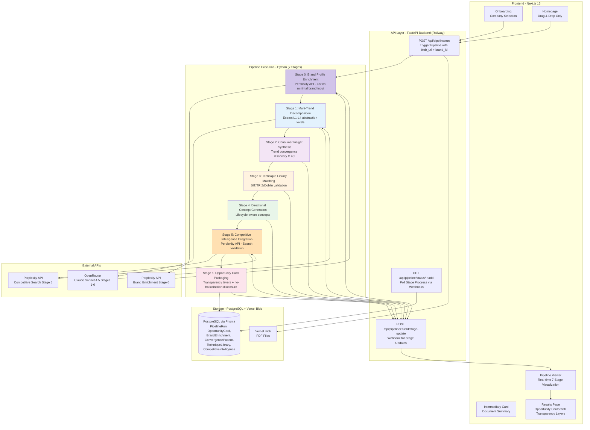

# Innovation Pipeline Web App - Production Architecture

**Version:** 3.0 (7-Stage Pipeline Redesign)
**Last Updated:** November 2025
**Status:** Epic Planning Complete - Ready for Story Breakdown
**Architecture Type:** Brownfield Enhancement - 5-Stage → 7-Stage Pipeline
**Build Time:** 3 weeks (Epic EPIC-001)
**Epic Reference:** `/docs/epics/pipeline-redesign-7-stage.md`

---

## Table of Contents

1. [Introduction](#1-introduction)
2. [Architecture Overview](#2-architecture-overview)
3. [Tech Stack](#3-tech-stack)
4. [User Journey](#4-user-journey)
5. [UI Specifications](#5-ui-specifications)
6. [API Design](#6-api-design)
7. [Pipeline Integration](#7-pipeline-integration)
8. [Deployment](#8-deployment)
9. [Implementation Roadmap](#9-implementation-roadmap)

---

## 1. Introduction

### Purpose

Enhance the existing Python pipeline from **5-stage to 7-stage architecture** to enable:
1. **Multi-trend convergence discovery** - Discover non-obvious connections between 2+ trends
2. **Systematic innovation framework integration** - Validate insights against SIT/TRIZ/Doblin techniques
3. **Lifecycle-aware strategic positioning** - Map opportunities to EMERGING/ACCELERATING/PEAKING phases
4. **Competitive intelligence validation** - Search-based validation with honesty constraints (no hallucinations)

**Key Enhancement:** Transform general trend reports into defensible, high-quality CPG innovation opportunities with full traceability from trend extraction to final opportunity cards.

**Architectural Approach:** Brownfield enhancement maintaining backward compatibility via feature flag (`PIPELINE_VERSION=v1_5stage|v2_7stage`).

### Core Philosophy

**Enhance, Don't Replace**
- Maintain existing REST API endpoints and webhook system
- Database schema changes are additive only (no breaking changes)
- Feature flag enables gradual rollout and instant rollback
- Preserve frontend integration with graceful degradation
- Comprehensive testing at each story boundary

### Key Constraints & Requirements

- ⏱️ **3-week build time** (Epic EPIC-001: 3 stories)
- 🎯 **Performance target**: < 3 minutes end-to-end (vs current < 2 minutes)
- 🔄 **Backward compatibility**: Existing 5-stage pipeline continues to work
- 🧪 **Testing**: Integration tests verify existing functionality after each story
- 📊 **Caching**: Stage 0 (>90%) and Stage 1 (>95%) cache hit rates
- 🔍 **New dependencies**: Perplexity API for Stages 0 and 5
- ✅ **Database**: PostgreSQL with Prisma ORM (existing)
- ✅ **LLM Provider**: OpenRouter (existing)

---

## 2. Architecture Overview

### System Diagram (7-Stage Pipeline)


```mermaid
graph TB
    subgraph "Frontend - Next.js 15"
        A0[Onboarding<br/>Company Selection]
        A[Homepage<br/>Drag & Drop Only]
        A1[Intermediary Card<br/>Document Summary]
        B[Pipeline Viewer<br/>Real-time 7-Stage Visualization]
        C[Results Page<br/>Opportunity Cards with Transparency Layers]
    end

    subgraph "API Layer - FastAPI Backend (Railway)"
        D[POST /api/pipeline/run<br/>Trigger Pipeline with blob_url + brand_id]
        E[GET /api/pipeline/status/:runId<br/>Poll Stage Progress via Webhooks]
        F[POST /api/pipeline/:runId/stage-update<br/>Webhook for Stage Updates]
    end

    subgraph "Pipeline Execution - Python (7 Stages)"
        G0[Stage 0: Brand Profile Enrichment<br/>Perplexity API - Enrich minimal brand input]
        G1[Stage 1: Multi-Trend Decomposition<br/>Extract L1-L4 abstraction levels]
        G2[Stage 2: Consumer Insight Synthesis<br/>Trend convergence discovery C n,2]
        G3[Stage 3: Technique Library Matching<br/>SIT/TRIZ/Doblin validation]
        G4[Stage 4: Directional Concept Generation<br/>Lifecycle-aware concepts]
        G5[Stage 5: Competitive Intelligence Integration<br/>Perplexity API - Search validation]
        G6[Stage 6: Opportunity Card Packaging<br/>Transparency layers + no-hallucination disclosure]
    end

    subgraph "External APIs"
        P1[Perplexity API<br/>Brand Enrichment Stage 0]
        P2[Perplexity API<br/>Competitive Search Stage 5]
        LLM[OpenRouter<br/>Claude Sonnet 4.5 Stages 1-6]
    end

    subgraph "Storage - PostgreSQL + Vercel Blob"
        DB[(PostgreSQL via Prisma<br/>PipelineRun, OpportunityCard,<br/>BrandEnrichment, ConvergencePattern,<br/>TechniqueLibrary, CompetitiveIntelligence)]
        H[Vercel Blob<br/>PDF Files]
    end

    A0 --> D
    A --> D
    D --> G0
    G0 --> P1
    P1 --> G0
    G0 --> G1
    G1 --> LLM
    LLM --> G1
    G1 --> G2
    G2 --> G3
    G3 --> G4
    G4 --> G5
    G5 --> P2
    P2 --> G5
    G5 --> G6
    G6 --> DB

    G0 --> F
    G1 --> F
    G2 --> F
    G3 --> F
    G4 --> F
    G5 --> F
    G6 --> F

    F --> B
    E --> DB
    B --> C

    D --> H

    style G0 fill:#d1c4e9
    style G1 fill:#e3f2fd
    style G2 fill:#f3e5f5
    style G3 fill:#fff3e0
    style G4 fill:#e8f5e9
    style G5 fill:#ffe0b2
    style G6 fill:#fce4ec
```

### Architecture Principles

1. **Brownfield Enhancement Pattern**: Preserve existing system integrity while adding new capabilities
2. **Feature Flag Architecture**: Toggle between 5-stage (v1) and 7-stage (v2) pipelines for gradual rollout
3. **Database-Backed State**: PostgreSQL via Prisma for persistent storage (OpportunityCard, PipelineRun, new models)
4. **Webhook-Based Progress**: Real-time stage updates via webhooks to frontend (POST `/api/pipeline/:runId/stage-update`)
5. **Caching Strategy**: Stage 0 (brand enrichment) and Stage 1 (trend decomposition) cached to reduce redundant API calls
6. **API Integration**: Perplexity API for brand enrichment (Stage 0) and competitive validation (Stage 5)
7. **Backward Compatibility**: Existing REST API endpoints unchanged, database migrations additive only
8. **Traceability**: Full lineage from trend → insight → convergence → technique → concept → opportunity card

---

## 3. Tech Stack

### Complete Technology Matrix

| Category | Technology | Version | Purpose |
|----------|-----------|---------|---------|
| **Frontend Framework** | Next.js | 15.1.8 | React Server Components + App Router |
| **UI Components** | shadcn/ui | latest | Minimal, accessible components |
| **UI Builder** | shadcn/ui MCP | latest | AI-powered component generation |
| **Styling** | Tailwind CSS | 3.4+ | Utility-first CSS |
| **State Management** | React useState | built-in | Local component state |
| **File Upload** | react-dropzone | 14.3+ | Drag & drop PDF upload |
| **Markdown Rendering** | react-markdown | 9.0+ | Display opportunity cards |
| **Markdown Plugins** | remark-gfm, rehype-sanitize | latest | GFM support + XSS protection (Epic 8) |
| **PDF Generation** | @react-pdf/renderer | latest | Download sparks as PDF (Epic 8) |
| **PDF Parsing** | pdf-parse | 1.1.1 | Extract text from PDFs |
| **YAML Parser** | yaml | 2.3.4 | Load brand profiles |
| **API Client** | Native fetch | built-in | Server/client data fetching |
| **Validation** | Zod | 3.22+ | API response validation (Epic 8) |
| **Database ORM** | Prisma | 5.8+ | PostgreSQL integration (Epic 8) |
| **Database** | PostgreSQL | latest | Production data storage (Epic 8) |
| **Backend Runtime** | Python | 3.11+ | Pipeline execution environment |
| **Backend Framework** | FastAPI | latest | REST API endpoints on Railway |
| **Pipeline Framework** | LangChain | 0.1.0+ | LLM orchestration framework |
| **LLM Provider** | OpenRouter | latest | Claude Sonnet 4.5 for Stages 1-6 |
| **Search API** | Perplexity API | latest | **NEW** - Stage 0 (brand) + Stage 5 (competitive) |
| **Caching** | Redis/In-Memory | latest | **NEW** - Stage 0 and Stage 1 output caching |
| **File Storage** | Vercel Blob | 0.23+ | PDF storage with public URLs |
| **Deployment (Frontend)** | Vercel | latest | Next.js deployment |
| **Deployment (Backend)** | Railway | latest | Python FastAPI deployment (Epic 8) |
| **Environment** | Node.js | 20+ | API routes runtime |

### Why This Stack?

- ✅ **Next.js 15**: React Server Components reduce client bundle size
- ✅ **shadcn/ui MCP**: Generate components via MCP tool (`mcp__magic__21st_magic_component_builder`)
- ✅ **Vercel Blob**: Simple API for file storage without S3 complexity
- ✅ **Prisma + PostgreSQL**: Type-safe database access, replaced file-based storage (Epic 8)
- ✅ **Zod**: Runtime validation ensures type safety for API responses (Epic 8)
- ✅ **Railway**: Scalable Python backend deployment with webhook support (Epic 8)
- ✅ **@react-pdf/renderer**: Server-side PDF generation without external dependencies (Epic 8)
- ✅ **React Dropzone**: Proven drag & drop library
- ✅ **Existing Python Pipeline**: Zero refactoring needed

---

## 3.1 7-Stage Pipeline Architecture Details

### Pipeline Transformation: 5-Stage → 7-Stage

**Legacy Pipeline (v1):**
1. Input Processing → 2. Signal Amplification → 3. General Translation → 4. Brand Contextualization → 5. Opportunity Generation

**Enhanced Pipeline (v2):**
0. Brand Profile Enrichment → 1. Multi-Trend Decomposition → 2. Consumer Insight Synthesis → 3. Technique Library Matching → 4. Directional Concept Generation → 5. Competitive Intelligence Integration → 6. Opportunity Card Packaging

### Stage-by-Stage Breakdown

#### Stage 0: Brand Profile Enrichment (NEW)
**Purpose:** Enrich minimal brand input (4 fields: company name, industry, geography, product portfolio) into comprehensive brand context using Perplexity API search.

**Input:**
- Minimal brand profile YAML (4 required fields)

**Processing:**
- Search queries via Perplexity API for market context, competitors, category trends, distribution channels
- Confidence scoring for enriched data
- Cache enriched profiles for reuse (>90% hit rate target)

**Output:**
- Enriched brand context with confidence scores
- Database: `BrandEnrichment` table

**Caching:** Redis/In-memory cache with brand_id as key

---

#### Stage 1: Multi-Trend Decomposition (REFACTORED)
**Purpose:** Extract 3-6 trends from WGSN report with L1-L4 abstraction levels for cross-domain transfer.

**Input:**
- WGSN PDF text (from Vercel Blob)

**Processing:**
- LLM extraction of trends with lifecycle stage (EMERGING/ACCELERATING/PEAKING)
- L1 (Concrete Example) → L2 (Product Category) → L3 (Innovation Archetype) → L4 (Human Need)
- Brand-agnostic output for reuse across brands

**Output:**
- JSON array of trend objects with L1-L4 abstraction levels
- Database: `TrendObject` table (updated schema)

**Caching:** Redis/In-memory cache with report hash as key (>95% hit rate target)

---

#### Stage 2: Consumer Insight Synthesis (MAJOR REFACTOR)
**Purpose:** Discover trend convergence patterns via C(n,2) enumeration and generate brand-specific consumer insights combining 2+ trends.

**Input:**
- Stage 1 trend objects (L1-L4)
- Stage 0 enriched brand context

**Processing:**
- Enumerate all possible trend pairs: C(n,2) combinations
- LLM synthesis to discover non-obvious convergences
- Generate consumer insights with functional + emotional + social needs
- Lifecycle strategy mapping (EMERGING: experimental, PEAKING: fast-follower)

**Output:**
- Convergence patterns with traceability to source trends
- Brand-specific consumer insights
- Database: `ConvergencePattern` table

**Success Metric:** Convergence discovery rate > 50% (non-obvious connections)

---

#### Stage 3: Technique Library Matching (NEW)
**Purpose:** Validate consumer insights against systematic innovation frameworks (SIT/TRIZ/Doblin) and assess defensibility.

**Input:**
- Stage 2 consumer insights
- Technique libraries (SIT: 5, TRIZ: 10, Doblin: 10 with CPG examples)

**Processing:**
- Multi-framework validation logic
- Pattern matching insights to appropriate techniques
- Defensibility assessment (LOW/MEDIUM/HIGH)
- Reasoning chains for technique selection

**Output:**
- Matched techniques with justification
- Defensibility score
- Database: `TechniqueLibrary` table (seeded data)

**Technique Libraries:**
- **SIT (5 techniques):** Subtraction, Task Unification, Multiplication, Attribute Dependency, Division
- **TRIZ (10 principles):** Segmentation, Taking Out, Local Quality, Asymmetry, Merging, Universality, Nested Doll, Anti-Weight, Preliminary Anti-Action, Preliminary Action
- **Doblin (10 types):** Profit Model, Network, Structure, Process, Product Performance, Product System, Service, Channel, Brand, Customer Engagement

---

#### Stage 4: Directional Concept Generation (REFACTORED)
**Purpose:** Generate lifecycle-aware directional concepts combining validated insight + technique + brand context.

**Input:**
- Stage 3 validated techniques
- Stage 2 consumer insights
- Stage 0 enriched brand context

**Processing:**
- Narrative framework construction (Problem/Solution/Payoff/Proof)
- Lifecycle-aware concept formulation (experimental vs fast-follower)
- Integration of technique application with brand assets

**Output:**
- Directional concept with narrative structure
- **STOPS HERE:** No financial projections, no business plans, no validation steps

**No-Hallucination Boundary:** Concepts are directional ideas, not validated business cases

---

#### Stage 5: Competitive Intelligence Integration (NEW)
**Purpose:** Search-based competitive validation with honesty constraints (no hallucinated statistics).

**Input:**
- Stage 4 directional concepts

**Processing:**
- 3 search queries per concept via Perplexity API:
  1. Direct competitors implementing similar concepts
  2. Analogous industries with similar patterns
  3. Competitive landscape assessment
- Honesty constraints: "No evidence found" vs "Zero competition" (never claim zero without proof)

**Output:**
- Competitive intelligence with search result citations
- Database: `CompetitiveIntelligence` table

**Success Metric:** Competitive validation accuracy > 90% (no false "zero competition" claims)

---

#### Stage 6: Opportunity Card Packaging (UPDATED)
**Purpose:** Package validated concepts into retail-ready opportunity cards with transparency layers and no-hallucination disclosure.

**Input:**
- Stage 4 directional concepts
- Stage 5 competitive intelligence
- Full traceability chain (trends → insights → convergences → techniques → concepts)

**Processing:**
- Markdown card generation with updated template
- Transparency layers:
  - What we know (from documents)
  - What we inferred (LLM reasoning)
  - What we validated (search results)
  - What we don't know (gaps)
- No-hallucination disclosure section

**Output:**
- 3-5 opportunity cards in markdown format
- Database: `OpportunityCard` table (updated schema)

**Card Format:**
```markdown
# Opportunity: [Title]

## Consumer Insight
[Stage 2 insight]

## Innovation Technique
[Stage 3 technique with SIT/TRIZ/Doblin reference]

## Directional Concept
[Stage 4 narrative: Problem/Solution/Payoff/Proof]

## Competitive Context
[Stage 5 search results with citations]

## Transparency
**What we know:** [Citations from documents]
**What we inferred:** [LLM reasoning chains]
**What we validated:** [Search results]
**What we don't know:** [Gaps and uncertainties]

## Traceability
**Source Trends:** [Stage 1 trends with L1-L4]
**Convergence Pattern:** [Stage 2 combination]
**Technique Applied:** [Stage 3 SIT/TRIZ/Doblin]
```

---

### Feature Flag Implementation

**Environment Variable:** `PIPELINE_VERSION=v1_5stage|v2_7stage`

**Default:** `v1_5stage` (safe rollback to legacy pipeline)

**Location:** `/backend/app/pipeline_runner.py`

**Behavior:**
```python
# backend/app/pipeline_runner.py
PIPELINE_VERSION = os.getenv("PIPELINE_VERSION", "v1_5stage")

if PIPELINE_VERSION == "v2_7stage":
    # Execute 7-stage pipeline (Stages 0-6)
    from pipeline.stages import stage0_brand_enrichment
    # ... stages 0-6
else:
    # Execute legacy 5-stage pipeline (Stages 1-5)
    from pipeline.stages import stage1_input_processing
    # ... stages 1-5
```

**Rollback Strategy:** Set `PIPELINE_VERSION=v1_5stage` in Railway environment variables for instant rollback

---

## 3.2 Project Directory Structure

```
innovation-web/
├── app/
│   ├── api/
│   │   ├── analyze-document/
│   │   │   └── route.ts          # LLM document analysis
│   │   ├── onboarding/
│   │   │   ├── current-company/
│   │   │   │   └── route.ts      # Get current company from cookie
│   │   │   └── set-company/
│   │   │       └── route.ts      # Set company cookie
│   │   ├── pipeline/             # Epic 8 - Story 8.0
│   │   │   └── [runId]/
│   │   │       ├── complete/
│   │   │       │   └── route.ts  # Save opportunity cards webhook
│   │   │       ├── download/
│   │   │       │   ├── all/
│   │   │       │   │   └── route.ts  # Download all sparks PDF
│   │   │       │   └── spark/
│   │   │       │       └── [sparkId]/
│   │   │       │           └── route.ts  # Download single spark PDF
│   │   │       ├── stage-update/
│   │   │       │   └── route.ts  # Stage progress webhook
│   │   │       └── status/
│   │   │           └── route.ts  # Poll pipeline status
│   │   ├── run/
│   │   │   └── route.ts          # Execute pipeline
│   │   ├── status/
│   │   │   └── [runId]/
│   │   │       └── route.ts      # Poll pipeline status (deprecated)
│   │   └── upload/
│   │       └── route.ts          # Upload to Vercel Blob
│   ├── analyze/
│   │   └── [uploadId]/
│   │       └── page.tsx          # Intermediary card page
│   ├── onboarding/
│   │   └── page.tsx              # Company selection
│   ├── pipeline/
│   │   └── [runId]/
│   │       └── page.tsx          # Pipeline viewer
│   ├── results/
│   │   └── [runId]/
│   │       └── page.tsx          # Results display
│   ├── layout.tsx                # Root layout
│   └── page.tsx                  # Homepage (upload)
├── components/
│   ├── animations/               # Epic 8 - Story 8.6
│   │   ├── FadeTransition.tsx
│   │   ├── SlideUpTransition.tsx
│   │   ├── ColorPulse.tsx
│   │   └── StateAnnouncer.tsx
│   ├── error/                    # Epic 8 - Story 8.9
│   │   ├── ErrorBanner.tsx
│   │   ├── ErrorPlaceholder.tsx
│   │   ├── EmptyState.tsx
│   │   └── RetryButton.tsx
│   ├── pipeline/                 # Epic 8 - Stories 8.1-8.5
│   │   ├── PipelineStateMachine.tsx      # State orchestrator (8.1)
│   │   ├── ExtractionAnimation.tsx       # State 1 (8.2)
│   │   ├── WorkflowIllustration.tsx      # State 1 (8.2)
│   │   ├── BOIBadge.tsx                  # State 2-3 (8.2)
│   │   ├── ThreeColumnLayout.tsx         # State 2 (8.3)
│   │   ├── SignalsColumn.tsx             # State 2 (8.3)
│   │   ├── TransferableInsightsColumn.tsx # State 2 (8.3)
│   │   ├── SparksPreviewColumn.tsx       # State 2 (8.3)
│   │   ├── IconNavigation.tsx            # State 3-4 (8.4)
│   │   ├── SparksGrid.tsx                # State 3 (8.4)
│   │   ├── SparkCard.tsx                 # State 3 (8.4)
│   │   ├── ActionBar.tsx                 # State 3 (8.4)
│   │   ├── CollapsedSidebar.tsx          # State 4 (8.5)
│   │   ├── ExpandedSparkDetail.tsx       # State 4 (8.5)
│   │   └── LoadingSkeletons.tsx          # All states
│   ├── ui/                       # shadcn/ui components
│   │   ├── badge.tsx
│   │   ├── button.tsx
│   │   ├── card.tsx
│   │   ├── select.tsx
│   │   └── skeleton.tsx
│   ├── CompanyBadge.tsx          # Display company name
│   ├── FileUploadZone.tsx        # Drag & drop upload
│   ├── InspirationTrack.tsx      # Stage 1 inspiration card
│   ├── LeftSidebar.tsx           # Collapsible home menu
│   └── StageBox.tsx              # Stages 2-5 status box
├── hooks/                        # Epic 8 - Story 8.6
│   ├── useReducedMotion.ts
│   ├── useWillChange.ts
│   └── usePipelinePolling.ts
├── lib/
│   ├── schemas.ts                # Zod validation (Story 8.9)
│   ├── errorMessages.ts          # User-friendly error copy (Story 8.9)
│   ├── logger.ts                 # Frontend error logging (Story 8.9)
│   ├── transitions.ts            # Animation config (Story 8.6)
│   └── utils.ts                  # Utility functions
├── types/
│   ├── pipeline.ts               # Pipeline types (Epic 8)
│   └── spark.ts                  # Spark/OpportunityCard types (Epic 8)
├── public/
│   └── images/                   # Static images
├── .env.local                    # Environment variables
├── .env.example                  # Environment template
├── next.config.js
├── package.json
├── tailwind.config.ts
└── tsconfig.json

# Backend - Python Pipeline (7-Stage Architecture)
backend/
├── app/
│   ├── main.py                   # FastAPI app entry point
│   ├── routes.py                 # REST API endpoints
│   ├── models.py                 # Prisma database models (updated)
│   ├── pipeline_runner.py        # Pipeline orchestrator with feature flag
│   └── pipeline_errors.py        # Custom exceptions
├── pipeline/
│   ├── stages/
│   │   ├── stage0_brand_enrichment.py          # NEW - Perplexity API integration
│   │   ├── stage1_trend_decomposition.py       # REFACTORED - L1-L4 abstraction
│   │   ├── stage2_insight_synthesis.py         # MAJOR REFACTOR - Convergence discovery
│   │   ├── stage3_technique_matching.py        # NEW - SIT/TRIZ/Doblin validation
│   │   ├── stage4_concept_generation.py        # REFACTORED - Narrative framework
│   │   ├── stage5_competitive_intel.py         # NEW - Search-based validation
│   │   └── stage6_opportunity_packaging.py     # UPDATED - Transparency layers
│   ├── prompts/
│   │   ├── stage0_prompt.py
│   │   ├── stage1_prompt.py
│   │   ├── stage2_prompt.py
│   │   ├── stage3_prompt.py
│   │   ├── stage4_prompt.py
│   │   ├── stage5_prompt.py
│   │   └── stage6_prompt.py
│   ├── technique_libraries/      # NEW - Seeded data files
│   │   ├── sit_techniques.yaml   # 5 SIT techniques with CPG examples
│   │   ├── triz_principles.yaml  # 10 TRIZ principles with CPG examples
│   │   └── doblin_types.yaml     # 10 Doblin types with CPG examples
│   ├── utils.py
│   └── chains.py
├── tests/
│   ├── test_pipeline_runner.py
│   ├── test_stage0_brand_enrichment.py          # NEW
│   ├── test_stage1_trend_decomposition.py       # UPDATED
│   ├── test_stage2_insight_synthesis.py         # UPDATED
│   ├── test_stage3_technique_matching.py        # NEW
│   ├── test_stage4_concept_generation.py        # UPDATED
│   ├── test_stage5_competitive_intel.py         # NEW
│   └── test_stage6_opportunity_packaging.py     # UPDATED
├── prisma/
│   └── schema.prisma             # Database schema (additive changes)
└── requirements.txt              # Python dependencies (Perplexity SDK added)

data/
├── brand-profiles/               # YAML files (unchanged)
├── brand-research/               # Markdown files (unchanged)
└── test-outputs/                 # Pipeline outputs
    └── {run_id}/
        ├── logs/
        │   └── pipeline.log
        ├── stage0/
        │   └── brand_enrichment.json
        ├── stage1/
        │   └── trends_l1_l4.json
        ├── stage2/
        │   └── convergence_patterns.json
        ├── stage3/
        │   └── matched_techniques.json
        ├── stage4/
        │   └── directional_concepts.json
        ├── stage5/
        │   └── competitive_intel.json
        └── stage6/
            ├── opportunity-1.md
            ├── opportunity-2.md
            ├── opportunity-3.md
            ├── opportunity-4.md
            └── opportunity-5.md
```

---

## 4. User Journey

### Flow Diagram

```
┌─────────────────────────────────────────────────────────────────┐
│ ONBOARDING: Company Selection (Team-Led)                        │
│ - Team member selects target company from dropdown              │
│ - System loads brand profile from YAML files                    │
│   (/data/brand-profiles/{company-id}.yaml)                      │
│ - Company context saved to session/cookie                       │
│ - User redirected to landing page                               │
└─────────────────────────────────────────────────────────────────┘
                            ↓
┌─────────────────────────────────────────────────────────────────┐
│ LANDING PAGE: My Board of Ideators                              │
│ - Clean visual design with "My Board of Ideators" heading       │
│ - Circular pattern of colored circles                           │
│ - Central search/input bar for file upload or search            │
│ - Top navigation: Everything | Spaces | Serendipity             │
│ - User can upload file or browse existing boards                │
└─────────────────────────────────────────────────────────────────┘
                            ↓
┌─────────────────────────────────────────────────────────────────┐
│ HOMEPAGE: Upload Only (Brand Pre-Selected)                      │
│ - Display selected company name at top (e.g. "Lactalis Canada") │
│ - Drag & drop PDF (trend report)                                │
│ - File uploads to Vercel Blob                                   │
│ - Redirect to intermediary card page                            │
└─────────────────────────────────────────────────────────────────┘
                            ↓
┌─────────────────────────────────────────────────────────────────┐
│ INTERMEDIARY CARD: Document Analysis (LLM-Powered)              │
│ - Extract PDF text content                                      │
│ - LLM analyzes document to generate:                            │
│   • Concise summary (2-3 sentences)                             │
│   • Industry identification                                     │
│   • Source attribution                                          │
│   • Theme/topic categorization                                  │
│ - Display in card format matching design reference              │
│ - Show "Launch" button to start pipeline                        │
└─────────────────────────────────────────────────────────────────┘
                            ↓
┌─────────────────────────────────────────────────────────────────┐
│ PIPELINE VIEWER: Real-time Execution (Epic 8 - 4 UI States)    │
│                                                                  │
│ STATE 1: Stage 1 Running (Extraction Animation)                 │
│ ┌─────────────────────┐  ┌─────────────────────┐               │
│ │ Left: Extraction    │  │ Right: Workflow     │               │
│ │ Animation           │  │ Illustration        │               │
│ │ (Beaker/Flask)      │  │ (5 stage flow)      │               │
│ └─────────────────────┘  └─────────────────────┘               │
│                                                                  │
│ STATE 2: Stage 1 Complete + Stages 2-5 Running                  │
│ ┌──────────────────────────────────────────────────────────────┐│
│ │ 3-Column Layout (Real-time Transformation Visualization)     ││
│ │ ┌─────────┐  ┌──────────────┐  ┌─────────────┐              ││
│ │ │ Signals │→ │ Transferable │→ │ Sparks      │              ││
│ │ │ Column  │  │ Insights Col │  │ Preview Col │              ││
│ │ │         │  │              │  │             │              ││
│ │ │ (Stage2)│  │   (Stage3)   │  │ (Stage4-5)  │              ││
│ │ └─────────┘  └──────────────┘  └─────────────┘              ││
│ │ "My Board of Ideators" Badge (BOI Branding)                  ││
│ └──────────────────────────────────────────────────────────────┘│
│                                                                  │
│ STATE 3: All Complete - Sparks Grid                             │
│ ┌──────────────────────────────────────────────────────────────┐│
│ │ Top Bar: [Download All] [New Pipeline] [Icons: S|I|Sp]      ││
│ │                                                               ││
│ │ 2-Column Grid of Spark Cards:                                ││
│ │ ┌────────────┐  ┌────────────┐                              ││
│ │ │ Spark #1   │  │ Spark #2   │  <- Numbered Overlays        ││
│ │ │ Title+Hero │  │ Title+Hero │                              ││
│ │ └────────────┘  └────────────┘                              ││
│ │ ┌────────────┐  ┌────────────┐                              ││
│ │ │ Spark #3   │  │ Spark #4   │                              ││
│ │ └────────────┘  └────────────┘                              ││
│ │ ┌────────────┐                                               ││
│ │ │ Spark #5   │                                               ││
│ │ └────────────┘                                               ││
│ └──────────────────────────────────────────────────────────────┘│
│                                                                  │
│ STATE 4: Card Detail View                                       │
│ ┌──────────────────────────────────────────────────────────────┐│
│ │ ┌────────┐ ┌──────────────────────────────────────────────┐ ││
│ │ │Sidebar │ │ Expanded Spark Detail                        │ ││
│ │ │120px   │ │ - Full markdown content                      │ ││
│ │ │        │ │ - Hero image                                 │ ││
│ │ │Thumb 1 │ │ - Rich typography                            │ ││
│ │ │Thumb 2 │ │ - Code blocks, tables, lists                 │ ││
│ │ │Thumb 3 │ │ - Sanitized HTML (rehype-sanitize)           │ ││
│ │ │Thumb 4 │ │                                              │ ││
│ │ │Thumb 5 │ │ [Back to Grid] button                        │ ││
│ │ └────────┘ └──────────────────────────────────────────────┘ ││
│ └──────────────────────────────────────────────────────────────┘│
└─────────────────────────────────────────────────────────────────┘

**State Transitions (Story 8.6):**
- State 1 → 2: 600ms fade
- State 2 → 3: 800ms slide-up with stagger
- State 3 ↔ 4: 400ms sidebar collapse/expand
- GPU-accelerated (transform + opacity only)
- Respects prefers-reduced-motion
```

### Detailed Steps

#### Step 0: Onboarding/Landing - Company Selection via Visual Interface (30 seconds, Team-Led)
1. Team member navigates to `/` (root - landing page/onboarding combined)
2. Sees "My Board of Ideators" page matching `docs/image/Landing-page.png` design
3. **Central input bar** displays placeholder: "Enter company name (Lactalis, Columbia, Decathlon, McCormick)"
4. User types company name into central search bar
5. System validates company name against available profiles
6. On valid entry, loads brand profile from `/data/brand-profiles/{company-id}.yaml`
7. Company ID saved to cookie/session storage
8. Redirect to upload page (`/upload`) with company context pre-loaded

**Why This Design?**
- **Clean, minimalist interface** - No dropdown clutter
- **Direct text input** - Faster than selecting from dropdown
- **Visual brand experience** - Colored circles create welcoming aesthetic
- **Team-controlled** - Company name is known, direct entry
- **Scalable** - Easy to add more companies without UI changes

**Design Elements:**
- **Title:** "My Board of Ideators" with "My" in teal italics
- **8 Colored Circles:** Arranged in circular pattern (teal, blue, yellow, orange)
- **Central Input Bar:** White rectangular input with company name placeholder
- **Top Navigation:** "Everything" | "Spaces" | "Serendipity" (visual only)
- **Background:** Light gray/off-white with subtle texture

#### Step 1: Homepage - Upload Only (1-2 minutes)
1. User lands on homepage matching `docs/image/main-page.png` design
2. **Company name displayed at top** (e.g. "Lactalis Canada")
3. **"My Board of Ideators"** title with brand styling
4. **Upload sources** card with drag & drop zone
5. User drags PDF trend report → file uploads to Vercel Blob
6. **No brand selector visible** (already selected in onboarding)
7. After successful upload → redirect to `/analyze/[uploadId]`

#### Step 2: Intermediary Card - Document Analysis (30-60 seconds)
1. Display loading state: "Analyzing document..."
2. Backend calls LLM to extract:
   - **Summary:** 2-3 sentence concise description of document content
   - **Industry:** Primary industry/sector identified (e.g. "fashion", "food & beverage", "sports")
   - **Source:** Document source if identifiable (e.g. "trendwatching.com")
   - **Theme:** Main topic or category (e.g. "marketing strategies", "sustainability")
   - **Latent Factors:** 1-3 innovation mechanisms (mechanism type, title, constraint eliminated)
3. Display extracted information in card format matching `docs/image/intermediary-card.png`:
   - Hero image placeholder
   - Title (generated from summary)
   - Source badges (e.g. "trendwatching.com", "8 others")
   - Industry badge (orange pill)
   - Theme badge (red pill)
   - Summary text
   - **Innovation Mechanisms section** (💡 icon, mechanism type badges, titles, constraints)
4. Show "Launch" button at bottom
5. Click "Launch" → POST to `/api/run` → redirect to `/pipeline/[runId]`

#### Step 3: Pipeline Execution (15-30 minutes)
**Stage 1: Special UI (2 Inspiration Tracks)**
- Displays 2 side-by-side cards
- Each card shows inspiration title + loading animation
- When complete: Shows extracted inspiration text (~2-3 paragraphs each)

**Stages 2-5: Minimal Box UI**
- Each stage = single box with:
  - Stage number + name
  - Status: "Running..." → "Complete ✓"
  - High-level description (1 sentence)
- No detailed output shown until complete

**Progress Polling:**
- Frontend polls `/api/status/:runId` every 5 seconds
- Updates stage status based on log file parsing
- Shows completion checkmarks as stages finish

#### Step 3: Results Display (2-3 minutes)
- All stages complete → shows 5 opportunity cards
- Each card rendered from markdown (frontmatter + content)
- "Download All" button exports as PDF
- "New Pipeline" button returns to homepage

---

## 5. UI Specifications

### 5.0 Onboarding/Landing Page - Company Selection

**Reference:** `docs/image/Landing-page.png`

**Purpose:** Combined onboarding and landing page where users enter company name to access their board

**Layout:**
```
┌──────────────────────────────────────────────────────────────┐
│                                    [Everything] [Spaces] [Serendipity]
│                                                               │
│                  ●  (teal)                                   │
│                                                               │
│         ●  (blue)                      ●  (yellow)           │
│                                                               │
│                                                               │
│    ●  (orange)     My Board of Ideators    ●  (orange)       │
│                                                               │
│                  ┌────────────────────────────────────┐      │
│                  │  Lactalis, Columbia, Decathlon...  │      │
│                  │  (Type company name)               │      │
│                  └────────────────────────────────────┘      │
│                                                               │
│         ●  (yellow)                    ●  (blue)             │
│                                                               │
│                  ●  (teal)                                   │
│                                                               │
└──────────────────────────────────────────────────────────────┘
```

**Visual Elements:**
- **Title:** "My Board of Ideators" with "My" in teal/green italics
- **Colored Circles:** 8 circles in circular arrangement (teal, blue, yellow, orange)
- **Central Input:** White rectangular text input with placeholder text
  - Placeholder: "Lactalis, Columbia, Decathlon, McCormick..."
  - On focus: Placeholder text fades
- **Top Navigation:** Three tabs aligned to right (Everything, Spaces, Serendipity)
- **Background:** Light gray/off-white with subtle texture

**Interactions:**
- **Type company name** → Validates against available companies
- **Press Enter or blur** → If valid, loads company profile and redirects to `/upload`
- **Invalid company** → Show error message below input
- **Hover over circles** → Optional: Slight scale/glow effect
- **Navigation tabs** → Visual only (Phase 1)

**Validation Logic:**
- Accepts: "Lactalis", "Columbia", "Decathlon", "McCormick" (case-insensitive)
- Maps to: `lactalis-canada`, `columbia-sportswear`, `decathlon`, `mccormick-usa`
- Loads corresponding YAML from `/data/brand-profiles/{company-id}.yaml`

**shadcn/ui Components Used:**
- `Tabs` - Top navigation
- `Input` - Central company name input
- Custom SVG circles or div elements for colored dots

---

### 5.1 Homepage Design

**Reference:** `docs/image/main-page.png`

**Layout:**
```
┌──────────────────────────────────────────────────────────────┐
│              Company: Lactalis Canada 🏢                      │
│                 (top-right corner, subtle)                    │
│                                                               │
│                   My Board of Ideators                        │
│                   (centered, large heading)                   │
│                                                               │
│   ┌───────────────────────────────────────────────────────┐  │
│   │              📤 Upload sources                         │  │
│   │                                                        │  │
│   │      Drag & drop or choose file to upload             │  │
│   │                                                        │  │
│   │   Supported file types: PDF, .txt, Markdown, Audio    │  │
│   │   Trend Report, Article, etc.                         │  │
│   │                                                        │  │
│   │   ┌──────────────┐  ┌──────────────┐                 │  │
│   │   │  🔗 Link     │  │  📋 Paste    │                 │  │
│   │   │  Website     │  │  Copied text │                 │  │
│   │   │  YouTube     │  │              │                 │  │
│   │   └──────────────┘  └──────────────┘                 │  │
│   └───────────────────────────────────────────────────────┘  │
│                                                               │
│            or Select a Starting Point                         │
│                                                               │
│   ┌──────────────┐  ┌──────────────┐  ┌──────────────┐     │
│   │ Food & Bev   │  │ Food & Bev   │  │ Food & Bev   │     │
│   │ Sept 2025    │  │ Sept 2025    │  │ Sept 2025    │     │
│   │ SERENDIPITY  │  │ SERENDIPITY  │  │ SERENDIPITY  │     │
│   │ SEEKERS      │  │ SEEKERS      │  │ SEEKERS      │     │
│   └──────────────┘  └──────────────┘  └──────────────┘     │
└──────────────────────────────────────────────────────────────┘
```

**After File Upload:**
```
┌──────────────────────────────────────────────────────────────┐
│              Company: Lactalis Canada 🏢                      │
│                                                               │
│   ✓ File uploaded: sustainable-packaging-2025.pdf             │
│                                                               │
│   [Generate Opportunities →]                                  │
│   (no brand selector - already set in onboarding)            │
└──────────────────────────────────────────────────────────────┘
```

**shadcn/ui Components Used:**
- `Card` - Upload container
- `Button` - Primary CTA
- `Badge` - File upload status + Company indicator
- Custom drag & drop zone (react-dropzone)

**Key Changes from Original Design:**
- ✅ No brand selector on homepage (moved to onboarding)
- ✅ Company name displayed at top-right corner
- ✅ Cleaner presentation for client demos

---

### 5.2 Left Sidebar - Collapsible Home Menu

**Hover Behavior:**
- Cursor moves to left edge → sidebar slides in (300ms transition)
- Shows minimal menu with home navigation

**Layout:**
```
┌─────────────────┐
│                 │
│   🏠 Home       │
│                 │
│                 │
└─────────────────┘
```

**Implementation:**
- Click "Home" → navigate to `/` (homepage)
- Collapsed by default (only visible on hover at left edge)
- Allows user to return to upload page from any view

---

### 5.3 Intermediary Card - Document Analysis Page with Track Division

**Reference:** `docs/image/intermediary-card.png` and `docs/image/track-division.png`

**Purpose:** Display LLM-extracted document summary with ideation track selection before launching pipeline

**Layout:**
```
┌─────────────────────────────────────────────────────────────────────────────┐
│                          My Board of Ideators                               │
│                                                                              │
│  Left: Document Summary                 Right: Ideation Tracks              │
│  ┌─────────────────────────────┐       ┌──────────────────────────┐        │
│  │                              │       │ Track 1: ✓ (Selected)   │        │
│  │  [Hero Image Placeholder]   │       │ [Track Icon]             │        │
│  │                              │       │ Summary of this track.   │        │
│  │  Ad-generating QR codes...  │       │ Summary of this track.   │        │
│  │                              │       │ Summary of this track.   │        │
│  │  Source: [trendwatching.com]│       └──────────────────────────┘        │
│  │  Industry: [fashion]         │       ┌──────────────────────────┐        │
│  │  Theme: [marketing]          │       │ Track 2: ✓ (Selected)   │        │
│  │                              │       │ [Track Icon]             │        │
│  │  Most people only wear...   │       │ Summary of this track.   │        │
│  │                              │       │ Summary of this track.   │        │
│  │          • • •               │       └──────────────────────────┘        │
│  └─────────────────────────────┘                                            │
│                                                                              │
│                              [Launch]                                        │
│                    (Start pipeline with top 2 tracks)                       │
└─────────────────────────────────────────────────────────────────────────────┘
```

**Data Flow:**
1. After file upload, call `/api/analyze-document` with blob URL
2. LLM extracts structured data from document AND identifies 2 key ideation tracks
3. Display document card (left) + track division showing 2 tracks (right)
4. Both tracks displayed as selected (matching `track-division.png` UI)
5. User reviews and clicks "Launch"
6. Navigate to horizontal pipeline viewer with selected tracks

---

### 5.4 Pipeline Viewer - Horizontal Flow Layout

**Reference:** `docs/image/track-division.png` for track UI at Stage 1

**Horizontal Pipeline Layout:**

```
┌────────────────────────────────────────────────────────────────────────────┐
│  ◀ Back                  Innovation Pipeline             Company: Lactalis  │
├────────────────────────────────────────────────────────────────────────────┤
│                                                                             │
│  ┌──────────┐    ┌──────────┐    ┌──────────┐    ┌──────────┐    ┌───────┐
│  │ Stage 1  │ →  │ Stage 2  │ →  │ Stage 3  │ →  │ Stage 4  │ →  │Stage 5│
│  │ Tracks   │    │ Signals  │    │ Lessons  │    │ Context  │    │Opport.│
│  │   ✓      │    │   ⏳     │    │   ⌛     │    │   ⌛     │    │  ⌛   │
│  └──────────┘    └──────────┘    └──────────┘    └──────────┘    └───────┘
│                                                                             │
│  ┌──────────────────────────────────────────────────────────────────────┐  │
│  │ Current Stage: Stage 2 - Signal Amplification                        │  │
│  │                                                                       │  │
│  │ Extracting broader trends from selected inspiration tracks...        │  │
│  │                                                                       │  │
│  │ Progress: ████████████░░░░░ 75%        Est. time: 2 min remaining   │  │
│  └──────────────────────────────────────────────────────────────────────┘  │
│                                                                             │
│  Stage 1 Output (Completed):                                               │
│  ┌─────────────────────────────┐  ┌─────────────────────────────┐         │
│  │ Track 1 (Selected) ✓        │  │ Track 2 (Selected) ✓        │         │
│  │ [Track Icon/Image]          │  │ [Track Icon/Image]          │         │
│  │ Experience Theater          │  │ Community Building          │         │
│  │ Summary of this track...    │  │ Summary of this track...    │         │
│  └─────────────────────────────┘  └─────────────────────────────┘         │
└────────────────────────────────────────────────────────────────────────────┘
```

**Layout Features:**
1. **Horizontal Stage Row:** All 5 stages displayed in single horizontal row at top
2. **Active Stage Panel:** Below stages, shows current stage details and progress
3. **Completed Output:** Previous stage outputs shown below (e.g., Stage 1 tracks)
4. **Flow Direction:** Left to right with arrow indicators between stages
5. **Track Division:** Stage 1 displays the 2 selected tracks matching `track-division.png` UI

**shadcn/ui Components:**
- `Card` - Stage boxes and track containers
- `Progress` - Progress bars for current stage
- `Badge` - Status indicators (✓, ⏳, ⌛)
- `Separator` - Between stages

---

### 5.5 Pipeline Viewer - Stages 2-5 (Horizontal Progress)

**Horizontal Stage Indicators:**

Each stage in the horizontal row shows:
- Stage number (1-5)
- Short name
- Status icon

**Current Stage Detail Panel:**

```
┌──────────────────────────────────────────────────────────────┐
│ Stage 2: Signal Amplification                                 │
│                                                               │
│ Extracting broader trends from inspiration patterns          │
│                                                               │
│ ⏳ Running... (estimated 4-6 minutes)                         │
└──────────────────────────────────────────────────────────────┘

┌──────────────────────────────────────────────────────────────┐
│ Stage 3: Universal Translation                                │
│                                                               │
│ Converting insights into brand-agnostic lessons               │
│                                                               │
│ ⌛ Pending                                                    │
└──────────────────────────────────────────────────────────────┘

┌──────────────────────────────────────────────────────────────┐
│ Stage 4: Brand Contextualization                              │
│                                                               │
│ Applying lessons to Lactalis Canada                          │
│                                                               │
│ ⌛ Pending                                                    │
└──────────────────────────────────────────────────────────────┘

┌──────────────────────────────────────────────────────────────┐
│ Stage 5: Opportunity Generation                               │
│                                                               │
│ Creating 5 actionable innovation opportunities                │
│                                                               │
│ ⌛ Pending                                                    │
└──────────────────────────────────────────────────────────────┘
```

**Status Icons:**
- ⌛ Pending (gray)
- ⏳ Running... (blue, animated spinner)
- ✓ Complete (green checkmark)

**When Complete:**
- Box turns green background
- Shows completion time: "Completed in 4m 23s"
- Next stage automatically starts

---

### 5.6 Results Page

**5 Opportunity Cards:**

```
┌──────────────────────────────────────────────────────────────┐
│ ✓ Pipeline Complete - 5 Opportunities Generated               │
│                                                               │
│ [Download All as PDF]  [Start New Pipeline]                  │
└──────────────────────────────────────────────────────────────┘

┌──────────────────────────────────────────────────────────────┐
│ Opportunity #1: Plant-Based Dairy Theater                     │
│                                                               │
│ Strategic Rationale                                           │
│ Lactalis can leverage experience theater principles...       │
│                                                               │
│ Implementation Approach                                       │
│ • Partner with local theaters for product launches           │
│ • Create immersive tasting experiences                       │
│ • Integrate social media sharing moments                     │
│                                                               │
│ Success Metrics                                               │
│ • 20% increase in event participation                        │
│ • 15% social media engagement lift                          │
│                                                               │
│ Timeline: 6-12 months  |  Investment: $500K-$1M              │
└──────────────────────────────────────────────────────────────┘

(4 more cards...)
```

**shadcn/ui Components:**
- `Card` - Opportunity containers
- `Accordion` - Collapsible sections
- `Button` - Download/New actions
- `Badge` - Timeline/Investment tags

---

## 5.10 Epic 8: Pipeline Visualization Refactor

**Status:** ✅ Implemented (Stories 8.0-8.9)
**Architecture Pattern:** 4-State Progressive UI with Real-Time Updates
**Reference:** See `docs/stories/8.0-8.9` for implementation details

### Key Architectural Changes

**State Machine Architecture:** Replaced linear pipeline visualization with 4-state progressive UI (`PipelineStateMachine.tsx`) that transitions based on backend pipeline progress: (1) Extraction Animation → (2) 3-Column Transformation View → (3) Sparks Grid → (4) Detail View.

**Real-Time Updates:** Webhook-based architecture where Railway backend pushes updates via `POST /api/pipeline/[runId]/stage-update`, frontend polls `GET /api/pipeline/[runId]/status` every 5 seconds. Prisma + PostgreSQL replaces file-based storage.

**Performance:** GPU-accelerated animations using `transform` and `opacity` only. Respects `prefers-reduced-motion` with color pulse fallback. Custom hooks `useReducedMotion`, `useWillChange` optimize animation performance.

**Error Handling:** Zod validation for all API responses, exponential backoff retry (5s→40s), graceful degradation for malformed data, user-friendly error messages via `lib/errorMessages.ts`.

**Download Functionality:** Server-side PDF generation with `@react-pdf/renderer` for individual sparks and full pipeline results.

**Component Architecture:** 14 new pipeline components in `components/pipeline/`, 4 animation components in `components/animations/`, 4 error components in `components/error/`. See directory structure in Section 3 for details.

**Mobile Responsiveness:** Breakpoints at 768px, 1024px, 1440px with state-specific adaptations (collapsible sidebar, touch gestures, mobile nav bar).

**Branding Update:** "Opportunity Cards" → "Sparks", "My Board of Ideators" badge integration.

---

## 6. API Design

### 6.1 Endpoints

#### `POST /api/onboarding/set-company`
**Purpose:** Set company context for session (team-led onboarding)

**Request:**
```json
{
  "company_id": "lactalis-canada"
}
```

**Response:**
```json
{
  "success": true,
  "company_id": "lactalis-canada",
  "company_name": "Lactalis Canada",
  "brand_profile": {
    "brand_name": "Lactalis Canada",
    "country": "Canada",
    "industry": "Dairy / Food & Beverage",
    "positioning": "Canada's premier dairy company...",
    "product_portfolio": [...],
    "target_customers": [...],
    "strategic_priorities": [...]
  }
}
```

**Implementation:**
```typescript
// app/api/onboarding/set-company/route.ts
import { readFile } from 'fs/promises'
import { parse } from 'yaml'
import { cookies } from 'next/headers'

export async function POST(request: Request) {
  const { company_id } = await request.json()

  // Load brand profile from YAML
  const profilePath = `data/brand-profiles/${company_id}.yaml`
  const yamlContent = await readFile(profilePath, 'utf-8')
  const brandProfile = parse(yamlContent)

  // Save to cookie (expires in 7 days)
  cookies().set('company_id', company_id, {
    maxAge: 60 * 60 * 24 * 7,
    httpOnly: true,
    sameSite: 'lax'
  })

  return NextResponse.json({
    success: true,
    company_id,
    company_name: brandProfile.brand_name,
    brand_profile: brandProfile
  })
}
```

**Cookie Storage:**
- `company_id` cookie persists for 7 days
- Available to all pages via `cookies().get('company_id')`
- Client-side accessible for display (company name in top-right)

---

#### `GET /api/onboarding/current-company`
**Purpose:** Get currently selected company from session

**Response:**
```json
{
  "company_id": "lactalis-canada",
  "company_name": "Lactalis Canada"
}
```

**Implementation:**
```typescript
// app/api/onboarding/current-company/route.ts
export async function GET() {
  const companyId = cookies().get('company_id')?.value

  if (!companyId) {
    return NextResponse.json({ error: 'No company selected' }, { status: 404 })
  }

  // Load brand name from YAML
  const profilePath = `data/brand-profiles/${companyId}.yaml`
  const yamlContent = await readFile(profilePath, 'utf-8')
  const brandProfile = parse(yamlContent)

  return NextResponse.json({
    company_id: companyId,
    company_name: brandProfile.brand_name
  })
}
```

---

#### `POST /api/analyze-document`
**Purpose:** Use LLM to extract summary, metadata, and innovation mechanisms (latent factors) from uploaded document

**Request:**
```json
{
  "blob_url": "https://blob.vercel-storage.com/uploads/abc123.pdf"
}
```

**Response:**
```json
{
  "upload_id": "upload-20250115-142030",
  "analysis": {
    "title": "Ad-generating QR codes incorporated into garments to make resale easy",
    "summary": "Most people only wear a fraction of the clothes they own. To keep their products in use, the Danish fashion brand Samsøe Samsøe is adding smart labels that simplify future resales. Sewn into garments...",
    "industry": "fashion",
    "theme": "marketing strategies",
    "sources": ["trendwatching.com", "8 others"],
    "latentFactors": [
      {
        "mechanismTitle": "QR codes eliminate resale friction",
        "mechanismType": "REMOVED FRICTION",
        "constraintEliminated": "Time: 30 min listing → 10 sec QR scan"
      },
      {
        "mechanismTitle": "Smart labels enable circular fashion",
        "mechanismType": "DIGITIZED ANALOG",
        "constraintEliminated": "Knowledge: Unknown provenance → Full garment history"
      }
    ]
  },
  "blob_url": "https://blob.vercel-storage.com/uploads/abc123.pdf",
  "analyzed_at": "2025-01-15T14:20:35Z"
}
```

**Implementation:**
```typescript
// app/api/analyze-document/route.ts
import { NextResponse } from 'next/server'
import { ChatOpenAI } from '@langchain/openai'
import { readFile } from 'fs/promises'
import { writeFile } from 'fs/promises'

export async function POST(request: Request) {
  const { blob_url } = await request.json()
  const upload_id = `upload-${Date.now()}`

  // Download PDF from Blob
  const response = await fetch(blob_url)
  const buffer = await response.arrayBuffer()
  const tmpPath = `/tmp/${upload_id}.pdf`
  await writeFile(tmpPath, Buffer.from(buffer))

  // Extract text from PDF
  const { PdfReader } = await import('pypdf')
  const reader = new PdfReader(tmpPath)
  const pages = await reader.getPages()
  const fullText = pages.map(p => p.extractText()).join('\n')

  // Use LLM to analyze document
  const llm = new ChatOpenAI({
    modelName: process.env.LLM_MODEL || 'anthropic/claude-sonnet-4.5',
    openAIApiKey: process.env.OPENROUTER_API_KEY,
    configuration: {
      baseURL: process.env.OPENROUTER_BASE_URL
    }
  })

  const analysisPrompt = `Analyze this document and extract:

1. A compelling title (10-15 words) that captures the main innovation or trend
2. A concise summary (2-3 sentences, ~50 words) explaining what the document is about
3. The primary industry (single word: fashion, food, technology, healthcare, etc.)
4. The main theme or topic (2-3 words: e.g. "marketing strategies", "sustainability", "customer experience")
5. Any identifiable sources mentioned in the document

Document text:
${fullText.slice(0, 4000)}

Respond in JSON format:
{
  "title": "...",
  "summary": "...",
  "industry": "...",
  "theme": "...",
  "sources": ["source1", "source2"]
}
`

  const result = await llm.invoke(analysisPrompt)
  const analysis = JSON.parse(result.content)

  return NextResponse.json({
    upload_id,
    analysis,
    blob_url,
    analyzed_at: new Date().toISOString()
  })
}
```

---

#### `POST /api/upload`
**Purpose:** Upload PDF to Vercel Blob storage

**Request:**
```typescript
Content-Type: multipart/form-data

{
  file: File (PDF)
}
```

**Response:**
```json
{
  "blob_url": "https://blob.vercel-storage.com/uploads/abc123.pdf",
  "file_name": "sustainable-packaging-2025.pdf",
  "file_size": 2457600
}
```

**Implementation:**
```typescript
// app/api/upload/route.ts
import { put } from '@vercel/blob'

export async function POST(request: Request) {
  const formData = await request.formData()
  const file = formData.get('file') as File

  const blob = await put(`uploads/${Date.now()}-${file.name}`, file, {
    access: 'public',
  })

  return NextResponse.json({
    blob_url: blob.url,
    file_name: file.name,
    file_size: file.size,
  })
}
```

---

#### `POST /api/run`
**Purpose:** Execute pipeline with uploaded file (brand from session)

**Request:**
```json
{
  "blob_url": "https://blob.vercel-storage.com/uploads/abc123.pdf"
}
```

**Note:** `brand_id` is read from cookie (set during onboarding), not passed in request

**Response:**
```json
{
  "run_id": "run-7f3e4a2b-9c1d-4e8f-b5a6-3d2c1e0f9a8b",
  "status": "running",
  "brand_id": "lactalis-canada",
  "created_at": "2025-01-15T14:20:30Z"
}
```

**Implementation:**
```typescript
// app/api/run/route.ts
import { exec } from 'child_process'
import { randomUUID } from 'crypto'
import { cookies } from 'next/headers'
import { NextResponse } from 'next/server'
import { writeFile } from 'fs/promises'

export async function POST(request: Request) {
  const { blob_url } = await request.json()

  // Get brand from cookie (set during onboarding)
  const brand_id = cookies().get('company_id')?.value

  if (!brand_id) {
    return NextResponse.json(
      { error: 'No company selected. Please complete onboarding.' },
      { status: 400 }
    )
  }

  // Use UUID for security (prevents run_id guessing)
  const run_id = `run-${randomUUID()}`

  // Download PDF from Blob to /tmp
  const response = await fetch(blob_url)
  const buffer = await response.arrayBuffer()
  const tmpPath = `/tmp/${run_id}.pdf`
  await writeFile(tmpPath, Buffer.from(buffer))

  // Execute pipeline in background (non-blocking)
  // IMPORTANT: Use nohup to prevent process termination when API route returns
  exec(
    `nohup python scripts/run_pipeline.py --input-file ${tmpPath} --brand ${brand_id} --run-id ${run_id} &`,
    { cwd: process.cwd() },
    (error, stdout, stderr) => {
      if (error) {
        console.error(`Pipeline execution error for ${run_id}:`, error)
      }
    }
  )

  return NextResponse.json({
    run_id,
    status: 'running',
    brand_id,
    created_at: new Date().toISOString(),
  })
}
```

---

#### `GET /api/status/:runId`
**Purpose:** Get current pipeline status by parsing log files

**Response:**
```json
{
  "run_id": "run-20250115-142030",
  "status": "running",
  "current_stage": 2,
  "stages": {
    "1": {
      "status": "complete",
      "output": {
        "inspiration_1_title": "Experience Theater",
        "inspiration_1_content": "The Savannah Bananas have...",
        "inspiration_2_title": "Community Building",
        "inspiration_2_content": "Creating a sense of belonging..."
      },
      "completed_at": "2025-01-15T14:24:15Z"
    },
    "2": {
      "status": "running",
      "started_at": "2025-01-15T14:24:16Z"
    },
    "3": { "status": "pending" },
    "4": { "status": "pending" },
    "5": { "status": "pending" }
  }
}
```

**Implementation:**
```typescript
// app/api/status/[runId]/route.ts
import { readFile, stat } from 'fs/promises'
import { NextResponse } from 'next/server'

export async function GET(
  request: Request,
  { params }: { params: { runId: string } }
) {
  const runId = params.runId
  const logPath = `data/test-outputs/${runId}/logs/pipeline.log`

  try {
    // Read log file
    const logContent = await readFile(logPath, 'utf-8')

    // Check for pipeline timeout (no log updates in 10 minutes)
    const logStats = await stat(logPath)
    const timeSinceLastUpdate = Date.now() - logStats.mtime.getTime()
    const TEN_MINUTES = 10 * 60 * 1000

    if (timeSinceLastUpdate > TEN_MINUTES) {
      const currentStage = detectStageFromLog(logContent)
      // Only timeout if not complete
      if (currentStage < 5) {
        return NextResponse.json({
          run_id: runId,
          status: 'error',
          error: 'Pipeline timeout - no activity in 10 minutes',
          current_stage: currentStage,
        })
      }
    }

    // Parse logs to detect current stage
    const currentStage = detectStageFromLog(logContent)
    const stages = parseStageOutputs(runId)

    return NextResponse.json({
      run_id: runId,
      status: currentStage === 5 ? 'complete' : 'running',
      current_stage: currentStage,
      stages,
    })
  } catch (error) {
    return NextResponse.json(
      {
        run_id: runId,
        status: 'error',
        error: 'Run not found or not started'
      },
      { status: 404 }
    )
  }
}

function detectStageFromLog(logContent: string): number {
  if (logContent.includes('Stage 5 execution completed')) return 5
  if (logContent.includes('Starting Stage 5')) return 5
  if (logContent.includes('Stage 4 execution completed')) return 4
  if (logContent.includes('Starting Stage 4')) return 4
  if (logContent.includes('Stage 3 execution completed')) return 3
  if (logContent.includes('Starting Stage 3')) return 3
  if (logContent.includes('Stage 2 execution completed')) return 2
  if (logContent.includes('Starting Stage 2')) return 2
  if (logContent.includes('Stage 1 execution completed')) return 1
  if (logContent.includes('Starting Stage 1')) return 1
  return 0
}
```

---

#### `GET /api/results/:runId`
**Purpose:** Get final opportunity cards

**Response:**
```json
{
  "run_id": "run-20250115-142030",
  "opportunities": [
    {
      "number": 1,
      "title": "Plant-Based Dairy Theater",
      "strategic_rationale": "...",
      "implementation_approach": "...",
      "success_metrics": "...",
      "timeline": "6-12 months",
      "investment": "$500K-$1M",
      "markdown_content": "# Opportunity #1\n\n..."
    },
    // ... 4 more
  ],
  "completed_at": "2025-01-15T14:45:30Z"
}
```

---

### 6.2 Epic 8 API Additions

**Reference:** See `docs/stories/8.0.backend-api-endpoints-prerequisites.md` for full specifications

**New Endpoints:**
- `POST /api/pipeline/[runId]/stage-update` - Webhook for backend stage updates (X-Webhook-Secret auth)
- `POST /api/pipeline/[runId]/complete` - Webhook to save opportunity cards (Prisma OpportunityCard model)
- `GET /api/pipeline/[runId]/status` - Enhanced polling with Zod validation
- `GET /api/pipeline/[runId]/download/all` - PDF generation (@react-pdf/renderer)
- `GET /api/pipeline/[runId]/download/spark/[sparkId]` - Single spark PDF

**Architecture Changes:**
- Webhook-based state updates replace file polling
- Prisma + PostgreSQL replaces file-based storage
- Zod validation (`lib/schemas.ts`) ensures type safety
- Exponential backoff retry for network errors

---

## 7. Pipeline Integration

### 7.1 Python Pipeline Modifications

**Minimal changes to `scripts/run_pipeline.py`:**

```python
# Add new CLI arguments
parser.add_argument('--input-file', type=str, help='Direct PDF file path')
parser.add_argument('--run-id', type=str, help='Unique run identifier')

def run_from_file(input_file_path: str, brand_id: str, run_id: str):
    """Execute pipeline from uploaded file."""

    # Create output directory with run_id
    output_dir = Path(f"data/test-outputs/{run_id}")
    output_dir.mkdir(parents=True, exist_ok=True)

    # Setup logging
    setup_pipeline_logging(output_dir)

    # Read PDF directly
    from pypdf import PdfReader
    reader = PdfReader(input_file_path)
    input_text = "".join(page.extract_text() for page in reader.pages)

    # Load brand data (UNCHANGED)
    brand_profile = load_brand_profile(brand_id)
    research_data = load_research_data(brand_id)

    # Run stages 1-5 (COMPLETELY UNCHANGED)
    logging.info("Starting Stage 1: Input Processing")
    stage1 = create_stage1_chain()
    result1 = stage1.run(input_text)
    stage1.save_output(result1['stage1_output'], output_dir)

    logging.info("Starting Stage 2: Signal Amplification")
    stage2 = create_stage2_chain()
    result2 = stage2.run(result1['stage1_output'])
    stage2.save_output(result2['stage2_output'], output_dir)

    # ... stages 3, 4, 5 (UNCHANGED)
```

**Stage 1 Output Modification:**

For the 2-track UI, Stage 1 must output structured JSON:

```python
# pipeline/stages/stage1_input_processing.py

def save_output(self, output: str, output_dir: Path) -> Path:
    """Save Stage 1 output with structured inspirations."""

    # Parse LLM output to extract 2 inspirations
    inspirations = parse_inspirations(output)

    # Save markdown (existing format)
    markdown_path = output_dir / "stage1" / "inspiration-analysis.md"
    markdown_path.write_text(output, encoding='utf-8')

    # Save JSON for API consumption
    json_path = output_dir / "stage1" / "inspirations.json"
    json_data = {
        "inspiration_1": {
            "title": inspirations[0]['title'],
            "content": inspirations[0]['content'],
            "key_elements": inspirations[0]['key_elements']
        },
        "inspiration_2": {
            "title": inspirations[1]['title'],
            "content": inspirations[1]['content'],
            "key_elements": inspirations[1]['key_elements']
        },
        "completed_at": datetime.now().isoformat()
    }
    json_path.write_text(json.dumps(json_data, indent=2), encoding='utf-8')

    return markdown_path
```

---

### 7.2 Stage Output Formats

**Stage 1: `inspirations.json`**
```json
{
  "inspiration_1": {
    "title": "Experience Theater",
    "content": "The Savannah Bananas have transformed...",
    "key_elements": ["Theatrical presentation", "Choreographed interactions", "Post-game experiences"]
  },
  "inspiration_2": {
    "title": "Community Building",
    "content": "Creating a sense of belonging...",
    "key_elements": ["Fan-first entertainment", "Social media integration", "Viral moment creation"]
  }
}
```

**Stages 2-5: Markdown only** (consumed by results page, not real-time UI)

---

## 8. Deployment

### 8.1 Vercel Configuration

**`vercel.json`:**
```json
{
  "buildCommand": "npm run build",
  "framework": "nextjs",
  "env": {
    "OPENROUTER_API_KEY": "@openrouter-api-key",
    "OPENROUTER_BASE_URL": "https://openrouter.ai/api/v1",
    "LLM_MODEL": "deepseek/deepseek-chat",
    "BLOB_READ_WRITE_TOKEN": "@blob-read-write-token"
  },
  "functions": {
    "app/api/run/route.ts": {
      "maxDuration": 300
    }
  }
}
```

### 8.2 Environment Variables

**Required in Vercel Dashboard:**
- `OPENROUTER_API_KEY` - OpenRouter API key
- `BLOB_READ_WRITE_TOKEN` - Vercel Blob token (auto-generated)
- `LLM_MODEL` - Model identifier (default: `deepseek/deepseek-chat`)

### 8.3 Python Dependencies

**`requirements.txt`** (existing file, versions specified):
```
langchain>=0.1.0
langchain-openai>=0.0.5
langchain-community>=0.0.1
openai>=1.0.0
pypdf>=3.17.0
pyyaml>=6.0
jinja2>=3.1.3
python-dotenv>=1.0.0
pydantic>=2.5.0
```

### 8.4 Node.js Dependencies

**`package.json`** (create in innovation-web/ directory):
```json
{
  "name": "innovation-web",
  "version": "1.0.0",
  "private": true,
  "scripts": {
    "dev": "next dev",
    "build": "next build",
    "start": "next start",
    "lint": "next lint"
  },
  "dependencies": {
    "@vercel/blob": "^0.23.0",
    "next": "15.1.8",
    "pdf-parse": "^1.1.1",
    "react": "^19.0.0",
    "react-dom": "^19.0.0",
    "react-dropzone": "^14.3.0",
    "react-markdown": "^9.0.0",
    "yaml": "^2.3.4"
  },
  "devDependencies": {
    "@types/node": "^20.0.0",
    "@types/react": "^19.0.0",
    "@types/react-dom": "^19.0.0",
    "autoprefixer": "^10.4.20",
    "postcss": "^8.4.49",
    "tailwindcss": "^3.4.0",
    "typescript": "^5.0.0"
  }
}
```

---

## 9. Epic EPIC-001 Implementation Roadmap

### Epic Overview

**Epic ID:** EPIC-001
**Title:** Pipeline Redesign to 7-Stage Architecture - Brownfield Enhancement
**Timeline:** 3 weeks (1 week per story)
**Priority:** HIGH

**Epic Reference Documents:**
- Epic Definition: `/docs/epics/pipeline-redesign-7-stage.md`
- Validation Report: `/docs/epics/pipeline-redesign-7-stage-validation.md`
- Handoff Document: `/docs/epics/pipeline-redesign-7-stage-handoff.md`
- Technical Spec: `/documentation/docs-pipeline-strategy/google-docs/simplified.md` (830 lines)

---

### Story Breakdown

#### Story 1: Foundation - Brand Enrichment + Trend Decomposition (Stages 0-1)

**Timeline:** Week 1
**Scope:** Implement Stage 0 (Brand Profile Enrichment) and refactor Stage 1 (Multi-Trend Decomposition)

**Key Deliverables:**
- [ ] New file: `backend/pipeline/stages/stage0_brand_enrichment.py`
- [ ] Refactored: `backend/pipeline/stages/stage1_input_processing.py` → `stage1_trend_decomposition.py`
- [ ] Perplexity API integration for search-based enrichment
- [ ] L1-L4 abstraction prompt templates
- [ ] Stage caching system for Stage 0 (brand) and Stage 1 (report)
- [ ] Database schema updates for `BrandEnrichment` table
- [ ] Feature flag implementation (`PIPELINE_VERSION` environment variable)
- [ ] Unit tests for Stage 0 and Stage 1

**Acceptance Criteria:**
- Stage 0 enriches minimal brand input (4 fields) into full context with confidence scores
- Stage 1 extracts 3-6 trends with L1-L4 abstraction levels per trend
- Stage 1 output is brand-agnostic and reusable across brands
- Stage 0 cache hit rate > 90% after initial runs
- Stage 1 cache hit rate > 95% after initial runs
- Feature flag toggles between v1 (5-stage) and v2 (7-stage) pipelines
- Integration tests verify existing REST API endpoints still work

---

#### Story 2: Core Innovation - Convergence Synthesis + Technique Matching (Stages 2-3)

**Timeline:** Week 2
**Scope:** Major refactor of Stage 2 (Consumer Insight Synthesis) and implement Stage 3 (Technique Library Matching)

**Key Deliverables:**
- [ ] Refactored: `backend/pipeline/stages/stage2_signal_amplification.py` → `stage2_insight_synthesis.py`
- [ ] New file: `backend/pipeline/stages/stage3_technique_matching.py`
- [ ] Convergence enumeration logic (C(n,2) trend pairs)
- [ ] Technique library data files:
  - [ ] `backend/pipeline/technique_libraries/sit_techniques.yaml` (5 techniques)
  - [ ] `backend/pipeline/technique_libraries/triz_principles.yaml` (10 principles)
  - [ ] `backend/pipeline/technique_libraries/doblin_types.yaml` (10 types)
- [ ] Database schema for `ConvergencePattern` and `TechniqueLibrary` tables
- [ ] Brand-specific insight synthesis with lifecycle strategy mapping
- [ ] Multi-framework validation logic
- [ ] Unit tests for Stage 2 and Stage 3

**Acceptance Criteria:**
- Stage 2 enumerates all possible trend pairs and discovers convergences
- Stage 2 generates brand-specific consumer insights combining 2+ trends
- Stage 2 outputs include functional + emotional + social needs
- Stage 3 matches insights to appropriate SIT/TRIZ/Doblin techniques
- Stage 3 includes defensibility assessment (LOW/MEDIUM/HIGH)
- Convergence patterns are fully traceable back to source trends
- Convergence discovery rate > 50% (non-obvious connections found)

---

#### Story 3: Validation & Packaging - Concept Generation + Competitive Intel + Cards (Stages 4-6)

**Timeline:** Week 3
**Scope:** Refactor Stage 4 (Directional Concept Generation), implement Stage 5 (Competitive Intelligence), and update Stage 6 (Opportunity Card Packaging)

**Key Deliverables:**
- [ ] Refactored: `backend/pipeline/stages/stage4_brand_contextualization.py` → `stage4_concept_generation.py`
- [ ] New file: `backend/pipeline/stages/stage5_competitive_intel.py`
- [ ] Updated: `backend/pipeline/stages/stage5_opportunity_generation.py` → `stage6_opportunity_packaging.py`
- [ ] Perplexity API integration for competitive search (3 queries per concept)
- [ ] Narrative framework for concept generation (Problem/Solution/Payoff/Proof)
- [ ] 3-query competitive validation (direct, analogous, competitive)
- [ ] Updated opportunity card markdown template with:
  - [ ] Transparency layers (What we know/inferred/validated/don't know)
  - [ ] No-hallucination disclosure
  - [ ] Full traceability (trends → insights → convergences → techniques → concepts)
- [ ] Database schema for `CompetitiveIntelligence` table
- [ ] Integration tests for end-to-end pipeline
- [ ] Performance optimization for < 3 minute total execution

**Acceptance Criteria:**
- Stage 4 generates directional concepts combining insight + technique + lifecycle strategy
- Stage 4 outputs include narrative framework (Problem/Solution/Payoff/Proof)
- Stage 5 executes 3 search queries per concept for competitive validation
- Stage 5 includes honesty constraints ("no evidence found" vs "zero competition")
- Stage 6 produces retail-ready opportunity cards in markdown format
- All cards include no-hallucination disclosure section
- End-to-end test passes: WGSN PDF → 7 stages → 3-5 opportunity cards
- Full traceability from trend extraction to final card
- Competitive validation accuracy > 90% (no false "zero competition" claims)
- End-to-end execution time < 3 minutes

---

### Compatibility Requirements Checklist

**Before deploying each story, verify:**

- [ ] **REST API endpoints unchanged**
  - [ ] `POST /api/pipeline/run` accepts same payload
  - [ ] `GET /api/pipeline/status/:runId` returns expected structure
  - [ ] Webhook notifications maintain payload structure

- [ ] **Database migrations backward compatible**
  - [ ] All schema changes are additive only (no drops)
  - [ ] Existing `PipelineRun` records coexist with new runs
  - [ ] Migration rollback is safe and tested

- [ ] **Frontend integration intact**
  - [ ] Opportunity cards output format compatible
  - [ ] Progress tracking UI displays 7 stages (graceful degradation)
  - [ ] Webhook payload parsing works with new stage names

- [ ] **Performance meets target**
  - [ ] End-to-end execution < 3 minutes
  - [ ] Stage 0 cache hit rate > 90%
  - [ ] Stage 1 cache hit rate > 95%

---

### Risk Mitigation Strategy

**Feature Flag (Story 1 - Non-Negotiable):**
- Environment variable: `PIPELINE_VERSION=v1_5stage|v2_7stage`
- Default: `v1_5stage` (safe rollback to legacy pipeline)
- Location: `/backend/app/pipeline_runner.py`
- Rollback: Set `PIPELINE_VERSION=v1_5stage` in Railway for instant rollback

**Deployment Strategy:**
- Deploy Story 1 with feature flag set to `v1_5stage` (no impact)
- Test Story 1 in staging with `v2_7stage` flag
- Deploy Story 2 incrementally, maintain v1 as default
- Deploy Story 3, validate end-to-end, then switch default to `v2_7stage`
- Monitor for 48 hours before removing feature flag

**Rollback Triggers:**
- Frontend integration breaks (webhook parsing errors)
- Performance degrades (>3 minutes execution time)
- Database migration failure
- Perplexity API outage (>10 minutes downtime)

---

### Success Metrics

**Quality Metrics:**
- Opportunity card quality score > 8/10 (stakeholder review)
- Convergence discovery rate > 50% (non-obvious connections)
- Competitive validation accuracy > 90% (no false claims)

**Performance Metrics:**
- End-to-end execution time < 3 minutes
- Stage 0 cache hit rate > 90%
- Stage 1 cache hit rate > 95%

**Reliability Metrics:**
- Zero breaking changes to existing API endpoints
- 100% backward compatibility for database migrations
- Feature flag enables instant rollback (<5 minutes)

---

### Definition of Done (Epic Level)

- [ ] All 3 stories completed with acceptance criteria met
- [ ] Existing functionality verified through regression testing
- [ ] Integration points working correctly (API, webhooks, database)
- [ ] Documentation updated (API docs, stage specifications, deployment guide)
- [ ] No regression in existing features (frontend still receives progress updates)
- [ ] End-to-end test passes with real WGSN report
- [ ] Performance meets < 3 minute target
- [ ] Deployed to Railway staging environment and validated
- [ ] Production deployment successful with zero downtime
- [ ] Feature flag default set to `v2_7stage` after 48-hour monitoring period

---

### Dependencies & Prerequisites

**External APIs:**
- [ ] Perplexity API access (API key configured)
- [ ] OpenRouter API access (existing)

**Data Files:**
- [ ] WGSN FC27 Emotions Report PDF (test data)
- [ ] Technique library YAML files (SIT/TRIZ/Doblin)

**Infrastructure:**
- [ ] Railway deployment environment (existing)
- [ ] PostgreSQL database via Prisma (existing)
- [ ] Vercel Blob storage (existing)

**Team Knowledge:**
- [ ] LLM pipeline architecture experience
- [ ] Prisma ORM and database migration workflows
- [ ] FastAPI backend development
- [ ] Feature flag implementation patterns

---

---

### Next Steps for Story Manager

**Story Manager should now:**

1. **Review epic documents** in `/docs/epics/`:
   - `pipeline-redesign-7-stage.md` - Epic definition
   - `pipeline-redesign-7-stage-validation.md` - Validation report
   - `pipeline-redesign-7-stage-handoff.md` - Handoff document

2. **Read technical specification**:
   - `/documentation/docs-pipeline-strategy/google-docs/simplified.md` (830 lines detailed spec)
   - `/documentation/handoff-pipeline-redesign.md` (implementation guidance)

3. **Create 3 detailed user stories** using BMAD brownfield story template:
   - Story 1: Foundation - Brand Enrichment + Trend Decomposition (Stages 0-1)
   - Story 2: Core Innovation - Convergence Synthesis + Technique Matching (Stages 2-3)
   - Story 3: Validation & Packaging - Concept Generation + Competitive Intel + Cards (Stages 4-6)

4. **Save stories to**: `/docs/stories/epic-001.{story-number}.{story-title}.md`

**BLOCKER:** Stakeholder decision required before story creation:
- [ ] Proceed with 3-story brownfield epic (faster, higher risk)
- [ ] Escalate to full brownfield PRD process (slower, lower risk, recommended by validation report)

---

## 10. Appendix: Legacy Implementation Notes (Pre-Epic)
- [ ] Create Next.js 15 app: `npx create-next-app@latest innovation-web --app --tailwind`
- [ ] Install dependencies:
  ```bash
  npm install @vercel/blob react-dropzone react-markdown yaml pdf-parse
  npm install -D @types/node
  ```
- [ ] Install shadcn/ui:
  ```bash
  npx shadcn-ui@latest init
  npx shadcn-ui@latest add card button select badge skeleton separator
  ```
- [ ] Symlink brand profiles: `ln -s ../data ./data`

### Hour 1-2: Onboarding Page
- [ ] Create `app/onboarding/page.tsx`
- [ ] Company selector dropdown (4 options: Lactalis, McCormick, Columbia, Decathlon)
- [ ] POST to `/api/onboarding/set-company` on selection
- [ ] Redirect to homepage with company context
- [ ] Create `app/api/onboarding/set-company/route.ts` (loads YAML, sets cookie)
- [ ] Create `app/api/onboarding/current-company/route.ts` (reads cookie)

**Use MCP Tool:**
```typescript
// Use mcp__magic__21st_magic_component_builder
// Prompt: "Create an onboarding page with centered card,
// 'Select Your Company' heading, dropdown with 4 company options,
// and Continue button that redirects on selection"
```

### Hour 2-3: Homepage UI
- [ ] Create `app/page.tsx` matching reference design
- [ ] Display company name from cookie (top-right corner)
- [ ] Implement drag & drop with react-dropzone
- [ ] **NO brand selector** (already set in onboarding)
- [ ] Upload to Vercel Blob on drop
- [ ] Show file upload status
- [ ] After upload → redirect to `/analyze/[uploadId]`
- [ ] Redirect to `/onboarding` if no company cookie found

### Hour 3-4: Intermediary Card Page
- [ ] Create `app/analyze/[uploadId]/page.tsx`
- [ ] Call `/api/analyze-document` on page load
- [ ] Show loading state during analysis
- [ ] Display card matching `docs/image/intermediary-card.png`:
  - [ ] Hero image placeholder
  - [ ] Title from LLM analysis
  - [ ] Source badges
  - [ ] Industry badge (orange)
  - [ ] Theme badge (red)
  - [ ] Summary text
- [ ] "Launch" button → POST /api/run → redirect to `/pipeline/[runId]`

**Use MCP Tool:**
```typescript
// Use mcp__magic__21st_magic_component_builder
// Prompt: "Create a file upload dropzone component with drag and drop,
// styled like the reference image with a centered upload icon,
// 'Drag & drop or choose file' text, and supported file types list"
```

### Hour 4-5: API Routes
- [ ] Create `app/api/upload/route.ts` (Vercel Blob integration)
- [ ] Create `app/api/analyze-document/route.ts` (LLM extraction)
- [ ] Create `app/api/run/route.ts` (spawn Python subprocess, read brand from cookie)
- [ ] Create `app/api/status/[runId]/route.ts` (log parsing)
- [ ] Create `app/api/results/[runId]/route.ts` (read markdown files)

### Hour 5-6: Pipeline Modifications
- [ ] Add `--input-file` and `--run-id` CLI args to `run_pipeline.py`
- [ ] Add JSON output to Stage 1 for 2-track UI
- [ ] Test local execution with sample PDF

### Hour 6-8: Pipeline Viewer UI
- [ ] Create `app/pipeline/[runId]/page.tsx`
- [ ] Implement Stage 1 two-track visualization
- [ ] Add polling logic with timeout protection:
  ```typescript
  'use client'
  const [status, setStatus] = useState(null)
  const [error, setError] = useState(null)

  useEffect(() => {
    const startTime = Date.now()
    const MAX_RUNTIME = 35 * 60 * 1000 // 35 minutes

    const pollStatus = async () => {
      try {
        const response = await fetch(`/api/status/${runId}`)
        const data = await response.json()
        setStatus(data)

        // Frontend timeout check
        const elapsed = Date.now() - startTime
        if (elapsed > MAX_RUNTIME && data.status === 'running') {
          setError('Pipeline timeout')
          return
        }

        // Backend error check
        if (data.status === 'error') {
          setError(data.error || 'Pipeline failed')
          return
        }

        // Continue polling if not complete
        if (data.status !== 'complete') {
          setTimeout(pollStatus, 5000)
        }
      } catch (e) {
        setError('Failed to fetch status')
      }
    }

    pollStatus()
  }, [runId])
  ```
- [ ] Implement Stages 2-5 minimal box UI
- [ ] Add status icons (pending/running/complete)
- [ ] Handle stage transitions

**Use MCP Tool:**
```typescript
// Use mcp__magic__21st_magic_component_builder
// Prompt: "Create two side-by-side cards for displaying inspiration tracks,
// each with a title, content area, bullet points, and loading skeleton state"
```

### Hour 8-9: Results Page
- [ ] Create `app/results/[runId]/page.tsx`
- [ ] Fetch opportunities from `/api/results/:runId`
- [ ] Render markdown cards with react-markdown (**with XSS protection**)
  ```typescript
  <ReactMarkdown
    disallowedElements={['script', 'iframe', 'object', 'embed']}
    unwrapDisallowed={true}
  >
    {markdown}
  </ReactMarkdown>
  ```
- [ ] Add "Download All" button (PDF export)
- [ ] Add "New Pipeline" button (redirect to homepage)

### Hour 9-10: Left Sidebar & Polish
- [ ] Create collapsible left sidebar component
- [ ] Hover-trigger at left edge
- [ ] Display "Home" button
- [ ] Click → navigate to `/` (homepage)
- [ ] Add basic error boundaries (optional but recommended):
  ```typescript
  // app/error.tsx
  'use client'

  export default function Error({
    error,
    reset,
  }: {
    error: Error & { digest?: string }
    reset: () => void
  }) {
    return (
      <div className="flex min-h-screen flex-col items-center justify-center">
        <h2 className="text-2xl font-bold mb-4">Something went wrong!</h2>
        <p className="text-gray-600 mb-4">{error.message}</p>
        <button
          onClick={() => reset()}
          className="px-4 py-2 bg-blue-500 text-white rounded"
        >
          Try again
        </button>
      </div>
    )
  }
  ```
- [ ] Final UI polish and testing

### Hour 10-11: Testing & Deployment
- [ ] Test full flow: upload → run → view results
- [ ] Deploy to Vercel: `vercel --prod`
- [ ] Set environment variables in Vercel dashboard
- [ ] Test deployed app with real PDF

---

## 10. Component Specifications (shadcn/ui MCP)

### Use MCP Tool for Rapid Development

```typescript
// File: components/FileUploadZone.tsx
// Generated via: mcp__magic__21st_magic_component_builder

{
  "message": "Create a drag and drop file upload zone matching this design: centered upload icon, 'Drag & drop or choose file to upload' text, supported file types (PDF, txt, Markdown, Audio), and secondary buttons for Link/Paste options. Use shadcn/ui card and button components. Add animation on drag hover.",
  "searchQuery": "file upload dropzone drag drop",
  "absolutePathToCurrentFile": "/path/to/components/FileUploadZone.tsx",
  "absolutePathToProjectDirectory": "/path/to/innovation-web",
  "standaloneRequestQuery": "File upload component with drag-drop, centered layout, file type indicators, and hover state"
}
```

```typescript
// File: components/PipelineStage.tsx
// Generated via: mcp__magic__21st_magic_component_builder

{
  "message": "Create a pipeline stage box component with stage number, title, description, and status (pending/running/complete). Use shadcn/ui card, show loading spinner when running, green checkmark when complete. Minimal, clean design.",
  "searchQuery": "status card loading spinner",
  "absolutePathToCurrentFile": "/path/to/components/PipelineStage.tsx",
  "absolutePathToProjectDirectory": "/path/to/innovation-web",
  "standaloneRequestQuery": "Pipeline stage card with status states and loading animations"
}
```

```typescript
// File: components/InspirationTrack.tsx
// Generated via: mcp__magic__21st_magic_component_builder

{
  "message": "Create a card component for displaying inspiration content with title, main text content, bullet points list, and 'Why it matters' section. Include skeleton loading state. Use shadcn/ui card and separator.",
  "searchQuery": "content card skeleton loading",
  "absolutePathToCurrentFile": "/path/to/components/InspirationTrack.tsx",
  "absolutePathToProjectDirectory": "/path/to/innovation-web",
  "standaloneRequestQuery": "Inspiration content card with structured sections and loading skeleton"
}
```

---

## Risk Mitigation

### ⚠️ Vercel Function Timeout (300s limit)

**Problem:** Pipeline takes 15-30 minutes, Vercel kills after 300s

**Solution:** Run pipeline in background, don't wait for completion

```typescript
// app/api/run/route.ts (FIXED)
export async function POST(request: Request) {
  const { blob_url, brand_id } = await request.json()
  const run_id = generateRunId()

  // Spawn process WITHOUT awaiting
  exec(
    `nohup python scripts/run_pipeline.py --input-file /tmp/${run_id}.pdf --brand ${brand_id} --run-id ${run_id} &`,
    { cwd: process.cwd() }
  )

  // Return immediately
  return NextResponse.json({ run_id, status: 'running' })
}
```

Frontend polls `/api/status/:runId` to track progress (no timeout issues).

---

## Success Metrics

**Hackathon Demo Checklist:**
- [ ] User uploads PDF → stored in Vercel Blob
- [ ] User selects brand → pipeline starts
- [ ] Stage 1: 2 inspiration tracks display with real content
- [ ] Stages 2-5: Status boxes update in real-time
- [ ] Results: 5 opportunity cards render from markdown
- [ ] Left sidebar: Shows uploaded files
- [ ] UI: Matches reference design, ultra-minimal, clean

**Target Demo Time:** 3 minutes (upload → view results)

---

**Architecture Status:** ✅ Ready for Implementation
**Estimated Build Time:** 8-10 hours
**Next Step:** Generate shadcn/ui components via MCP tool
