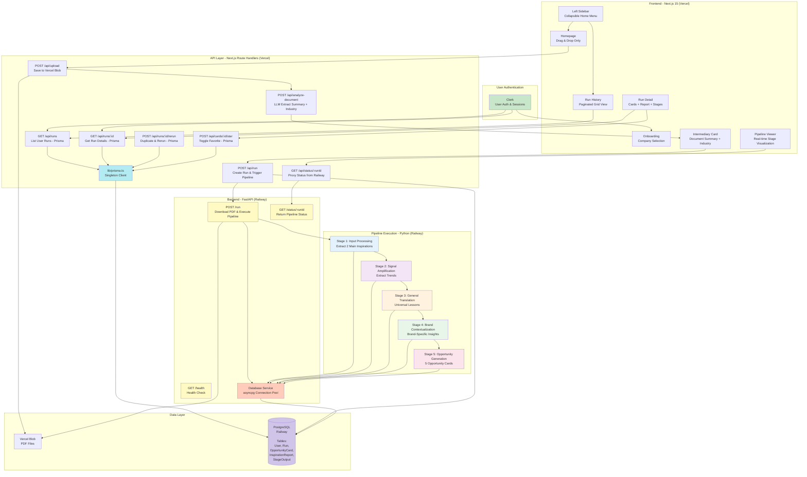

# 2. Architecture Overview

## System Diagram



## Architecture Principles

1. **User Authentication Layer**: Clerk handles authentication, provides `userId` for all database queries
2. **Prisma Data Layer**: Type-safe ORM for Next.js frontend (reads from PostgreSQL)
3. **asyncpg Backend Service**: Python async PostgreSQL driver for high-performance pipeline writes
4. **Backend Separation**: FastAPI backend on Railway handles Python pipeline execution
5. **Vercel Blob Storage**: Store uploaded PDFs, Railway backend downloads via blob URLs
6. **Database-Driven State**: PostgreSQL stores runs, cards, reports, stage outputs
7. **Sequential Execution**: Run stages 1-5 sequentially, writing to DB after each stage
8. **Connection Pooling Strategy**: PgBouncer for Vercel serverless, asyncpg pool for Railway
9. **User Data Isolation**: Every query filtered by authenticated Clerk user ID
10. **shadcn/ui MCP**: Use Magic component builder for rapid UI development

## Data Flow Architecture

### Frontend Read Path (Prisma)
```
User Request → Clerk Auth → Next.js API Route → Prisma Client → PostgreSQL
```

### Backend Write Path (asyncpg)
```
Pipeline Stage → Database Service → asyncpg Pool → PostgreSQL
```

### Why Two Database Clients?

| Client | Language | Use Case | Location |
|--------|----------|----------|----------|
| **Prisma** | TypeScript | Type-safe reads, user queries | Next.js (Vercel) |
| **asyncpg** | Python | High-performance writes during pipeline | FastAPI (Railway) |

**Rationale:**
- Prisma provides TypeScript type safety and autocomplete for frontend
- asyncpg provides async high-performance writes for long-running Python pipeline
- Separation of concerns: Frontend reads, backend writes

## Deployment Architecture (Epic 5)

**Frontend (Vercel):**
- Next.js 15 application
- API routes proxy to Railway backend
- Environment variable: `NEXT_PUBLIC_BACKEND_URL`

**Backend (Railway):**
- FastAPI application with 3 endpoints: `/run`, `/status/:runId`, `/health`
- Python pipeline execution (stages 1-5)
- Dockerfile deployment with uvicorn server
- Environment variables: `OPENROUTER_API_KEY`, `VERCEL_BLOB_READ_WRITE_TOKEN`

**Benefits:**
- ✅ No Vercel serverless timeout issues (300s limit)
- ✅ Independent scaling of backend processing
- ✅ Simplified development (local Docker backend + Vercel frontend)
- ✅ Clear separation of concerns

---
