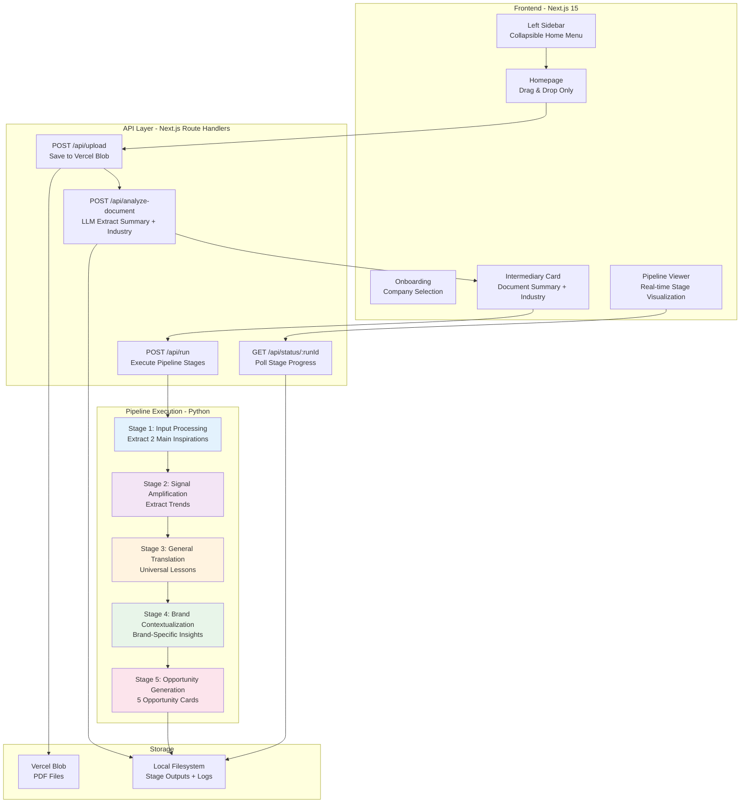

# 2. Architecture Overview

## System Diagram

## Architecture Principles

1. **Minimal Web Wrapper**: Next.js frontend + API routes trigger existing Python pipeline
2. **Vercel Blob Storage**: Store uploaded PDFs, serve via public URLs
3. **File-Based State**: No database - use filesystem for stage outputs
4. **Sequential Execution**: Run stages 1-5 sequentially in single API call
5. **Log-Based Progress**: Poll log files to detect current stage
6. **shadcn/ui MCP**: Use Magic component builder for rapid UI development

---
