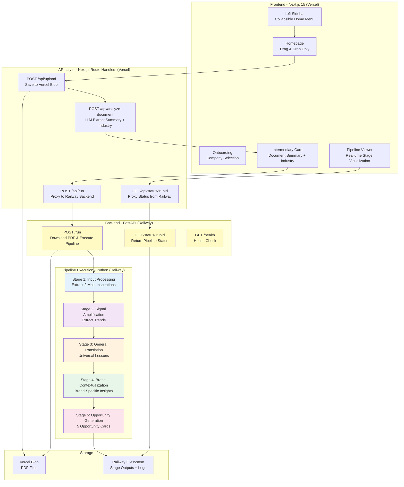

# 2. Architecture Overview

## System Diagram

## Architecture Principles

1. **Backend Separation**: FastAPI backend on Railway handles Python pipeline execution (Stories 5.1-5.3)
2. **Frontend Proxy Pattern**: Next.js API routes proxy requests to Railway backend
3. **Vercel Blob Storage**: Store uploaded PDFs, Railway backend downloads via blob URLs
4. **File-Based State**: No database - Railway filesystem stores stage outputs
5. **Sequential Execution**: Run stages 1-5 sequentially on Railway infrastructure
6. **CORS & Environment**: Railway backend configured with CORS for Vercel domains
7. **shadcn/ui MCP**: Use Magic component builder for rapid UI development

## Deployment Architecture (Epic 5)

**Frontend (Vercel):**
- Next.js 15 application
- API routes proxy to Railway backend
- Environment variable: `NEXT_PUBLIC_BACKEND_URL`

**Backend (Railway):**
- FastAPI application with 3 endpoints: `/run`, `/status/:runId`, `/health`
- Python pipeline execution (stages 1-5)
- Dockerfile deployment with uvicorn server
- Environment variables: `OPENROUTER_API_KEY`, `VERCEL_BLOB_READ_WRITE_TOKEN`

**Benefits:**
- ✅ No Vercel serverless timeout issues (300s limit)
- ✅ Independent scaling of backend processing
- ✅ Simplified development (local Docker backend + Vercel frontend)
- ✅ Clear separation of concerns

---
