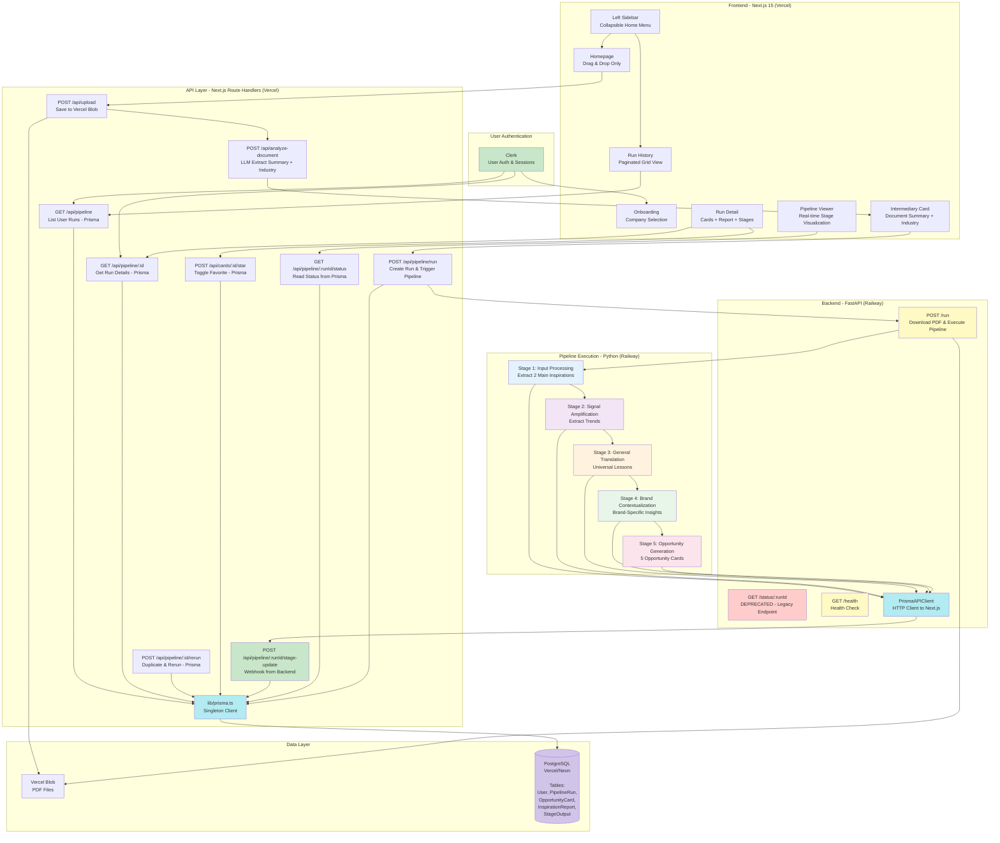

# 2. Architecture Overview

## System Diagram



## Architecture Principles

1. **User Authentication Layer**: Clerk handles authentication, provides `userId` for all database queries
2. **Prisma-First Database**: Single ORM for all database operations (reads AND writes)
3. **HTTP API Integration**: Python backend writes to Prisma via Next.js API webhook endpoints
4. **Backend Separation**: FastAPI backend on Railway handles Python pipeline execution
5. **Vercel Blob Storage**: Store uploaded PDFs, Railway backend downloads via blob URLs
6. **Database-Driven State**: PostgreSQL stores runs, cards, reports, stage outputs (single source of truth)
7. **Sequential Execution**: Run stages 1-5 sequentially, writing to Prisma after each stage via HTTP
8. **Real-time Status Updates**: Frontend reads directly from Prisma, no polling Railway backend
9. **User Data Isolation**: Every query filtered by authenticated Clerk user ID
10. **shadcn/ui MCP**: Use Magic component builder for rapid UI development

## Data Flow Architecture

### Frontend Read Path (Prisma)
```
User Request → Clerk Auth → Next.js API Route → Prisma Client → PostgreSQL
```

### Backend Write Path (Prisma via HTTP API)
```
Pipeline Stage → PrismaAPIClient → POST /api/pipeline/:runId/stage-update → Prisma Client → PostgreSQL
```

### Prisma-First Architecture Benefits

**Why Prisma for Everything:**
- ✅ Single source of truth (no dual-state management)
- ✅ Type-safe schema shared between frontend and backend contracts
- ✅ Real-time status updates (no polling, no sync issues)
- ✅ Survives Railway dyno restarts (database persistence)
- ✅ Auto-completion logic (stage 5 done → PipelineRun.status = COMPLETED)
- ✅ Simplified testing (one database to mock/seed)

**Backend Integration via HTTP:**
- Python backend calls Next.js API endpoints via HTTP
- Authenticated with `X-Webhook-Secret` header
- No direct database connection needed from Railway
- Frontend acts as database gateway (Prisma ORM layer)

## Deployment Architecture (Epic 5)

**Frontend (Vercel):**
- Next.js 15 application
- API routes proxy to Railway backend
- Environment variable: `NEXT_PUBLIC_BACKEND_URL`

**Backend (Railway):**
- FastAPI application with 3 endpoints: `/run`, `/status/:runId`, `/health`
- Python pipeline execution (stages 1-5)
- Dockerfile deployment with uvicorn server
- Environment variables: `OPENROUTER_API_KEY`, `VERCEL_BLOB_READ_WRITE_TOKEN`

**Benefits:**
- ✅ No Vercel serverless timeout issues (300s limit)
- ✅ Independent scaling of backend processing
- ✅ Simplified development (local Docker backend + Vercel frontend)
- ✅ Clear separation of concerns

---
