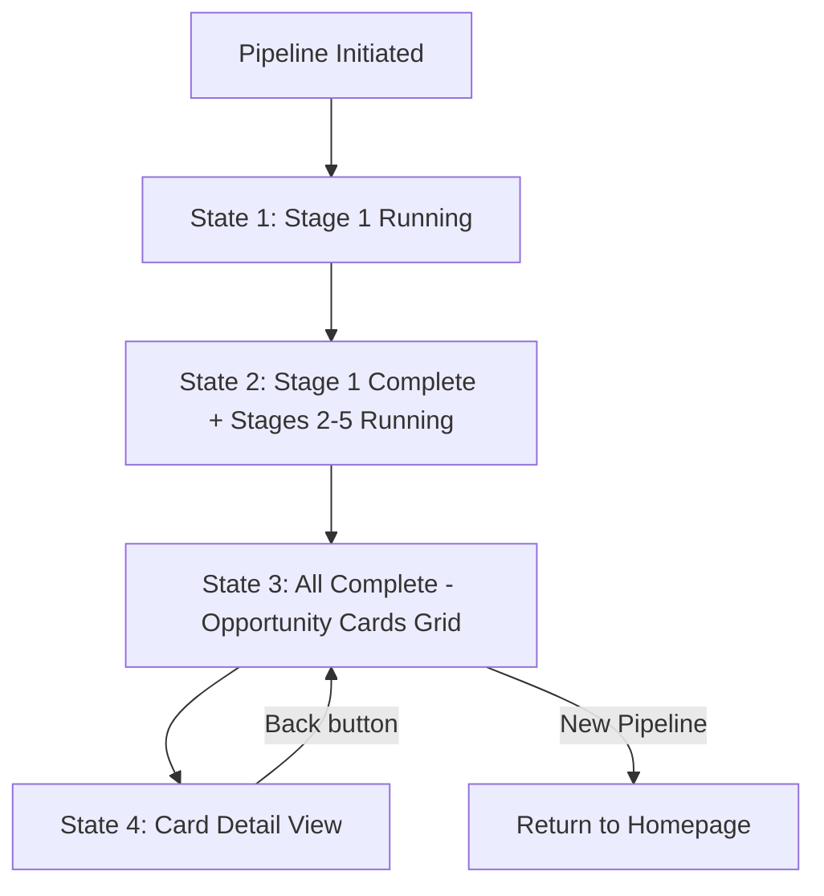
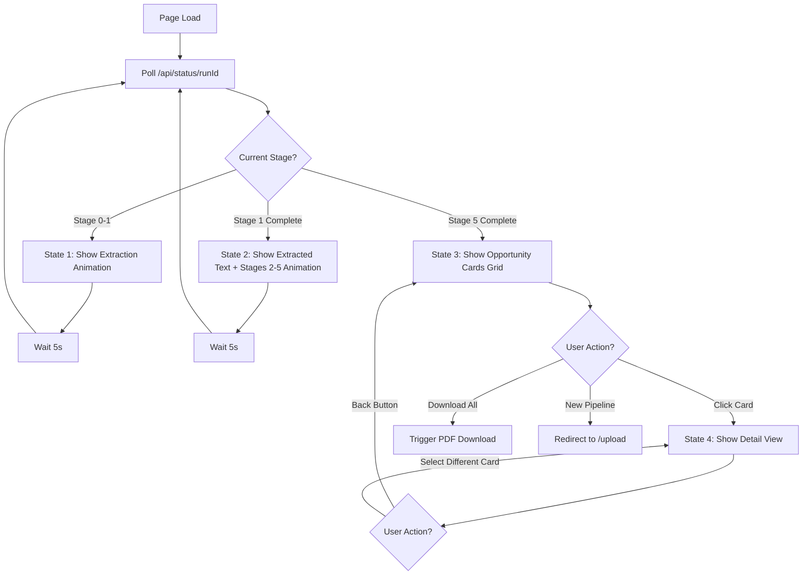
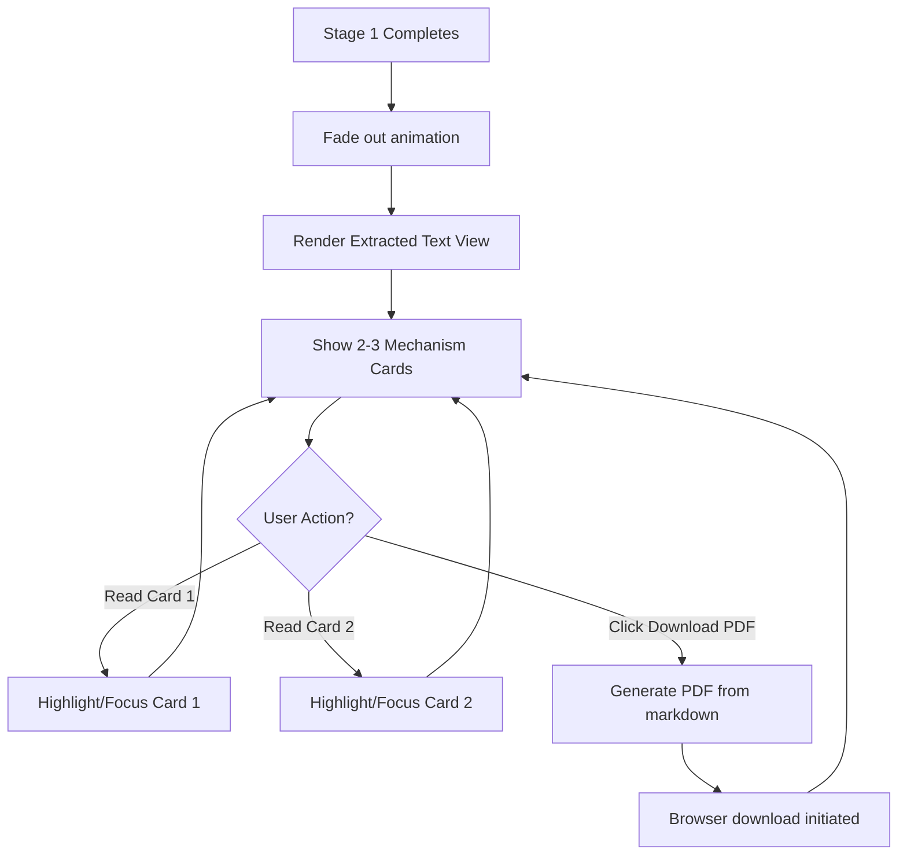
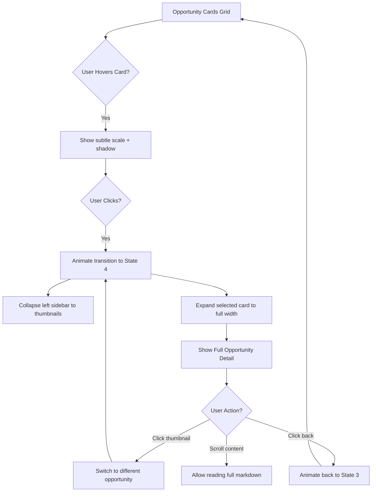

# Pipeline Visualization Page - UI/UX Specification

This document defines the user experience goals, information architecture, user flows, and visual design specifications for the **Pipeline Visualization Page** (`/pipeline/[runId]`) - a single dynamic component that evolves through four progressive states as the Innovation Intelligence Pipeline executes.

**Purpose:** Transform the static extraction mockup into a live, real-time UI that visualizes all 5 pipeline stages and displays the final Opportunity Cards.

**Scope:** This specification covers only the pipeline visualization page, not the onboarding or upload pages (which are already implemented per slides 1-2).

## Overall UX Goals & Principles

### Target User Personas

**CPG Innovation Manager:** Mid-market brand innovation lead who needs to quickly extract mechanisms from trend reports and present retail-ready opportunities to buyers. Values speed, clarity, and actionable outputs. Comfort with digital tools but not technical.

**Consultant/Agency Strategist:** Innovation consultants serving CPG clients who use this tool during client workshops. Needs impressive real-time visualization to demonstrate value and generate discussion. High digital literacy.

### Usability Goals

- **Real-time feedback:** Users can see exactly what's happening at each stage (no black box)
- **Estimated completion time:** Within 5 seconds of pipeline start, show ETA
- **Error recovery:** If pipeline fails, clear explanation + retry option
- **Actionable outputs:** Opportunity Cards must be immediately usable (download, share, expand)

### Design Principles

1. **Progressive Revelation** - Show each stage completing before revealing the next
2. **Status Always Visible** - User never wonders "is it working?" or "how long?"
3. **Smooth State Transitions** - Animate between states to maintain spatial continuity
4. **Content > Chrome** - Minimize UI decoration, maximize extracted content visibility
5. **Graceful Degradation** - If animations fail, fall back to instant state changes

### Change Log

| Date | Version | Description | Author |
|------|---------|-------------|--------|
| 2025-10-21 | 1.0 | Initial specification for pipeline visualization page | Sally (UX Expert) |

## Migration from Current Implementation

### Current State Analysis

**Existing Implementation:** `innovation-web/app/pipeline/[runId]/page.tsx`

The current UI already has sophisticated pipeline visualization with:
- ✅ Real-time polling with exponential backoff retry
- ✅ Left sidebar with stage boxes and non-selected track
- ✅ Main content area with selected track card
- ✅ DetailPanel component for stage-specific content
- ✅ Auto-redirect to `/results/[runId]` when complete

**Current Layout Structure:**
```
PipelinePage (current)
├── StatusHeader (with Back button + Brand badge)
├── Left Sidebar (lg:col-span-3)
│   ├── Stage Boxes (scrollable)
│   └── Non-selected Track (IdeationTracksSidebar)
└── Main Content (lg:col-span-9)
    ├── Selected Track Card (PipelineTrackCard)
    └── DetailPanel (stage-specific content)
```

### What Needs to Change

### Component Replacement Map

| **Current Component** | **Replacement Strategy** | **New Component(s)** |
|----------------------|-------------------------|---------------------|
| `DetailPanel` (lines 175-271) | **DELETE ENTIRELY** → Replace with state machine | `PipelineStateMachine` + 4 state views |
| "Track 1" / "Track 2" cards (lines 227-271) | **KEEP** → Use in State 2 left box | Reuse existing, add mechanism details |
| Auto-redirect to `/results` (lines 108-110) | **DELETE** → Replace with State 3 | `OpportunityCardsGrid` |
| Main content area (lines 213-276) | **REPLACE** → Becomes state-dependent rendering | State 1-4 components |
| Left sidebar (lines 148-209) | **KEEP (mostly)** → Adjust for State 4 collapse | Add `CollapsedSidebar` variant |

#### 🔴 MAJOR CHANGES (Core Architecture)

**1. Replace DetailPanel with State Machine**
- **Current:** `DetailPanel` renders different content based on `currentStage` (lines 175-271)
- **Target:** Four distinct UI states that replace the entire main content area
- **Impact:** Complete refactor of innovation-web/app/pipeline/[runId]/page.tsx:175-271
- **Replacement:** `<PipelineStateMachine>` component that conditionally renders State 1-4

**2. Add Stage 1 Two-Track Visualization**
- **Current:** Shows selected track immediately when `currentStage >= 1`
- **Target:** Show BOTH tracks side-by-side initially, with "extraction animation" in left box
- **New Components Needed:**
  - `ExtractionAnimation` - Animated visualization for Stage 1 processing
  - `WorkflowIllustration` - Static/animated image for workflow context
  - `ExtractedTextView` - Display mechanism cards with PDF download

**3. Add Stages 2-5 Sequential Animation**
- **Current:** No visualization for stages 2-5 progression
- **Target:** Animated sequence showing each stage activating/completing
- **New Component:** `StagesAnimation` - Cycles through stages 2-5 with visual feedback

**4. Add Opportunity Cards Grid (State 3)**
- **Current:** Auto-redirects to `/results/[runId]` when complete
- **Target:** Show cards in-page before redirect (or replace redirect entirely)
- **New Components:**
  - `OpportunityCardsGrid` - 2-column grid layout
  - `OpportunityCard` - Individual card matching mockup style

**5. Add Detail View with Collapsed Sidebar (State 4)**
- **Current:** N/A (redirect happens)
- **Target:** Expand selected opportunity, collapse left sidebar to thumbnails
- **New Components:**
  - `CollapsedSidebar` - Vertical thumbnails of all opportunities
  - `ExpandedOpportunityDetail` - Full markdown content view

#### 🟡 MODERATE CHANGES (Enhancements)

**6. Enhance Stage 1 JSON Output**
- **Backend Change:** `backend/pipeline/stages/stage1_input_processing.py:86-131`
- **Current:** Saves 2 tracks to `inspirations.json`
- **Add:** Mechanism extraction details for "ExtractedTextView"
- **Format:**
  ```json
  {
    "mechanisms": [
      {
        "title": "Mechanism 1 Title",
        "type": "UNBUNDLED",
        "constraint_eliminated": "Time: 45min → 5min",
        "why_it_works": "Explanation..."
      }
    ]
  }
  ```

**7. Update API Status Endpoint**
- **File:** `innovation-web/app/api/status/[runId]/route.ts` (needs creation/update)
- **Add:** Stage completion timestamps for progress bars
- **Add:** Estimated time remaining calculation

**8. Remove Auto-Redirect to Results**
- **File:** innovation-web/app/pipeline/[runId]/page.tsx:108-110
- **Remove:** Auto-redirect on completion
- **Replace:** Transition to State 3 (Opportunity Cards)

#### 🟢 MINOR CHANGES (Styling & Polish)

**9. Adjust Sidebar Behavior for State 4**
- **Current:** Fixed left sidebar with stage boxes
- **Target:** Collapsible sidebar that reduces to thumbnail strip

**10. Add State Transition Animations**
- **New Utility:** Framer Motion or CSS transitions for smooth state changes

**11. Match Mockup Visual Style**
- **Current:** Uses existing teal theme (#5B9A99)
- **Verify:** Card styles, typography, spacing match Pages 3-6 mockup

### Files to Create

```
innovation-web/components/pipeline/
├── ExtractionAnimation.tsx        (NEW)
├── WorkflowIllustration.tsx       (NEW)
├── ExtractedTextView.tsx          (NEW)
├── MechanismCard.tsx              (NEW)
├── StagesAnimation.tsx            (NEW)
├── Stage2to5Box.tsx               (NEW)
├── OpportunityCardsGrid.tsx       (NEW)
├── OpportunityCard.tsx            (NEW)
├── CollapsedSidebar.tsx           (NEW)
├── ExpandedOpportunityDetail.tsx  (NEW)
└── PipelineStateMachine.tsx       (NEW - orchestrator)
```

### Code Structure Comparison

**❌ OLD (Current Implementation):**
```tsx
// innovation-web/app/pipeline/[runId]/page.tsx (lines 209-276)
<div className="grid grid-cols-1 lg:grid-cols-12">
  <div className="lg:col-span-3">
    {/* Stage boxes sidebar */}
    {stageInfo.map(stage => <StageBox key={stage.id} />)}
    {/* Non-selected track */}
    {stage1Data && <TrackCard track={nonSelectedTrack} />}
  </div>

  <div className="lg:col-span-9">
    {/* Selected track */}
    {stage1Data && <TrackCard track={selectedTrack} />}

    {/* DetailPanel - REPLACE THIS */}
    <DetailPanel
      currentStage={currentStage}
      status={status}
      runId={runId}
    />
  </div>
</div>

// Auto-redirect on completion (lines 108-110) - DELETE THIS
if (data.current_stage === 5 && data.status === 'completed') {
  router.push(`/results/${runId}`)
}
```

**✅ NEW (Target Implementation):**
```tsx
// innovation-web/app/pipeline/[runId]/page.tsx (REFACTORED)
<div className="grid grid-cols-1 lg:grid-cols-12">
  {/* Sidebar - Conditionally render based on state */}
  {uiState !== 'state4' ? (
    <div className="lg:col-span-3">
      {stageInfo.map(stage => <StageBox key={stage.id} />)}
      {/* Tracks shown only in State 2 */}
      {uiState === 'state2' && stage1Data && (
        <>
          <TrackCard track={track1} />
          <TrackCard track={track2} />
        </>
      )}
    </div>
  ) : (
    <CollapsedSidebar opportunities={opportunities} />
  )}

  {/* Main content - State machine replaces DetailPanel */}
  <div className={uiState === 'state4' ? 'lg:col-span-12' : 'lg:col-span-9'}>
    <PipelineStateMachine
      uiState={uiState}
      currentStage={currentStage}
      status={status}
      stage1Data={stage1Data}
      opportunities={opportunities}
      selectedOpportunityId={selectedOpportunityId}
      onCardClick={(id) => setSelectedOpportunityId(id)}
      onDownload={handleDownload}
    />
  </div>
</div>

// NO auto-redirect - State 3 renders in-page
// User manually clicks "New Pipeline" or selects a card
```

### Files to Modify

```
innovation-web/app/pipeline/[runId]/page.tsx     (MAJOR REFACTOR)
backend/pipeline/stages/stage1_input_processing.py  (ENHANCE JSON)
backend/pipeline/prompts/stage1_prompt.py          (Already enhanced ✅)
innovation-web/app/api/status/[runId]/route.ts   (ENHANCE response)
```

### Files to Keep As-Is

```
innovation-web/components/pipeline/StageBox.tsx          (✅ Keep)
innovation-web/components/pipeline/IdeationTracksSidebar.tsx  (✅ Keep)
innovation-web/components/pipeline/PipelineTrackCard.tsx     (✅ Keep, use in State 2)
innovation-web/lib/stageStatus.ts                        (✅ Keep)
```

### Migration Strategy Recommendation

**Option A: Incremental Migration (SAFER)**
1. Keep current implementation working
2. Add new components alongside existing
3. Feature flag to switch between old/new UI
4. Test thoroughly before removing old code

**Option B: Clean Slate Refactor (FASTER)**
1. Comment out existing DetailPanel logic
2. Build new state machine from scratch
3. Wire up state transitions
4. Delete old code when working

**Recommended:** Option A for production, Option B for hackathon/demo

## Information Architecture

### Page State Map

The pipeline visualization page exists as a **single component with four progressive states**, not four separate pages. Each state replaces the previous one through animated transitions.



### Component Hierarchy

```
PipelineVisualizationPage
├── StatusHeader (persistent across all states)
│   ├── BrandName
│   ├── DocumentTitle
│   ├── OverallProgress
│   └── EstimatedTimeRemaining
├── State1: TwoBoxLayout
│   ├── LeftBox: Stage1Animation
│   └── RightBox: WorkflowIllustration
├── State2: TwoBoxLayout
│   ├── LeftBox: ExtractedTextView
│   │   ├── MechanismCards (2-3 cards)
│   │   └── DownloadPDFButton
│   └── RightBox: Stages2to5Animation
│       ├── Stage2StatusBox
│       ├── Stage3StatusBox
│       ├── Stage4StatusBox
│       └── Stage5StatusBox
├── State3: OpportunityCardsGrid
│   ├── OpportunityCard (repeatable, 2-column)
│   │   ├── HeroImage
│   │   ├── Title
│   │   ├── Summary
│   │   └── ViewButton
│   └── ActionBar
│       ├── DownloadAllButton
│       └── NewPipelineButton
└── State4: DetailViewLayout
    ├── CollapsedSidebar (left)
    │   └── CardThumbnails (scrollable list)
    └── ExpandedOpportunityDetail (right)
        ├── FullOpportunityContent (markdown)
        └── BackToGridButton
```

### Navigation Structure

**Primary Navigation:** None - this is a focused, immersive experience. Navigation occurs through:
- State progression (automatic, pipeline-driven)
- Card selection (user-driven, State 3 → State 4)
- Back button (State 4 → State 3)
- Action buttons (New Pipeline → Homepage)

**Breadcrumb Strategy:** Single breadcrumb in StatusHeader: `Home > Pipeline > [Brand Name] - [Document Title]`

## User Flows

### Flow 1: Pipeline Execution - Full Journey

**User Goal:** Watch the pipeline extract mechanisms and generate brand-specific opportunities from an uploaded trend report

**Entry Points:**
- Redirected from `/analyze/[uploadId]` after clicking "Launch Pipeline"
- Direct URL `/pipeline/[runId]` (if refreshing browser)

**Success Criteria:** User sees all 5 stages complete and can view/download generated opportunity cards

#### Flow Diagram



#### Edge Cases & Error Handling

- **Pipeline timeout (>35 min):** Show error state with "Back to Upload" button
- **Network error during polling:** Exponential backoff retry (5s, 10s, 20s), then error state
- **Stage 1 fails:** Show error in left box, keep polling stopped
- **Browser refresh mid-pipeline:** Resume from current stage (polling resumes automatically)
- **No opportunities generated:** Show empty state with "Something went wrong" message
- **Markdown rendering fails:** Fallback to plain text display

#### State Transition Timing

| Transition | Trigger | Animation Duration |
|-----------|---------|-------------------|
| State 1 → State 2 | `currentStage === 1 && status === 'completed'` | 800ms fade + slide |
| State 2 → State 3 | `currentStage === 5 && status === 'completed'` | 1200ms fade + scale |
| State 3 → State 4 | User clicks card | 600ms slide |
| State 4 → State 3 | User clicks back | 400ms slide |

**Notes:** All timing values are recommendations and should be tested with real users

---

### Flow 2: Stage 1 Detailed Interaction

**User Goal:** Understand what mechanisms were extracted from the input document

**Entry Points:** State 2 (after Stage 1 completes)

**Success Criteria:** User can read mechanism cards and download PDF report

#### Flow Diagram



#### Edge Cases & Error Handling

- **Only 1 mechanism extracted:** Show single card (not 2-3)
- **PDF generation fails:** Show toast error, keep UI functional
- **Mechanism text too long:** Truncate with "Read more" expansion
- **No mechanisms extracted:** Show placeholder "No mechanisms found" message

**Notes:** PDF download should include full markdown content, not just visible summary

---

### Flow 3: Opportunity Card Selection & Detail View

**User Goal:** Explore generated opportunities and select one for deep dive

**Entry Points:** State 3 (all stages complete, cards grid visible)

**Success Criteria:** User can view full opportunity details and navigate between cards

#### Flow Diagram



#### Edge Cases & Error Handling

- **Only 1 opportunity generated:** Show single card, disable sidebar thumbnails
- **Opportunity content too long:** Add sticky header with back button
- **Markdown images fail to load:** Show placeholder image
- **User clicks same thumbnail twice:** No action (already selected)

**Notes:** Sidebar thumbnails should show miniature versions of hero images for quick recognition

## Component Specifications

### State 1 Components: Extraction in Progress

#### ExtractionAnimation Component

**Purpose:** Visual feedback showing Stage 1 mechanism extraction is running

**Location:** Left box of TwoBoxLayout in State 1

**Visual Design:**
- Animated illustration matching mockup Page 3 style (beaker/flask with bubbles)
- Teal color scheme (#5B9A99 primary, #7DB5AA accents)
- Subtle pulsing/bubbling animation (2-3s loop)
- Optional: Rotating mechanism type labels ("UNBUNDLED" → "COMBINED" → etc.)

**States:**
- Active: Full opacity, animated
- Error: Red tint overlay, animation stops

**Props:**
```typescript
interface ExtractionAnimationProps {
  status: 'running' | 'error'
  elapsedTime?: number // Optional: show elapsed time
}
```

**Implementation Notes:**
- Use CSS animations (not Lottie) for performance
- Fallback to static image if animations disabled
- Accessible: Include `aria-live="polite"` status updates

---

#### WorkflowIllustration Component

**Purpose:** Contextual image showing what Stage 1 does (static reference)

**Location:** Right box of TwoBoxLayout in State 1

**Visual Design:**
- Matches mockup Page 3 right box (AI/workflow diagram)
- Static or minimal animation (breathing effect)
- Overlaid text: "Extracting transferable insights"
- Teal badge: "BOI" (Board of Ideators branding)

**States:**
- Loading: Skeleton placeholder
- Loaded: Show full illustration
- Error: Show fallback icon + text

**Props:**
```typescript
interface WorkflowIllustrationProps {
  stage: 1 | 2 | 3 | 4 | 5 // Which stage to illustrate
  imageUrl?: string // Optional custom image
}
```

**Implementation Notes:**
- Use Next.js Image component for optimization
- Lazy load for performance (not critical content)
- Fallback to SVG icon if image fails

---

### State 2 Components: Mechanisms Revealed

#### ExtractedTextView Component

**Purpose:** Display extracted mechanisms with download option

**Location:** Left box of TwoBoxLayout in State 2

**Visual Design:**
- White background card
- Heading: "Mechanisms Extracted" (teal underline)
- 2-3 MechanismCard components (vertical stack)
- Download PDF button at bottom (teal, prominent)

**Layout:**
```
┌──────────────────────────────────┐
│ Mechanisms Extracted             │
│ ━━━━━━━━━━━━━━━━━━━━━━━━━━━━━━━ │
│                                  │
│ ┌────────────────────────────┐  │
│ │ MechanismCard #1           │  │
│ └────────────────────────────┘  │
│                                  │
│ ┌────────────────────────────┐  │
│ │ MechanismCard #2           │  │
│ └────────────────────────────┘  │
│                                  │
│ [Download PDF] ↓                 │
└──────────────────────────────────┘
```

**Props:**
```typescript
interface ExtractedTextViewProps {
  mechanisms: Mechanism[]
  runId: string
  onDownload: () => void
}

interface Mechanism {
  title: string
  type: string // "UNBUNDLED", "COMBINED", etc.
  constraint_eliminated: string
  why_it_works: string
  structural_pattern?: string
}
```

**Interactions:**
- Cards clickable to expand/collapse full content
- PDF button triggers `/api/download/stage1/${runId}`
- Scrollable if more than 2 mechanisms

---

#### MechanismCard Component

**Purpose:** Individual mechanism display with key details

**Visual Design:**
- Border: Teal (#5B9A99), 2px
- Padding: 16px
- Typography: Title (18px bold), Details (14px regular)
- Badge: Mechanism type (top-right, small pill)

**Layout:**
```
┌────────────────────────────────────┐
│ Mechanism Title          [BADGE]   │
│                                    │
│ Constraint: Time 45min → 5min      │
│                                    │
│ Why it works: [Explanation...]     │
└────────────────────────────────────┘
```

**Props:**
```typescript
interface MechanismCardProps {
  mechanism: Mechanism
  isExpanded?: boolean
  onToggle?: () => void
}
```

**States:**
- Default: Collapsed, show summary only
- Expanded: Full content visible
- Hover: Subtle shadow increase

---

#### StagesAnimation Component

**Purpose:** Visualize Stages 2-5 progressing sequentially

**Location:** Right box of TwoBoxLayout in State 2

**Visual Design:**
- 4 vertical boxes (one per stage 2-5)
- Each box has: Stage number, name, status icon
- Active stage: Pulsing teal border
- Completed stage: Green checkmark
- Pending stage: Gray, dimmed

**Layout:**
```
┌──────────────────────────────┐
│ Stage 2: Signals       ⟳     │ ← Pulsing (active)
├──────────────────────────────┤
│ Stage 3: Lessons        ○    │ ← Dimmed (pending)
├──────────────────────────────┤
│ Stage 4: Context        ○    │
├──────────────────────────────┤
│ Stage 5: Opport.        ○    │
└──────────────────────────────┘
```

**Props:**
```typescript
interface StagesAnimationProps {
  currentStage: number
  completedStages: number[]
}
```

**Animation Behavior:**
- When stage completes: Check icon fades in (300ms)
- Next stage activates: Border pulsing starts
- Scroll to active stage automatically

---

### State 3 Components: Opportunity Cards Grid

#### OpportunityCardsGrid Component

**Purpose:** Display all generated opportunities in 2-column grid

**Layout:**
- Desktop: 2 columns, equal width
- Tablet: 2 columns, responsive
- Mobile: 1 column, stack

**Visual Design:**
- Grid gap: 24px
- Container: Max-width 1200px, centered
- Action bar: Fixed at bottom (Download All + New Pipeline buttons)

**Props:**
```typescript
interface OpportunityCardsGridProps {
  opportunities: Opportunity[]
  onCardClick: (id: string) => void
  onDownloadAll: () => void
  onNewPipeline: () => void
}

interface Opportunity {
  id: string
  title: string
  summary: string
  heroImageUrl?: string
  fullContent: string // Markdown
}
```

---

#### OpportunityCard Component

**Purpose:** Individual opportunity preview matching mockup Page 5 style

**Visual Design:**
- Hero image: 16:9 aspect ratio, rounded corners (12px)
- Title: 20px bold, 2 lines max (truncate with ellipsis)
- Summary: 14px regular, 3-4 lines max
- View button: Teal, bottom-right
- Shadow: Elevation 2 → 4 on hover

**Layout:**
```
┌───────────────────────────────┐
│                               │
│     [Hero Image 16:9]         │
│                               │
├───────────────────────────────┤
│ Title of Opportunity          │
│                               │
│ Summary text here. Summary    │
│ continues for 3-4 lines max...│
│                               │
│                    [View →]   │
└───────────────────────────────┘
```

**Props:**
```typescript
interface OpportunityCardProps {
  opportunity: Opportunity
  onClick: () => void
}
```

**States:**
- Default: Elevation 2 shadow
- Hover: Elevation 4, scale 1.02, cursor pointer
- Active: Teal border (when selected in State 4)

---

### State 4 Components: Detail View

#### CollapsedSidebar Component

**Purpose:** Compact thumbnail strip for rapid card navigation

**Location:** Left side of screen (replaces full sidebar)

**Visual Design:**
- Width: 120px fixed
- Background: White
- Border-right: 1px gray
- Thumbnails: 80x80px, stacked vertically
- Selected thumbnail: Teal border, 3px
- Scrollable if >4 cards

**Layout:**
```
┌──────┐
│ [T1] │ ← Selected (teal border)
│ [T2] │
│ [T3] │
│ [T4] │
│  ⋮   │
└──────┘
```

**Props:**
```typescript
interface CollapsedSidebarProps {
  opportunities: Opportunity[]
  selectedId: string
  onSelectCard: (id: string) => void
}
```

**Interactions:**
- Click thumbnail → Switch to that opportunity
- Keyboard: Arrow keys to navigate
- Auto-scroll to selected thumbnail

---

#### ExpandedOpportunityDetail Component

**Purpose:** Full-width display of opportunity content

**Location:** Main content area (right of CollapsedSidebar)

**Visual Design:**
- Width: Flex 1 (remaining space)
- Padding: 48px
- Typography: Markdown rendered with react-markdown
- Back button: Top-left, "← Back to Grid"
- Scroll container: Full height

**Props:**
```typescript
interface ExpandedOpportunityDetailProps {
  opportunity: Opportunity
  onBack: () => void
}
```

**Layout:**
```
┌──────────────────────────────────────┐
│ [← Back to Grid]                      │
│                                       │
│ # Opportunity Title                   │
│                                       │
│ [Hero Image Full Width]               │
│                                       │
│ ## Summary                            │
│ Full opportunity content rendered     │
│ as markdown with proper formatting... │
│                                       │
│ ...continues with full details...     │
└──────────────────────────────────────┘
```

**Markdown Rendering:**
- Use `react-markdown` with XSS protection
- Custom components for headings, lists, code blocks
- Link handling: Open external links in new tab
- Image handling: Lazy load, fallback to placeholder

## Visual Design System

### Color Palette

| Color Type | Hex Code | Usage | Notes |
|-----------|----------|-------|-------|
| Primary Teal | #5B9A99 | Buttons, links, active states, brand elements | Main brand color from mockup |
| Light Teal | #7DB5AA | Accents, hover states, secondary elements | Lighter variation |
| Dark Teal | #4A7F7E | Button hover, focused states, emphasis | Darker variation |
| Background Gray | #F5F5F5 | Page background | Consistent with existing pages |
| Card White | #FFFFFF | Card backgrounds, content containers | Pure white for contrast |
| Text Primary | #1F2937 | Headings, primary text | Near-black for readability |
| Text Secondary | #6B7280 | Secondary text, descriptions | Gray for hierarchy |
| Success Green | #10B981 | Completed stages, success states | Standard green |
| Error Red | #EF4444 | Error states, failed stages | Standard red |
| Border Gray | #E5E7EB | Card borders, dividers | Light gray |

### Typography

| Element | Font Family | Size | Weight | Line Height | Usage |
|---------|------------|------|--------|-------------|-------|
| Page Title | System UI | 30px | 700 (Bold) | 1.2 | "Pipeline Execution" |
| Section Heading | System UI | 24px | 600 (Semibold) | 1.3 | "Selected Inspiration Track" |
| Card Title | System UI | 20px | 600 (Semibold) | 1.4 | Opportunity card titles |
| Mechanism Title | System UI | 18px | 600 (Semibold) | 1.4 | Mechanism card titles |
| Body Text | System UI | 16px | 400 (Regular) | 1.6 | General content |
| Small Text | System UI | 14px | 400 (Regular) | 1.5 | Metadata, labels |
| Button Text | System UI | 16px | 500 (Medium) | 1 | Button labels |
| Badge Text | System UI | 12px | 500 (Medium) | 1 | Stage badges, mechanism types |

**Font Stack:** `system-ui, -apple-system, BlinkMacSystemFont, 'Segoe UI', Roboto, sans-serif`

### Spacing Scale

Following Tailwind CSS spacing conventions (4px base unit):

| Name | Value | Usage |
|------|-------|-------|
| xs | 4px | Tight spacing within components |
| sm | 8px | Small gaps, compact layouts |
| md | 16px | Standard spacing between elements |
| lg | 24px | Large gaps, section spacing |
| xl | 32px | Extra large spacing, major sections |
| 2xl | 48px | Page-level spacing |

### Shadows & Elevation

| Level | Shadow | Usage |
|-------|--------|-------|
| 1 | `0 1px 3px rgba(0,0,0,0.1)` | Subtle elevation (cards at rest) |
| 2 | `0 4px 6px rgba(0,0,0,0.1)` | Standard elevation (default cards) |
| 3 | `0 10px 15px rgba(0,0,0,0.1)` | Raised elevation (hover states) |
| 4 | `0 20px 25px rgba(0,0,0,0.15)` | High elevation (modals, popovers) |

### Border Radius

| Size | Value | Usage |
|------|-------|-------|
| sm | 6px | Small elements (badges, pills) |
| md | 12px | Standard elements (buttons, cards) |
| lg | 16px | Large elements (hero images) |
| full | 9999px | Circular elements (avatars, indicators) |

### Animation & Transitions

| Type | Duration | Easing | Usage |
|------|----------|--------|-------|
| Fast | 150ms | `ease-out` | Hover states, small interactions |
| Normal | 300ms | `ease-in-out` | Standard transitions, fade in/out |
| Slow | 600ms | `ease-in-out` | State changes, card expansions |
| Extra Slow | 800-1200ms | `cubic-bezier(0.4, 0, 0.2, 1)` | Major state transitions |

**Reduce motion:** Respect `prefers-reduced-motion` for accessibility

## Technical Requirements

### State Management

**Approach:** React hooks + local state (no Redux/Zustand needed for single-page state machine)

**Key State Variables:**
```typescript
const [uiState, setUiState] = useState<'state1' | 'state2' | 'state3' | 'state4'>('state1')
const [currentStage, setCurrentStage] = useState<number>(0)
const [pipelineStatus, setPipelineStatus] = useState<'running' | 'completed' | 'error'>('running')
const [stage1Data, setStage1Data] = useState<Stage1Data | null>(null)
const [opportunities, setOpportunities] = useState<Opportunity[]>([])
const [selectedOpportunityId, setSelectedOpportunityId] = useState<string | null>(null)
```

**State Transition Logic:**
```typescript
useEffect(() => {
  // Determine UI state based on pipeline progress
  if (currentStage === 0) setUiState('state1')
  else if (currentStage === 1 && pipelineStatus !== 'completed') setUiState('state2')
  else if (currentStage === 5 && pipelineStatus === 'completed') setUiState('state3')
  else if (selectedOpportunityId) setUiState('state4')
}, [currentStage, pipelineStatus, selectedOpportunityId])
```

### API Integration

**Polling Strategy:**
```typescript
useEffect(() => {
  const pollInterval = 5000 // 5 seconds
  const maxRetries = 3
  let retryCount = 0

  const poll = async () => {
    try {
      const response = await fetch(`/api/status/${runId}`)
      const data = await response.json()

      setCurrentStage(data.current_stage)
      setPipelineStatus(data.status)
      setStage1Data(data.stage1_data)

      // Continue polling if running
      if (data.status === 'running') {
        setTimeout(poll, pollInterval)
      }

      // Fetch opportunities when complete
      if (data.status === 'completed' && data.current_stage === 5) {
        fetchOpportunities()
      }
    } catch (error) {
      if (retryCount < maxRetries) {
        retryCount++
        setTimeout(poll, pollInterval * Math.pow(2, retryCount)) // Exponential backoff
      } else {
        setPipelineStatus('error')
      }
    }
  }

  poll()
  return () => clearTimeout(pollTimeout)
}, [runId])
```

**API Endpoints Required:**
- `GET /api/status/[runId]` - Poll pipeline progress
- `GET /api/results/[runId]` - Fetch final opportunities
- `GET /api/download/stage1/[runId]` - Download Stage 1 PDF
- `GET /api/download/all/[runId]` - Download all opportunities PDF

### Performance Considerations

**Optimization Strategies:**
1. **Lazy load opportunities:** Only fetch when State 3 reached
2. **Memoize components:** Use React.memo for cards to prevent re-renders
3. **Virtual scrolling:** If >10 opportunities, use `react-virtual`
4. **Image optimization:** Use Next.js Image component with lazy loading
5. **Code splitting:** Dynamic import for State 4 components

**Bundle Size Targets:**
- Initial bundle: <150KB gzipped
- Per-route: <50KB gzipped
- Total: <300KB gzipped

### Accessibility Requirements

**WCAG 2.1 Level AA Compliance:**

| Requirement | Implementation |
|------------|----------------|
| Color Contrast | All text ≥4.5:1 ratio against background |
| Keyboard Navigation | Tab order follows visual flow, Enter/Space activate cards |
| Screen Readers | ARIA labels on all interactive elements, live regions for status updates |
| Focus Indicators | Visible 3px teal outline on all focusable elements |
| Motion Control | Respect `prefers-reduced-motion`, provide instant state changes fallback |
| Alt Text | All images have descriptive alt text |
| Semantic HTML | Use proper heading hierarchy (h1 → h2 → h3) |

**ARIA Attributes:**
```typescript
// State 1 - Extraction running
<div role="status" aria-live="polite" aria-label="Stage 1 extraction in progress">

// State 2 - Mechanisms revealed
<section aria-labelledby="mechanisms-heading">
  <h2 id="mechanisms-heading">Mechanisms Extracted</h2>

// State 3 - Opportunity cards
<div role="grid" aria-label="Generated innovation opportunities">

// State 4 - Detail view
<article aria-label="Opportunity details">
```

### Responsive Breakpoints

| Breakpoint | Min Width | Max Width | Target Devices | Layout Changes |
|-----------|-----------|-----------|----------------|----------------|
| Mobile | - | 767px | Phones | Single column, stacked layout |
| Tablet | 768px | 1023px | Tablets | 2-column grid (State 3), full-width detail |
| Desktop | 1024px | 1439px | Laptops | 2-column grid, sidebar visible |
| Wide | 1440px | - | Large screens | Max-width 1400px, centered |

**State-Specific Responsive Behavior:**

- **State 1-2:** Stack left/right boxes vertically on mobile
- **State 3:** 2 columns on tablet+, 1 column on mobile
- **State 4:** Hide collapsed sidebar on mobile, add hamburger menu

### Browser Compatibility

**Minimum Supported Versions:**
- Chrome 90+
- Safari 14+
- Firefox 88+
- Edge 90+

**Progressive Enhancement:**
- CSS Grid with flexbox fallback
- Intersection Observer with scroll position fallback
- WebP images with JPEG fallback

### Testing Requirements

**Unit Tests:**
- Component render tests (Jest + React Testing Library)
- State transition logic tests
- API polling behavior tests

**Integration Tests:**
- Full flow: State 1 → State 4
- Error handling: Network failure, timeout
- Edge cases: Single mechanism, no opportunities

**Visual Regression Tests:**
- Chromatic or Percy for all states
- Mobile, tablet, desktop viewports

**Accessibility Tests:**
- Axe or Pa11y automated testing
- Manual keyboard navigation testing
- Screen reader testing (NVDA/JAWS)

## Implementation Checklist

### Phase 1: Foundation (2-3 hours)
- [ ] Create new component files (see "Files to Create" section)
- [ ] Set up TypeScript interfaces for all props
- [ ] Implement PipelineStateMachine orchestrator component
- [ ] Wire up state transitions logic
- [ ] Add polling with exponential backoff

### Phase 2: State 1-2 Components (3-4 hours)
- [ ] Build ExtractionAnimation with CSS animations
- [ ] Build WorkflowIllustration with Next Image
- [ ] Build ExtractedTextView container
- [ ] Build MechanismCard component
- [ ] Build StagesAnimation with progress indicators
- [ ] Connect to Stage 1 JSON data from backend

### Phase 3: State 3-4 Components (3-4 hours)
- [ ] Build OpportunityCardsGrid layout
- [ ] Build OpportunityCard with hover effects
- [ ] Build CollapsedSidebar with thumbnails
- [ ] Build ExpandedOpportunityDetail with markdown
- [ ] Implement card selection and back navigation
- [ ] Add Download All / New Pipeline actions

### Phase 4: Polish & Testing (2-3 hours)
- [ ] Add state transition animations (Framer Motion optional)
- [ ] Implement responsive breakpoints
- [ ] Add accessibility attributes
- [ ] Test keyboard navigation
- [ ] Test error states (timeout, network failure)
- [ ] Visual QA against mockup Pages 3-6
- [ ] Cross-browser testing

### Phase 5: Backend Integration (1-2 hours)
- [ ] Enhance Stage 1 JSON output (add mechanism details)
- [ ] Update API status endpoint with timestamps
- [ ] Create download endpoints (Stage 1 PDF, All PDFs)
- [ ] Test full pipeline integration
- [ ] Verify data flows correctly through all states

**Total Estimated Time:** 11-16 hours

## Next Steps

1. **Review this specification** with stakeholders/team
2. **Prioritize** which states to build first (recommend State 1 → State 2 → State 3 → State 4)
3. **Create design mockups** in Figma for animation details (optional)
4. **Begin implementation** following Phase 1 checklist
5. **Test incrementally** after each component completion
6. **Deploy** and gather user feedback

---

**Document Status:** ✅ Complete - Ready for Implementation

**Last Updated:** 2025-10-21

**Contact:** Sally (UX Expert Agent) via `/BMad:agents:ux-expert`

