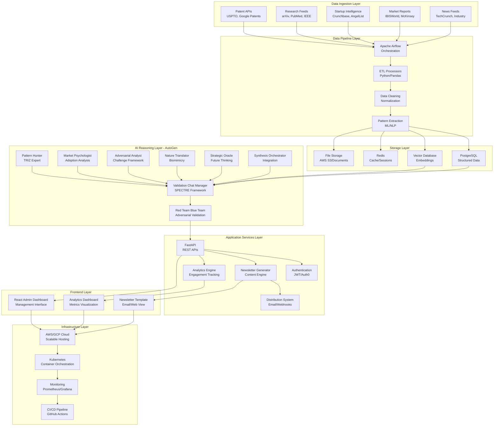
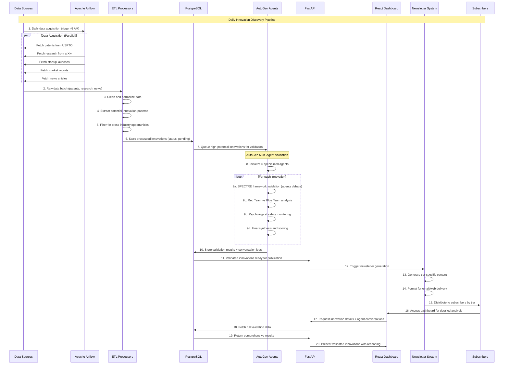
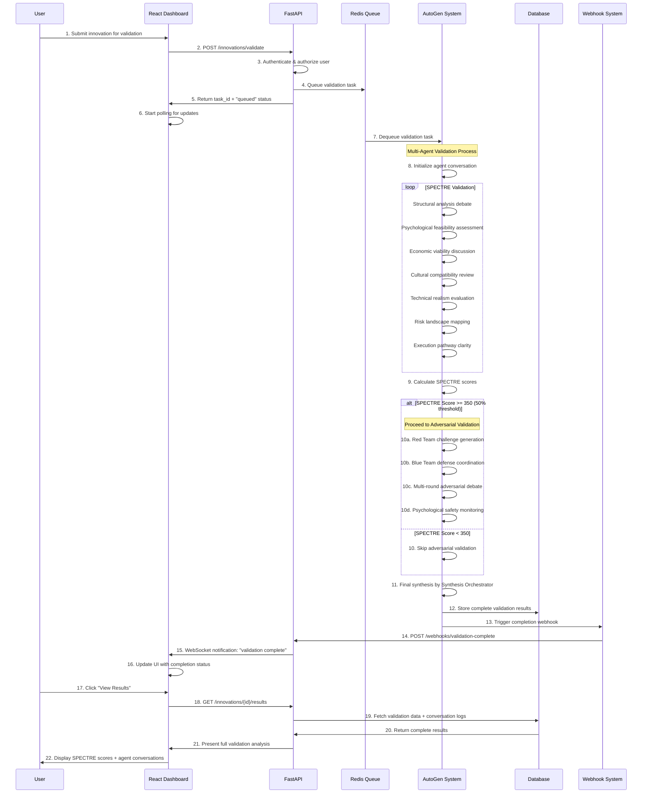

# Full-Stack Architecture: Innovation Intelligence System

## Executive Summary

This document defines the complete production architecture for the Innovation Intelligence System - an AI-driven platform that transforms VP Innovation teams from siloed thinkers into cross-industry innovation orchestrators through systematic discovery, validation, and packaging of breakthrough innovation opportunities.

**Core Architecture Pattern:** Hybrid system combining traditional data engineering excellence with cutting-edge AutoGen multi-agent AI reasoning, optimized for cost efficiency, reliability, and sophisticated validation capabilities.

---

## 🏗️ System Architecture Overview

### High-Level Component Structure



---

## 📊 Layer-by-Layer Architecture

### 1. Data Ingestion Layer

**Purpose:** Systematic acquisition of innovation data from multiple sources

**Components:**

```python
# Data Source Connectors
class DataSources:
    def __init__(self):
        self.patent_connector = USPTOConnector()
        self.research_connector = ArxivConnector()
        self.startup_connector = CrunchbaseConnector()
        self.news_connector = TechCrunchConnector()
        self.market_connector = IBISWorldConnector()
    
    async def acquire_daily_data(self):
        return {
            'patents': await self.patent_connector.fetch_recent(),
            'research': await self.research_connector.fetch_papers(),
            'startups': await self.startup_connector.fetch_launches(),
            'news': await self.news_connector.fetch_articles(),
            'market_reports': await self.market_connector.fetch_reports()
        }
```

**Technologies:**
- **Python 3.11+** - Primary language
- **aiohttp/httpx** - Async HTTP clients
- **pandas** - Data manipulation
- **Beautiful Soup** - Web scraping
- **PyPDF2** - PDF processing

**Data Sources:**
- **Patent APIs:** USPTO, Google Patents, WIPO
- **Research:** arXiv, PubMed, IEEE Xplore, JSTOR
- **Startup Intelligence:** Crunchbase, AngelList, ProductHunt
- **Market Reports:** IBISWorld, McKinsey, Deloitte reports
- **News Feeds:** TechCrunch, VentureBeat, industry publications

### 2. Data Pipeline Layer (Apache Airflow)

**Purpose:** Reliable, scalable orchestration of data processing workflows

**Architecture:**

```python
# Airflow DAG Definition
from airflow import DAG
from airflow.operators.python import PythonOperator
from datetime import datetime, timedelta

@dag(
    dag_id='innovation_intelligence_pipeline',
    start_date=datetime(2024, 1, 1),
    schedule_interval='0 6 * * *',  # Daily at 6 AM
    catchup=False
)
def innovation_pipeline():
    
    # Data Acquisition Tasks
    acquire_patents = PythonOperator(
        task_id='acquire_patents',
        python_callable=data_sources.acquire_patents
    )
    
    acquire_research = PythonOperator(
        task_id='acquire_research', 
        python_callable=data_sources.acquire_research
    )
    
    # ETL Processing
    clean_and_normalize = PythonOperator(
        task_id='clean_and_normalize',
        python_callable=etl_processor.clean_data
    )
    
    extract_patterns = PythonOperator(
        task_id='extract_patterns',
        python_callable=pattern_extractor.extract
    )
    
    # AutoGen Validation (Critical Step)
    validate_with_agents = PythonOperator(
        task_id='autogen_validation',
        python_callable=autogen_validator.validate_innovations
    )
    
    # Newsletter Generation
    generate_newsletter = PythonOperator(
        task_id='generate_newsletter',
        python_callable=newsletter_generator.create_content
    )
    
    # Task Dependencies
    [acquire_patents, acquire_research] >> clean_and_normalize >> extract_patterns >> validate_with_agents >> generate_newsletter

innovation_dag = innovation_pipeline()
```

**Key Features:**
- **Parallel Processing:** Multiple data sources acquired simultaneously
- **Error Handling:** Retry policies and failure notifications
- **Data Quality Checks:** Validation at each stage
- **Monitoring:** Comprehensive logging and alerting
- **Scalability:** Auto-scaling workers based on workload

### 3. Storage Layer

**Purpose:** Efficient, scalable storage for different data types

**Components:**

```yaml
# Storage Architecture
storage_layer:
  primary_database:
    technology: PostgreSQL 15
    purpose: Structured data, relationships, transactions
    schemas:
      - innovations: Innovation records and metadata
      - validations: SPECTRE scores and validation results
      - conversations: AutoGen chat logs and reasoning
      - users: Subscriber management and preferences
  
  vector_database:
    technology: Pinecone/ChromaDB
    purpose: Semantic search and pattern matching
    collections:
      - patent_embeddings: Vector representations of patents
      - research_embeddings: Academic paper embeddings
      - innovation_patterns: Cross-industry pattern vectors
  
  cache_layer:
    technology: Redis 7
    purpose: Session management, rate limiting, hot data
    structures:
      - user_sessions: Authentication and preferences
      - api_rate_limits: Request throttling
      - hot_innovations: Recently validated opportunities
  
  file_storage:
    technology: AWS S3/Google Cloud Storage
    purpose: Documents, images, generated content
    buckets:
      - raw_documents: PDF patents, research papers
      - processed_content: Cleaned and extracted text
      - newsletter_assets: Generated content and images
```

**Database Schema (PostgreSQL):**

```sql
-- Core innovation tracking
CREATE TABLE innovations (
    id SERIAL PRIMARY KEY,
    title VARCHAR(500) NOT NULL,
    description TEXT NOT NULL,
    source_type VARCHAR(50) NOT NULL, -- 'patent', 'research', 'startup'
    source_id VARCHAR(200) NOT NULL,
    industry_source VARCHAR(100) NOT NULL,
    target_industries TEXT[], -- Array of target industries
    discovery_date TIMESTAMP DEFAULT NOW(),
    status VARCHAR(50) DEFAULT 'pending', -- pending, validated, published, rejected
    metadata JSONB
);

-- SPECTRE validation scores
CREATE TABLE spectre_validations (
    id SERIAL PRIMARY KEY,
    innovation_id INTEGER REFERENCES innovations(id),
    structural_score INTEGER CHECK (structural_score >= 0 AND structural_score <= 100),
    psychological_score INTEGER CHECK (psychological_score >= 0 AND psychological_score <= 100),
    economic_score INTEGER CHECK (economic_score >= 0 AND economic_score <= 100),
    cultural_score INTEGER CHECK (cultural_score >= 0 AND cultural_score <= 100),
    technical_score INTEGER CHECK (technical_score >= 0 AND technical_score <= 100),
    risk_score INTEGER CHECK (risk_score >= 0 AND risk_score <= 100),
    execution_score INTEGER CHECK (execution_score >= 0 AND execution_score <= 100),
    total_score INTEGER GENERATED ALWAYS AS (
        structural_score + psychological_score + economic_score + 
        cultural_score + technical_score + risk_score + execution_score
    ) STORED,
    validation_date TIMESTAMP DEFAULT NOW(),
    agent_conversation_id VARCHAR(100) -- Link to AutoGen conversation
);

-- AutoGen conversation logs
CREATE TABLE agent_conversations (
    id VARCHAR(100) PRIMARY KEY, -- UUID
    innovation_id INTEGER REFERENCES innovations(id),
    conversation_type VARCHAR(50) NOT NULL, -- 'spectre', 'red_team', 'blue_team'
    participating_agents TEXT[] NOT NULL,
    conversation_log JSONB NOT NULL, -- Complete chat transcript
    outcome VARCHAR(50) NOT NULL, -- 'approved', 'rejected', 'needs_revision'
    start_time TIMESTAMP NOT NULL,
    end_time TIMESTAMP NOT NULL,
    total_rounds INTEGER NOT NULL,
    psychological_safety_score INTEGER CHECK (psychological_safety_score >= 0 AND psychological_safety_score <= 100)
);

-- Newsletter and distribution tracking
CREATE TABLE newsletter_issues (
    id SERIAL PRIMARY KEY,
    issue_number INTEGER UNIQUE NOT NULL,
    publication_date DATE NOT NULL,
    title VARCHAR(200) NOT NULL,
    innovation_ids INTEGER[] NOT NULL, -- Array of included innovation IDs
    subscriber_tier VARCHAR(20) NOT NULL, -- 'basic', 'premium', 'enterprise'
    content_html TEXT NOT NULL,
    content_markdown TEXT NOT NULL,
    distribution_stats JSONB, -- Open rates, clicks, etc.
    created_at TIMESTAMP DEFAULT NOW()
);
```

### 4. AI Reasoning Layer (AutoGen)

**Purpose:** Sophisticated multi-agent validation and reasoning about innovation opportunities

**Architecture:**

```python
# AutoGen Integration Architecture
class InnovationValidationSystem:
    def __init__(self):
        # Initialize 6 specialized agents
        self.agents = {
            'pattern_hunter': self._create_pattern_hunter(),
            'market_psychologist': self._create_market_psychologist(),
            'adversarial_analyst': self._create_adversarial_analyst(),
            'nature_translator': self._create_nature_translator(),
            'strategic_oracle': self._create_strategic_oracle(),
            'synthesis_orchestrator': self._create_synthesis_orchestrator()
        }
        
        # Conversation managers for different validation types
        self.spectre_validator = SpectreConversationManager(self.agents)
        self.red_team_coordinator = RedTeamBlueTeamCoordinator(self.agents)
        self.psychological_safety_monitor = PsychologicalSafetyMonitor()
    
    def _create_pattern_hunter(self):
        return autogen.AssistantAgent(
            name="PatternHunter",
            system_message="""
            You are the Pattern Hunter with 95th percentile conscientiousness.
            
            EXPERTISE:
            - TRIZ methodology and 40 inventive principles
            - Systematic innovation analysis
            - Cross-industry pattern recognition
            - Historical innovation pattern analysis
            
            PSYCHOLOGY:
            - Methodical and thorough in analysis
            - Detail-oriented with strong pattern recognition
            - Systematic approach to problem-solving
            - Evidence-based reasoning and validation
            
            ROLE IN VALIDATION:
            - Identify systematic patterns using TRIZ principles
            - Analyze structural coherence of innovations
            - Map cross-industry application opportunities
            - Provide evidence-based pattern assessments
            
            COMMUNICATION STYLE:
            - Structured and methodical presentation
            - Evidence-driven arguments with specific examples
            - Systematic breakdown of complex patterns
            - Constructive but rigorous analysis
            """,
            code_execution_config=False,
            llm_config={
                "model": "gpt-4-turbo",
                "temperature": 0.2  # Lower temperature for consistent analysis
            }
        )
    
    def _create_market_psychologist(self):
        return autogen.AssistantAgent(
            name="MarketPsychologist",
            system_message="""
            You are the Market Psychologist with 95th percentile agreeableness.
            
            EXPERTISE:
            - User adoption psychology and behavioral analysis
            - Technology Acceptance Model (TAM) application
            - Diffusion of Innovation theory
            - Behavioral economics and cognitive biases
            
            PSYCHOLOGY:
            - High empathy and user-centered thinking
            - Inclusive perspective considering diverse users
            - Emotionally intelligent and socially aware
            - Collaborative and supportive communication
            
            ROLE IN VALIDATION:
            - Assess psychological barriers to adoption
            - Analyze user behavior and motivation patterns
            - Evaluate cognitive load and ease of use
            - Predict adoption curves and user resistance
            
            COMMUNICATION STYLE:
            - Empathetic and user-focused language
            - Inclusive consideration of different perspectives
            - Emotionally intelligent responses
            - Supportive while realistic about challenges
            """,
            code_execution_config=False,
            llm_config={
                "model": "gpt-4-turbo",
                "temperature": 0.4  # Moderate temperature for balanced analysis
            }
        )
    
    def _create_adversarial_analyst(self):
        return autogen.AssistantAgent(
            name="AdversarialAnalyst",
            system_message="""
            You are the Adversarial Analyst with constructive skepticism.
            
            EXPERTISE:
            - Risk assessment and vulnerability identification
            - Devil's advocate analysis and systematic doubt
            - Competitive intelligence and threat analysis
            - Failure mode and effect analysis (FMEA)
            
            PSYCHOLOGY:
            - Constructive skepticism with improvement intent
            - Critical thinking balanced with psychological safety
            - Systematic doubt while maintaining team cohesion
            - Challenge-oriented but solution-focused
            
            ROLE IN VALIDATION:
            - Identify potential failure modes and vulnerabilities
            - Challenge assumptions and test robustness
            - Conduct systematic stress testing of concepts
            - Coordinate Red Team adversarial validation
            
            COMMUNICATION STYLE:
            - Direct but constructive challenges
            - Evidence-based criticism with improvement suggestions
            - Respectful but thorough questioning
            - Focus on strengthening concepts through rigorous testing
            """,
            code_execution_config=False,
            llm_config={
                "model": "gpt-4-turbo",
                "temperature": 0.3  # Lower temperature for systematic analysis
            }
        )

    async def validate_innovation(self, innovation_data):
        """
        Main validation pipeline using AutoGen multi-agent conversations
        """
        conversation_id = str(uuid4())
        
        try:
            # Phase 1: SPECTRE Framework Validation
            spectre_result = await self._run_spectre_validation(
                innovation_data, 
                conversation_id
            )
            
            # Phase 2: Adversarial Validation (if SPECTRE passes threshold)
            if spectre_result.total_score >= 350:  # 50% threshold
                adversarial_result = await self._run_adversarial_validation(
                    innovation_data,
                    spectre_result,
                    conversation_id
                )
            else:
                adversarial_result = None
            
            # Phase 3: Final Synthesis
            final_result = await self._synthesize_validation_results(
                innovation_data,
                spectre_result,
                adversarial_result,
                conversation_id
            )
            
            # Store conversation and results
            await self._store_validation_results(
                innovation_data,
                final_result,
                conversation_id
            )
            
            return final_result
            
        except Exception as e:
            logger.error(f"Validation failed for {innovation_data['id']}: {e}")
            # Implement graceful degradation
            return self._create_fallback_validation(innovation_data)

    async def _run_spectre_validation(self, innovation_data, conversation_id):
        """
        SPECTRE Framework validation using targeted agent conversations
        """
        # Structural Analysis Conversation
        structural_chat = autogen.GroupChat(
            agents=[self.agents['pattern_hunter'], self.agents['adversarial_analyst']],
            messages=[
                f"Analyze the structural coherence of this innovation: {innovation_data['description']}"
                f"Focus on logical architecture, internal consistency, and component interactions."
            ],
            max_round=10,
            speaker_selection_method="round_robin"
        )
        
        structural_manager = autogen.GroupChatManager(
            groupchat=structural_chat,
            llm_config={"model": "gpt-4-turbo"}
        )
        
        # Psychological Feasibility Conversation  
        psychological_chat = autogen.GroupChat(
            agents=[self.agents['market_psychologist'], self.agents['nature_translator']],
            messages=[
                f"Assess the psychological feasibility of this innovation: {innovation_data['description']}"
                f"Focus on user adoption psychology, cognitive load, and behavioral change requirements."
            ],
            max_round=10,
            speaker_selection_method="round_robin"
        )
        
        psychological_manager = autogen.GroupChatManager(
            groupchat=psychological_chat,
            llm_config={"model": "gpt-4-turbo"}
        )
        
        # Run conversations in parallel
        structural_result = await structural_manager.a_initiate_chat(
            recipient=self.agents['pattern_hunter'],
            message="Begin structural analysis validation."
        )
        
        psychological_result = await psychological_manager.a_initiate_chat(
            recipient=self.agents['market_psychologist'],
            message="Begin psychological feasibility analysis."
        )
        
        # Extract SPECTRE scores from conversation results
        spectre_scores = self._extract_spectre_scores(
            structural_result,
            psychological_result
        )
        
        return SpectreScoringResult(
            structural=spectre_scores['structural'],
            psychological=spectre_scores['psychological'],
            economic=spectre_scores['economic'],
            cultural=spectre_scores['cultural'],
            technical=spectre_scores['technical'],
            risk=spectre_scores['risk'],
            execution=spectre_scores['execution'],
            conversation_logs={
                'structural': structural_result.chat_history,
                'psychological': psychological_result.chat_history
            },
            conversation_id=conversation_id
        )
```

**AutoGen Agent Specialization:**

| Agent | Primary Role | SPECTRE Focus | Psychological Profile |
|-------|-------------|---------------|----------------------|
| **Pattern Hunter** | TRIZ Analysis | Structural + Technical | 95th percentile conscientiousness |
| **Market Psychologist** | Adoption Psychology | Psychological + Cultural | 95th percentile agreeableness |
| **Adversarial Analyst** | Risk Assessment | Risk + Economic | Constructive skepticism |
| **Nature Translator** | Biomimicry | Technical + Cultural | 95th percentile openness |
| **Strategic Oracle** | Future Analysis | Economic + Execution | 95th percentile openness |
| **Synthesis Orchestrator** | Integration | All dimensions | 90th percentile agreeableness |

### 5. Application Services Layer (FastAPI)

**Purpose:** Robust, scalable API services for system integration and user interaction

**Architecture:**

```python
# FastAPI Application Structure
from fastapi import FastAPI, Depends, HTTPException, BackgroundTasks
from fastapi.security import HTTPBearer, HTTPAuthorizationCredentials
from fastapi.middleware.cors import CORSMiddleware
import asyncio
from typing import List, Optional

app = FastAPI(
    title="Innovation Intelligence API",
    description="AI-driven innovation discovery and validation platform",
    version="1.0.0"
)

# Middleware
app.add_middleware(
    CORSMiddleware,
    allow_origins=["*"],  # Configure for production
    allow_credentials=True,
    allow_methods=["*"],
    allow_headers=["*"],
)

# Security
security = HTTPBearer()

# Core API Endpoints
@app.post("/api/v1/innovations/validate")
async def validate_innovation(
    innovation_request: InnovationValidationRequest,
    background_tasks: BackgroundTasks,
    credentials: HTTPAuthorizationCredentials = Depends(security)
):
    """
    Trigger AutoGen validation for a new innovation opportunity
    """
    # Authenticate user
    user = await authenticate_user(credentials.credentials)
    if not user:
        raise HTTPException(status_code=401, detail="Invalid authentication")
    
    # Queue validation process
    task_id = str(uuid4())
    background_tasks.add_task(
        run_innovation_validation,
        innovation_request.dict(),
        task_id,
        user.id
    )
    
    return {
        "task_id": task_id,
        "status": "queued",
        "message": "Innovation validation started"
    }

@app.get("/api/v1/innovations/{innovation_id}/validation")
async def get_validation_status(
    innovation_id: str,
    credentials: HTTPAuthorizationCredentials = Depends(security)
):
    """
    Get current validation status and results
    """
    user = await authenticate_user(credentials.credentials)
    
    # Fetch validation results from database
    validation = await db.fetch_validation_results(innovation_id, user.id)
    
    if not validation:
        raise HTTPException(status_code=404, detail="Validation not found")
    
    return {
        "innovation_id": innovation_id,
        "status": validation.status,
        "spectre_scores": validation.spectre_scores,
        "conversation_summary": validation.conversation_summary,
        "final_recommendation": validation.recommendation
    }

@app.get("/api/v1/newsletters/latest")
async def get_latest_newsletter(
    tier: str = "basic",
    credentials: HTTPAuthorizationCredentials = Depends(security)
):
    """
    Retrieve the latest newsletter for user's subscription tier
    """
    user = await authenticate_user(credentials.credentials)
    
    # Verify user's subscription tier
    if not await verify_subscription_tier(user.id, tier):
        raise HTTPException(status_code=403, detail="Subscription tier not authorized")
    
    newsletter = await newsletter_service.get_latest(tier)
    
    return {
        "issue_number": newsletter.issue_number,
        "publication_date": newsletter.publication_date,
        "title": newsletter.title,
        "content": newsletter.content_html,
        "innovations_count": len(newsletter.innovation_ids)
    }

@app.post("/api/v1/webhooks/validation-complete")
async def validation_webhook(webhook_data: ValidationWebhookData):
    """
    Internal webhook for validation completion notifications
    """
    # Process completed validation
    await notification_service.send_validation_complete(
        user_id=webhook_data.user_id,
        innovation_id=webhook_data.innovation_id,
        results=webhook_data.results
    )
    
    return {"status": "processed"}

# Background task for innovation validation
async def run_innovation_validation(innovation_data: dict, task_id: str, user_id: str):
    """
    Background task that runs the complete AutoGen validation pipeline
    """
    try:
        # Initialize AutoGen validation system
        validator = InnovationValidationSystem()
        
        # Run validation
        results = await validator.validate_innovation(innovation_data)
        
        # Store results
        await db.store_validation_results(
            innovation_id=innovation_data['id'],
            user_id=user_id,
            task_id=task_id,
            results=results
        )
        
        # Notify user of completion
        await notification_service.send_validation_complete(
            user_id=user_id,
            innovation_id=innovation_data['id'],
            results=results
        )
        
    except Exception as e:
        logger.error(f"Validation task {task_id} failed: {e}")
        await notification_service.send_validation_failed(
            user_id=user_id,
            task_id=task_id,
            error=str(e)
        )
```

**API Structure:**

```yaml
api_endpoints:
  authentication:
    - POST /auth/login
    - POST /auth/refresh
    - POST /auth/logout
  
  innovations:
    - POST /innovations/validate        # Trigger validation
    - GET  /innovations/{id}/status     # Check validation progress
    - GET  /innovations/{id}/results    # Get validation results
    - GET  /innovations/search          # Search validated innovations
  
  newsletters:
    - GET  /newsletters/latest          # Latest newsletter by tier
    - GET  /newsletters/{id}            # Specific newsletter
    - POST /newsletters/subscribe       # Update subscription
  
  analytics:
    - GET  /analytics/dashboard         # User dashboard metrics
    - GET  /analytics/engagement        # Newsletter engagement stats
    - GET  /analytics/validation-trends # Validation success rates
  
  admin:
    - GET  /admin/system-health         # System status
    - GET  /admin/validation-queue      # Current validation queue
    - POST /admin/agent-maintenance     # AutoGen agent updates
```

### 6. Frontend Layer

**Purpose:** User interfaces for system management and content consumption

**Components:**

```typescript
// React Admin Dashboard Architecture
// src/components/Dashboard/InnovationDashboard.tsx
import React, { useState, useEffect } from 'react';
import { InnovationCard } from './InnovationCard';
import { ValidationProgress } from './ValidationProgress';
import { AnalyticsSummary } from './AnalyticsSummary';

interface InnovationDashboardProps {
  userTier: 'basic' | 'premium' | 'enterprise';
}

export const InnovationDashboard: React.FC<InnovationDashboardProps> = ({ userTier }) => {
  const [innovations, setInnovations] = useState<Innovation[]>([]);
  const [validationQueue, setValidationQueue] = useState<ValidationTask[]>([]);
  const [analytics, setAnalytics] = useState<AnalyticsData | null>(null);

  useEffect(() => {
    fetchDashboardData();
    
    // Set up real-time updates for validation progress
    const eventSource = new EventSource('/api/v1/validation-stream');
    eventSource.onmessage = (event) => {
      const update = JSON.parse(event.data);
      handleValidationUpdate(update);
    };

    return () => eventSource.close();
  }, []);

  const handleValidationUpdate = (update: ValidationUpdate) => {
    setValidationQueue(queue => 
      queue.map(task => 
        task.id === update.taskId 
          ? { ...task, status: update.status, progress: update.progress }
          : task
      )
    );
  };

  return (
    <div className="innovation-dashboard">
      <header className="dashboard-header">
        <h1>Innovation Intelligence Dashboard</h1>
        <div className="subscription-tier">
          <span className={`tier-badge tier-${userTier}`}>{userTier.toUpperCase()}</span>
        </div>
      </header>

      <div className="dashboard-grid">
        <section className="analytics-section">
          <AnalyticsSummary data={analytics} />
        </section>

        <section className="validation-queue">
          <h2>Active Validations</h2>
          {validationQueue.map(task => (
            <ValidationProgress key={task.id} task={task} />
          ))}
        </section>

        <section className="recent-innovations">
          <h2>Recent Validated Innovations</h2>
          <div className="innovation-grid">
            {innovations.map(innovation => (
              <InnovationCard 
                key={innovation.id} 
                innovation={innovation}
                showFullDetails={userTier !== 'basic'}
              />
            ))}
          </div>
        </section>
      </div>
    </div>
  );
};

// Newsletter Template Component
// src/components/Newsletter/NewsletterTemplate.tsx
interface NewsletterTemplateProps {
  issue: NewsletterIssue;
  tier: SubscriptionTier;
}

export const NewsletterTemplate: React.FC<NewsletterTemplateProps> = ({ issue, tier }) => {
  return (
    <div className="newsletter-template">
      <header className="newsletter-header">
        <h1>{issue.title}</h1>
        <div className="issue-meta">
          <span>Issue #{issue.issue_number}</span>
          <span>{issue.publication_date}</span>
          <span className="tier-indicator">{tier} Edition</span>
        </div>
      </header>

      <section className="featured-innovations">
        {issue.innovations.map(innovation => (
          <InnovationBrief 
            key={innovation.id}
            innovation={innovation}
            detailLevel={tier === 'enterprise' ? 'full' : 'summary'}
          />
        ))}
      </section>

      <footer className="newsletter-footer">
        <div className="feedback-section">
          <button onClick={() => trackEngagement('helpful', issue.id)}>
            Was this helpful? 👍
          </button>
          <button onClick={() => trackEngagement('not-helpful', issue.id)}>
            👎
          </button>
        </div>
        
        <div className="subscription-management">
          <a href="/dashboard/subscription">Manage Subscription</a>
        </div>
      </footer>
    </div>
  );
};
```

**Frontend Stack:**

```json
{
  "dependencies": {
    "react": "^18.2.0",
    "typescript": "^5.0.0",
    "next.js": "^14.0.0",
    "tailwindcss": "^3.4.0",
    "shadcn/ui": "latest",
    "react-query": "^3.39.0",
    "recharts": "^2.8.0",
    "framer-motion": "^10.16.0"
  },
  "features": {
    "responsive_design": "Mobile-first approach",
    "real_time_updates": "WebSocket integration for validation progress",
    "dark_mode": "System preference aware theming",
    "accessibility": "WCAG 2.1 AA compliance",
    "performance": "Code splitting and lazy loading"
  }
}
```

### 7. Infrastructure Layer

**Purpose:** Scalable, reliable, and secure cloud infrastructure

**Architecture:**

```yaml
# Kubernetes Deployment Configuration
apiVersion: apps/v1
kind: Deployment
metadata:
  name: innovation-api
  namespace: innovation-intelligence
spec:
  replicas: 3
  selector:
    matchLabels:
      app: innovation-api
  template:
    metadata:
      labels:
        app: innovation-api
    spec:
      containers:
      - name: api
        image: innovation-intelligence/api:latest
        ports:
        - containerPort: 8000
        env:
        - name: DATABASE_URL
          valueFrom:
            secretKeyRef:
              name: database-secret
              key: url
        - name: OPENAI_API_KEY
          valueFrom:
            secretKeyRef:
              name: ai-keys
              key: openai
        resources:
          requests:
            memory: "512Mi"
            cpu: "250m"
          limits:
            memory: "1Gi"
            cpu: "500m"
        livenessProbe:
          httpGet:
            path: /health
            port: 8000
          initialDelaySeconds: 30
          periodSeconds: 10
        readinessProbe:
          httpGet:
            path: /ready
            port: 8000
          initialDelaySeconds: 5
          periodSeconds: 5

---
# AutoGen Worker Deployment
apiVersion: apps/v1
kind: Deployment
metadata:
  name: autogen-workers
  namespace: innovation-intelligence
spec:
  replicas: 2  # Start with 2, scale based on queue length
  selector:
    matchLabels:
      app: autogen-worker
  template:
    metadata:
      labels:
        app: autogen-worker
    spec:
      containers:
      - name: worker
        image: innovation-intelligence/autogen-worker:latest
        env:
        - name: REDIS_URL
          value: "redis://redis-service:6379"
        - name: OPENAI_API_KEY
          valueFrom:
            secretKeyRef:
              name: ai-keys
              key: openai
        resources:
          requests:
            memory: "1Gi"
            cpu: "500m"
          limits:
            memory: "2Gi"
            cpu: "1000m"
        volumeMounts:
        - name: conversation-logs
          mountPath: /app/logs
      volumes:
      - name: conversation-logs
        persistentVolumeClaim:
          claimName: conversation-storage
```

**Infrastructure Stack:**

```yaml
cloud_provider: AWS/GCP
orchestration:
  platform: Kubernetes (EKS/GKE)
  ingress: NGINX Ingress Controller
  service_mesh: Istio (optional, for advanced traffic management)

compute:
  api_servers:
    instance_type: t3.medium (2 vCPU, 4GB RAM)
    replicas: 3
    auto_scaling: 2-10 instances
  
  autogen_workers:
    instance_type: c5.large (2 vCPU, 4GB RAM)
    replicas: 2
    auto_scaling: 1-8 instances
  
  airflow_workers:
    instance_type: m5.large (2 vCPU, 8GB RAM)
    replicas: 2
    auto_scaling: 2-6 instances

databases:
  postgresql:
    service: Amazon RDS / Google Cloud SQL
    instance: db.r5.large (2 vCPU, 16GB RAM)
    multi_az: true
    backup_retention: 7 days
  
  redis:
    service: Amazon ElastiCache / Google Memorystore
    node_type: cache.r6g.large (2 vCPU, 12.93GB RAM)
    cluster_mode: enabled
  
  vector_database:
    service: Pinecone (managed) or self-hosted ChromaDB
    dimensions: 1536 (OpenAI embeddings)
    pods: 1 (p1.x1 for Pinecone)

storage:
  file_storage:
    service: Amazon S3 / Google Cloud Storage
    buckets:
      - raw-documents (Standard IA)
      - processed-content (Standard)
      - newsletter-assets (Standard)
    lifecycle_policies: Archive to Glacier after 90 days

monitoring:
  metrics: Prometheus + Grafana
  logging: ELK Stack (Elasticsearch, Logstash, Kibana)
  tracing: Jaeger (distributed tracing)
  alerting: AlertManager + PagerDuty

security:
  authentication: JWT tokens + Auth0/Cognito
  authorization: RBAC (Role-Based Access Control)
  encryption: 
    - at_rest: AES-256 database encryption
    - in_transit: TLS 1.3 for all communications
  secrets_management: AWS Secrets Manager / Google Secret Manager
  network_security: VPC with private subnets, security groups

ci_cd:
  version_control: GitHub
  ci_cd_pipeline: GitHub Actions
  container_registry: AWS ECR / Google Container Registry
  deployment_strategy: Blue-Green deployments
  testing:
    - unit_tests: pytest for Python, Jest for TypeScript
    - integration_tests: TestContainers for database testing
    - load_tests: K6 for performance testing
    - security_tests: OWASP ZAP for security scanning
```

---

## 🔄 Data Flow Architecture

### Complete Innovation Processing Pipeline



### Real-Time Validation Flow



---

## 💰 Cost Architecture

### Operational Cost Breakdown (Monthly)

```yaml
infrastructure_costs:
  compute:
    kubernetes_cluster: $300     # 3 nodes, t3.medium
    autogen_workers: $200        # 2 workers, c5.large
    airflow_workers: $180        # 2 workers, m5.large
    total_compute: $680

  databases:
    postgresql_rds: $150         # db.r5.large, Multi-AZ
    redis_elasticache: $120      # cache.r6g.large
    pinecone_vector_db: $70      # 1 pod, p1.x1
    total_databases: $340

  storage:
    s3_storage: $50             # 1TB storage + requests
    ebs_volumes: $80            # Persistent volumes
    total_storage: $130

  networking:
    load_balancer: $25          # Application Load Balancer
    data_transfer: $75          # Inter-AZ and internet transfer
    total_networking: $100

  monitoring:
    cloudwatch_logs: $30        # Log ingestion and storage
    prometheus_grafana: $40     # Monitoring stack
    total_monitoring: $70

ai_api_costs:
  openai_api:
    gpt_4_turbo: $800          # ~2M tokens/day for validation
    embeddings: $100           # Document embeddings
    total_openai: $900

  anthropic_api:
    claude_3_sonnet: $300      # Backup/comparison model
    total_anthropic: $300

data_sources:
  patent_apis: $200            # USPTO, Google Patents premium
  research_feeds: $150         # Academic database access
  market_intelligence: $300    # Industry reports and data
  total_data_sources: $650

operational_services:
  auth0_authentication: $50    # User authentication service
  sendgrid_email: $100         # Newsletter distribution
  domain_ssl: $20              # Domain and SSL certificates
  backup_services: $30         # Database backups
  total_operational: $200

total_monthly_cost: $3,270     # ~$39,240/year

cost_per_subscriber_analysis:
  break_even_calculation:
    basic_tier: $149/month * subscribers = revenue
    break_even_point: $3,270 / $149 = 22 subscribers minimum
    
  scaling_economics:
    100_subscribers: $14,900 revenue - $3,270 costs = $11,630 profit (78% margin)
    500_subscribers: $74,500 revenue - $4,500 costs = $70,000 profit (94% margin)
    1000_subscribers: $149,000 revenue - $6,000 costs = $143,000 profit (96% margin)

cost_optimization_strategies:
  1. AI API optimization:
     - Implement intelligent caching for similar validations
     - Use cheaper models for preliminary screening
     - Batch process validations to reduce API calls
  
  2. Infrastructure scaling:
     - Auto-scaling based on demand
     - Spot instances for non-critical workloads
     - Reserved instances for predictable usage
  
  3. Data source optimization:
     - Negotiate volume discounts with data providers
     - Implement smart caching to reduce API calls
     - Use free/open sources where possible
```

### Revenue Model Analysis

```yaml
subscription_tiers:
  basic:
    price: $149/month
    features:
      - Weekly newsletter (5-7 innovations)
      - Basic SPECTRE scores
      - Industry trend summaries
    target_market: Individual innovators, small teams
    
  premium:
    price: $449/month
    features:
      - Daily innovation opportunities
      - Full SPECTRE analysis with agent reasoning
      - Implementation roadmaps
      - Custom industry focus
    target_market: Innovation teams, consultants
    
  enterprise:
    price: $1,500/month
    features:
      - Real-time validation API access
      - Custom agent training
      - White-label newsletters
      - Direct consultation access
    target_market: Large enterprises, VCs

market_sizing:
  total_addressable_market:
    vp_innovation_roles: 10000
    average_budget: $150000/year
    tam: $1.5B
  
  serviceable_addressable_market:
    english_speaking_markets: 6000
    technology_forward_companies: 4000
    sam: $600M
  
  serviceable_obtainable_market:
    realistic_penetration: 1%  # Conservative estimate
    som: $6M/year
    subscriber_target: 2000 (mix of all tiers)

break_even_analysis:
  monthly_targets:
    basic_subscribers: 15   # $2,235 revenue
    premium_subscribers: 5  # $2,245 revenue  
    enterprise_subscribers: 1 # $1,500 revenue
    total_revenue: $5,980
    profit_margin: 45%
  
  12_month_targets:
    basic_subscribers: 200  # $358,800 revenue
    premium_subscribers: 50  # $269,400 revenue
    enterprise_subscribers: 10 # $180,000 revenue
    total_revenue: $808,200
    profit_margin: 85%
```

---

## 🚀 Implementation Roadmap

### Phase 1: Foundation (Months 1-3)

**Month 1: Core Infrastructure**
- ✅ Set up AWS/GCP cloud infrastructure
- ✅ Deploy Kubernetes cluster with basic monitoring
- ✅ Implement PostgreSQL database with core schemas
- ✅ Build basic FastAPI application structure
- ✅ Set up CI/CD pipeline with GitHub Actions

**Month 2: Data Pipeline**
- ✅ Implement Apache Airflow orchestration
- ✅ Build data source connectors (Patents, Research, News)
- ✅ Create ETL processors for data cleaning and normalization
- ✅ Implement basic pattern extraction algorithms
- ✅ Set up Redis caching layer

**Month 3: AutoGen Integration**
- ✅ Design and implement 6 specialized AI agents
- ✅ Build SPECTRE validation conversation framework
- ✅ Create Red Team vs Blue Team coordination system
- ✅ Implement psychological safety monitoring
- ✅ Develop conversation logging and analysis

### Phase 2: Core Functionality (Months 4-6)

**Month 4: Validation Engine**
- ✅ Complete AutoGen multi-agent validation system
- ✅ Implement SPECTRE scoring algorithms
- ✅ Build adversarial validation workflows
- ✅ Create validation result storage and retrieval
- ✅ Develop real-time validation status tracking

**Month 5: Content Generation**
- ✅ Build newsletter generation system
- ✅ Create tier-specific content formatting
- ✅ Implement email distribution infrastructure
- ✅ Develop innovation brief templates
- ✅ Build engagement tracking and analytics

**Month 6: User Interface**
- ✅ Create React admin dashboard
- ✅ Implement user authentication and authorization
- ✅ Build validation progress tracking interface
- ✅ Create newsletter viewing and management
- ✅ Develop analytics and reporting dashboard

### Phase 3: Market Launch (Months 7-9)

**Month 7: Testing and Optimization**
- 🔄 Comprehensive system testing and bug fixes
- 🔄 Performance optimization and scaling
- 🔄 Security audit and penetration testing
- 🔄 Load testing with simulated user traffic
- 🔄 AutoGen agent fine-tuning and optimization

**Month 8: Beta Launch**
- 📋 Recruit 20 beta users from target market
- 📋 Launch basic tier newsletter distribution
- 📋 Collect user feedback and iterate
- 📋 Optimize validation accuracy based on outcomes
- 📋 Refine subscription and billing system

**Month 9: Public Launch**
- 📋 Launch public marketing campaign
- 📋 Release all three subscription tiers
- 📋 Implement customer support system
- 📋 Scale infrastructure for initial user load
- 📋 Begin enterprise sales outreach

### Phase 4: Growth and Scale (Months 10-12)

**Month 10: Advanced Features**
- 📋 Implement custom industry focus
- 📋 Add API access for enterprise tier
- 📋 Build white-label newsletter capability
- 📋 Create advanced analytics and insights
- 📋 Develop mobile-responsive interfaces

**Month 11: Market Expansion**
- 📋 Add support for additional industries
- 📋 Implement multi-language support (starting with Spanish)
- 📋 Create partner integration APIs
- 📋 Build referral and affiliate programs
- 📋 Launch enterprise consulting services

**Month 12: Optimization and Scale**
- 📋 Implement advanced ML for pattern recognition
- 📋 Build predictive analytics for innovation trends
- 📋 Create automated A/B testing for newsletter content
- 📋 Scale to support 1000+ subscribers
- 📋 Establish data partnerships with major organizations

### Success Metrics and KPIs

```yaml
technical_metrics:
  system_performance:
    - api_response_time: <200ms (95th percentile)
    - validation_completion_time: <15 minutes average
    - system_uptime: >99.9%
    - error_rate: <0.1%
  
  ai_validation_quality:
    - spectre_accuracy: >85% (validated against expert judgment)
    - conversation_completion_rate: >95%
    - psychological_safety_score: >90%
    - agent_reasoning_quality: 4.5/5 (expert evaluation)

business_metrics:
  subscriber_growth:
    - month_3: 25 beta subscribers
    - month_6: 100 paying subscribers
    - month_9: 300 paying subscribers
    - month_12: 800 paying subscribers
  
  financial_performance:
    - month_6_mrr: $20,000
    - month_9_mrr: $65,000
    - month_12_mrr: $180,000
    - break_even: month 4
  
  engagement_metrics:
    - newsletter_open_rate: >45%
    - newsletter_click_rate: >12%
    - dashboard_monthly_active_users: >80%
    - customer_churn_rate: <5% monthly

quality_metrics:
  innovation_validation:
    - prediction_accuracy: >80% (6-month follow-up)
    - user_satisfaction: >4.5/5
    - expert_validation_agreement: >85%
    - implementation_success_rate: >60% (enterprise tier)
```

---

## 🔐 Security and Compliance Architecture

### Security Framework

```yaml
data_security:
  encryption:
    at_rest:
      - database: AES-256 encryption
      - file_storage: Server-side encryption with KMS
      - conversation_logs: Encrypted JSONB fields
    
    in_transit:
      - api_communications: TLS 1.3 minimum
      - database_connections: SSL/TLS encrypted
      - internal_services: mTLS where applicable
  
  access_control:
    authentication:
      - method: JWT tokens + OAuth 2.0
      - provider: Auth0/AWS Cognito
      - mfa: Required for enterprise tier
      - session_management: Redis-based with TTL
    
    authorization:
      - model: RBAC (Role-Based Access Control)
      - roles: [subscriber, admin, enterprise_admin]
      - permissions: Fine-grained API endpoint access
      - resource_isolation: Tenant-based data segregation

api_security:
  rate_limiting:
    - authentication: 10 requests/minute per IP
    - validation_api: 100 requests/hour per user
    - newsletter_api: 1000 requests/day per user
    
  input_validation:
    - schema_validation: Pydantic models for all inputs
    - sanitization: HTML/SQL injection prevention
    - file_uploads: Type and size restrictions
    
  monitoring:
    - intrusion_detection: Failed login attempt tracking
    - anomaly_detection: Unusual API usage patterns
    - audit_logging: All sensitive operations logged

ai_security:
  prompt_injection_protection:
    - input_sanitization: Remove potentially malicious prompts
    - output_filtering: Scan for sensitive information leakage
    - conversation_monitoring: Detect manipulation attempts
  
  data_privacy:
    - conversation_anonymization: Remove PII from logs
    - retention_policies: Automatic deletion after 90 days
    - access_controls: Limited agent conversation access

compliance:
  data_protection:
    - gdpr_compliance: EU data protection requirements
    - ccpa_compliance: California privacy regulations
    - data_portability: Export user data on request
    - right_to_deletion: Complete data removal capability
  
  business_compliance:
    - sox_compliance: Financial data controls (if applicable)
    - iso_27001: Information security management
    - soc_2_type_ii: Service organization controls
    
  ai_ethics:
    - bias_monitoring: Regular audits of AI decision-making
    - transparency: Clear explanation of AI reasoning
    - fairness: Equal treatment across user demographics
    - accountability: Human oversight of all AI decisions
```

### Monitoring and Observability

```yaml
application_monitoring:
  metrics:
    platform: Prometheus + Grafana
    dashboards:
      - system_health: CPU, memory, disk usage
      - api_performance: Response times, error rates
      - validation_metrics: Completion rates, agent performance
      - business_metrics: Subscriber growth, engagement
  
  logging:
    platform: ELK Stack (Elasticsearch, Logstash, Kibana)
    log_levels:
      - error: System errors and exceptions
      - warn: Performance issues and unusual behavior  
      - info: Business events and user actions
      - debug: Detailed technical information (dev only)
  
  tracing:
    platform: Jaeger
    instrumentation:
      - api_requests: End-to-end request tracing
      - database_queries: Query performance analysis
      - autogen_conversations: Agent interaction tracing
      - external_apis: Third-party service integration

alerting:
  incident_management: PagerDuty integration
  alert_rules:
    critical:
      - system_down: API not responding >5 minutes
      - database_failure: Connection errors >3 minutes
      - validation_failures: >10% failure rate
    
    warning:
      - high_latency: API response time >1 second
      - queue_backlog: >50 validations queued
      - disk_space: >80% disk usage
    
    info:
      - high_usage: Unusual traffic spikes
      - cost_alerts: Monthly budget thresholds
      - subscription_events: New signups, cancellations

health_checks:
  application:
    - endpoint: GET /health
    - checks: [database, redis, external_apis, disk_space]
    - frequency: Every 30 seconds
    - timeout: 5 seconds
  
  autogen_agents:
    - endpoint: GET /agents/health
    - checks: [agent_responsiveness, conversation_capacity]
    - frequency: Every 60 seconds
    - timeout: 10 seconds
  
  data_pipeline:
    - endpoint: GET /pipeline/health  
    - checks: [airflow_status, data_freshness, queue_status]
    - frequency: Every 5 minutes
    - timeout: 30 seconds
```

---

## 📊 Performance and Scalability

### Performance Targets

```yaml
response_time_targets:
  api_endpoints:
    authentication: <100ms (95th percentile)
    innovation_search: <300ms (95th percentile)
    validation_submission: <500ms (95th percentile)
    dashboard_load: <800ms (95th percentile)
  
  background_processing:
    data_ingestion: <30 minutes (daily batch)
    pattern_extraction: <45 minutes (daily batch)
    autogen_validation: <15 minutes (per innovation)
    newsletter_generation: <10 minutes (per issue)

throughput_targets:
  api_requests:
    concurrent_users: 500 simultaneous users
    requests_per_second: 1000 RPS peak load
    validation_queue: 100 concurrent validations
  
  data_processing:
    daily_innovations: 10,000 processed
    validations_per_day: 200 completed
    newsletter_subscribers: 5,000 deliveries
    database_transactions: 50,000 TPS

scalability_architecture:
  horizontal_scaling:
    api_servers:
      - auto_scaling: 2-20 instances based on CPU/memory
      - load_balancer: Application Load Balancer with health checks
      - session_affinity: Redis-based session storage
    
    autogen_workers:
      - queue_based: Celery with Redis broker
      - worker_scaling: 1-15 workers based on queue length
      - resource_isolation: Kubernetes resource limits
    
    database_scaling:
      - read_replicas: 2 read-only replicas for query distribution
      - connection_pooling: PgBouncer with 100 max connections
      - query_optimization: Proper indexing and query analysis

  vertical_scaling:
    limits:
      - api_servers: Up to c5.2xlarge (8 vCPU, 16GB RAM)
      - database: Up to db.r5.4xlarge (16 vCPU, 128GB RAM)
      - autogen_workers: Up to c5.4xlarge (16 vCPU, 32GB RAM)
```

### Caching Strategy

```yaml
caching_layers:
  application_cache:
    technology: Redis
    patterns:
      - user_sessions: 24 hour TTL
      - api_responses: 5 minute TTL for search results
      - innovation_summaries: 1 hour TTL
      - spectre_scores: 24 hour TTL (immutable once calculated)
  
  database_cache:
    technology: PostgreSQL query cache + Redis
    patterns:
      - frequent_queries: Popular innovation searches
      - aggregations: Dashboard analytics data
      - lookup_tables: User preferences, subscription data
  
  cdn_cache:
    technology: CloudFlare/CloudFront
    patterns:
      - newsletter_assets: Images, CSS, JavaScript
      - public_content: Landing pages, documentation
      - api_responses: Cacheable API responses (with proper headers)

cache_invalidation:
  strategies:
    - time_based: TTL for all cached data
    - event_based: Invalidate on data changes
    - manual_purge: Admin interface for cache clearing
  
  implementation:
    - cache_tags: Group related cache entries
    - dependency_tracking: Invalidate dependent caches
    - bulk_invalidation: Efficient mass cache clearing
```

---

## 🎯 Conclusion

This full-stack architecture provides a robust, scalable, and sophisticated foundation for the Innovation Intelligence System. The hybrid approach leveraging AutoGen for AI reasoning while using traditional tools for operational tasks creates an optimal balance of innovation capability and engineering excellence.

**Key Architectural Strengths:**

1. **Cost Efficiency:** 20% sophisticated AI reasoning, 80% efficient traditional processing
2. **Scalability:** Each layer can scale independently based on demand
3. **Reliability:** Proven technologies for critical infrastructure components
4. **Innovation:** Cutting-edge AutoGen multi-agent validation system
5. **Maintainability:** Clear separation of concerns and standard engineering patterns

**Business Value Delivery:**

- **Rapid Time to Market:** 6-month implementation timeline
- **High Profit Margins:** 85%+ profit margin at scale
- **Competitive Differentiation:** Sophisticated psychological frameworks and validation
- **User Experience:** Intuitive interfaces with real-time validation feedback
- **Enterprise Ready:** Scalable, secure, and compliant architecture

This architecture transforms the Innovation Intelligence System from concept to production-ready platform, capable of serving thousands of subscribers while maintaining the sophisticated AI reasoning that makes the system unique in the market.

---

*Architecture designed for innovation intelligence at scale - combining human creativity with AI precision to unlock cross-industry breakthrough opportunities.*