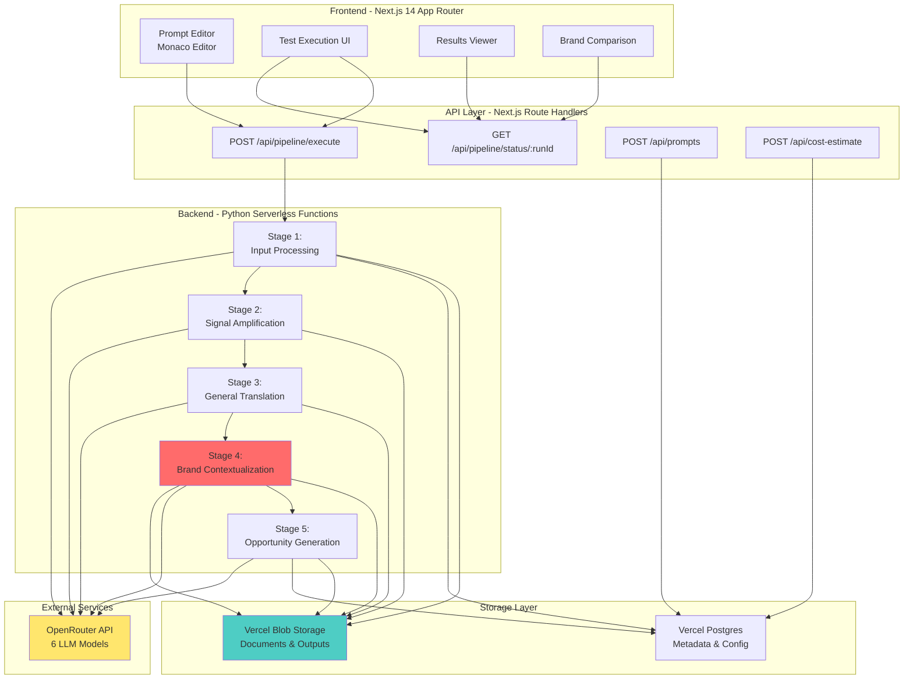

# 2. High Level Architecture

## System Overview

## Architecture Principles

1. **Stateless Serverless Functions**: Each stage is an independent Python function, survives 300s Vercel timeout
2. **Blob-Based State Persistence**: All intermediate outputs saved to Vercel Blob for debugging and auditability
3. **Stage-by-Stage Orchestration**: API routes trigger stages sequentially, update Postgres status after each
4. **Research Data Injection**: Stage 4 loads comprehensive brand profiles from Blob storage (8 sections, 120+ facts)
5. **Per-Stage Model Selection**: Users can override default model for specific stages (e.g., use expensive Claude for Stage 4 only)

## Deployment Model

- **Platform**: Vercel (Hobby or Pro tier)
- **Monorepo Structure**: NPM workspaces with `apps/web` (Next.js) and `api/python` (serverless functions)
- **Regions**: Single region (US East - `iad1`) for simplicity
- **Scaling**: Auto-scaling via Vercel (no manual configuration)

---
