# Innovation Intelligence Pipeline - Complete Flow Diagram

## Mermaid Diagram

Copy the code below and paste it into https://mermaid.live to visualize:

```mermaid
graph TB
    %% INPUT SOURCES
    subgraph INPUTS["📥 INPUT SOURCES"]
        I1["🏟️ Case Study<br/>Savannah Bananas"]
        I2["📊 Trend Report<br/>Premium Fast Food"]
        I3["📊 Trend Report<br/>Non-Alcoholic Beverage"]
        I4["📊 Trend Report<br/>Sacred Sync"]
        I5["💡 Spotted Innovation<br/>Cat Dad Campaign"]
        I6["💡 Spotted Innovation<br/>QR Garment Resale"]
    end

    %% PROCESSING PIPELINE
    subgraph PIPELINE["🔄 PROCESSING PIPELINE"]

        subgraph STAGE1["STAGE 1: Input Processing"]
            S1A["🔍 Content Reviewer Expert<br/>Identify Inspirations"]
            S1B["📚 Research Expert<br/>Deep Dive on Inspiration"]
            S1C["📝 Summarize Inspiration<br/>with Supporting Research"]
        end

        subgraph STAGE2["STAGE 2: Signal Amplification"]
            S2A["📱 Social Media Expert<br/>Extract Social Pulse"]
            S2B["📈 Trend Analyst Expert<br/>Extract Related Trends"]
            S2C["🎯 Enhanced Signal Output<br/>with Trend Context"]
        end

        subgraph STAGE3["STAGE 3: General Translation"]
            S3A["💼 Innovation Agency Expert<br/>Extract Universal Lessons"]
            S3B["🔑 Key Takeaways<br/>De-contextualized Principles"]
        end

        subgraph STAGE4["STAGE 4: Brand Contextualization"]
            S4A["🔬 Expert Researcher<br/>Deep Brand Research"]
            S4B["💼 Innovation Agency Expert<br/>Customize for Brand Context"]
            S4C["🎨 Brand-Specific<br/>Strategic Insights"]
        end

        subgraph STAGE5["STAGE 5: Opportunity Generation"]
            S5A["💼 Innovation Agency Expert<br/>Identify 5-10 Best Opportunities"]
            S5B["🎨 Content & Visual Expert<br/>Create Opportunity Cards"]
            S5C["⚙️ Prompt Engineer<br/>Generate Follow-up Prompts"]
        end
    end

    %% BRAND CONTEXT DATABASE
    subgraph BRANDS["🏢 BRAND CONTEXT PROFILES"]
        B1["🥛 Lactalis Canada<br/>Dairy Products<br/>(Milk, Cheese, Yogurt)"]
        B2["🌶️ McCormick USA<br/>Condiments & Spices"]
        B3["🌱 Seventh Generation<br/>Sustainable Household"]
        B4["😁 Colgate-Palmolive<br/>Oral & Personal Care"]
    end

    %% OUTPUTS
    subgraph OUTPUTS["📤 OUTPUT PACKAGE (Per Test Run)"]
        O1["📋 Opportunity Cards<br/>5-10 Ideas with Visuals"]
        O2["🔮 Follow-up Prompts<br/>for Further Development"]
    end

    %% TEST MATRIX (Updated to 6 inputs)
    subgraph TESTMATRIX["🧪 TEST MATRIX (24 Tests = 6 inputs × 4 brands)"]
        T1["Test 1-4: Savannah Bananas<br/>→ All 4 Brands"]
        T2["Test 5-8: Premium Fast Food<br/>→ All 4 Brands"]
        T3["Test 9-12: Non-Alcoholic Beverage<br/>→ All 4 Brands"]
        T4["Test 13-16: Sacred Sync<br/>→ All 4 Brands"]
        T5["Test 17-20: Cat Dad Campaign<br/>→ All 4 Brands"]
        T6["Test 21-24: QR Garment Resale<br/>→ All 4 Brands"]
    end

    %% VALIDATION METRICS
    subgraph VALIDATION["✅ SUCCESS VALIDATION"]
        V1["⏱️ Speed: Pipeline Execution Time"]
        V2["⭐ Quality: Novelty & Actionability"]
        V3["🎯 Relevance: Brand Fit Authenticity"]
        V4["📊 Specificity: Implementation Detail"]
        V5["🔀 Differentiation: Unique Outputs per Brand"]
    end

    %% FLOW CONNECTIONS
    I1 --> S1A
    I2 --> S1A
    I3 --> S1A
    I4 --> S1A
    I5 --> S1A
    I6 --> S1A

    S1A --> S1B --> S1C
    S1C --> S2A
    S2A --> S2B --> S2C
    S2C --> S3A --> S3B

    S3B --> S4A
    B1 --> S4A
    B2 --> S4A
    B3 --> S4A
    B4 --> S4A

    S4A --> S4B --> S4C
    S4C --> S5A --> S5B --> S5C

    S5C --> O1
    S5C --> O2

    O1 --> TESTMATRIX
    O2 --> TESTMATRIX

    TESTMATRIX --> VALIDATION

    %% STYLING
    classDef inputStyle fill:#e1f5ff,stroke:#0066cc,stroke-width:2px
    classDef stageStyle fill:#fff4e6,stroke:#ff9800,stroke-width:2px
    classDef brandStyle fill:#f3e5f5,stroke:#9c27b0,stroke-width:2px
    classDef outputStyle fill:#e8f5e9,stroke:#4caf50,stroke-width:2px
    classDef testStyle fill:#fff3e0,stroke:#ff6f00,stroke-width:2px
    classDef validationStyle fill:#fce4ec,stroke:#e91e63,stroke-width:2px

    class I1,I2,I3,I4,I5 inputStyle
    class S1A,S1B,S1C,S2A,S2B,S2C,S3A,S3B,S4A,S4B,S4C,S5A,S5B,S5C stageStyle
    class B1,B2,B3,B4 brandStyle
    class O1,O2,O3 outputStyle
    class T1,T2,T3,T4,T5 testStyle
    class V1,V2,V3,V4,V5 validationStyle
```



## How to Use This Diagram

1. **Copy the entire code block** above (everything between the ```mermaid tags)
2. **Go to** https://mermaid.live
3. **Paste** the code into the editor
4. The diagram will render automatically

## Pipeline Testing Strategy

### Sequential Execution Flow:
1. **Input Selection** → Choose 1 of 5 inspiration sources
2. **Stage 1-3** → Process input into universal insights (brand-agnostic)
3. **Stage 4** → Inject brand context (runs 4x for 4 brands)
4. **Stage 5** → Generate brand-specific opportunities
5. **Validation** → Measure against success criteria

### Test Execution Options:

**Option A: Manual Single Test**
- Pick 1 input (e.g., Savannah Bananas)
- Pick 1 brand (e.g., Lactalis)
- Run through all 5 stages manually
- Document learnings

**Option B: Systematic Pipeline**
- Build BMAD tasks for each stage
- Create reusable workflows
- Semi-automated execution

**Option C: Full Test Matrix**
- Run all 20 combinations
- Compare outputs across brands
- Statistical validation

## Key Insights from Diagram

- **Stages 1-3** are brand-agnostic (run once per input)
- **Stages 4-5** are brand-specific (run 4x per input)
- **Total output volume**: 5 inputs × 4 brands × 5-10 ideas = **100-200 opportunity cards**
- **Per test run**: 1 input + 1 brand = 5-10 opportunity cards + follow-up prompts
- **Efficiency gain**: Share stages 1-3 across brands (60% reduction in processing)

